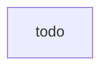

# Account Fleet Management Pipeline

Enterprises develop and deploy shared services that can be consumed by many teams in an organization. A shared services deployment pipeline may provision one or more services. For example, you may design a shared services deployment pipeline to launch an AWS Organization including provisioning multiple AWS accounts with guardrails. As part of this provisioning, certain AWS services and configuration may be enabled such as AWS Control Tower, AWS Organizations, AWS Service Catalog, AWS Security Hub, Amazon GuardDuty, Amazon Macie, and others. The automated provisioning of these services and configurations are run as part of these shared services deployment pipelines. 

## Source

* Test source code
* Infrastructure as code
* Dependency libraries
* Configuration

## Pre-Commit hooks

* *Secrets Detection* - Identify secrets such as usernames, passwords, and access keys in code and other files before they are published to a repository by using pre-commit hooks. When discovering secrets, the code push should fail immediately.
* *IDE Plugins* - Warn developers in their IDE using plugins and extensions such as. Examples could include markdown linters, yaml/json validators, and flake8/PEP8 code quality analyzers.

## Alpha

All actions run In this stage are also run on developers’ local environments prior to code commit and peer review. 

* *Policy as Code* - Run preventative automated checks are run to ensure that the code and environments conform to organization/team policy. For example, these checks might alert when code defines volumes or buckets as not encrypted, services not enabled, or endpoints not protected. When policies are violated, AWS recommends the build fails so that developers can fix the errors. (e.g., CloudFormation Guard, OPA, and IAM Access Analyzer)
* *Secrets Detection & Repo Cleansing* - Identify secrets such as usernames, passwords, and access keys. When secrets are discovered, the build fails and all secrets in the source code repo history are purged. (e.g., Amazon CodeGuru Secrets Detection, git-secrets)
* *IaC Unit Tests* - Run automated test-driven infrastructure based on requirements (e.g., Cucumber/Gherkin, Rego)

## Beta

* *Provision Resources* - Launch an environment in an AWS test account from IaC code templates.
* *Integration Tests* - Run tests against the provisioned resources to check for errors (e.g., AWS TaskCat)

## Gamma

* *TODO*

## Prod

* *Approval* - Optional action as part of an automated workflow, obtain authorized human approval before completing deployment.
* *Generate Service Catalog Product* - Provide shared services through a service catalog so that teams can obtain the software through self-service means in a controlled manner. IAM policies ensure only the necessary access is applied to principals.  
