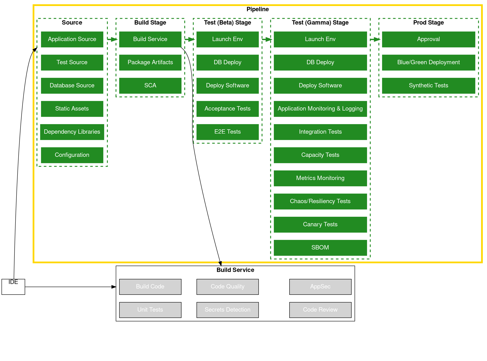
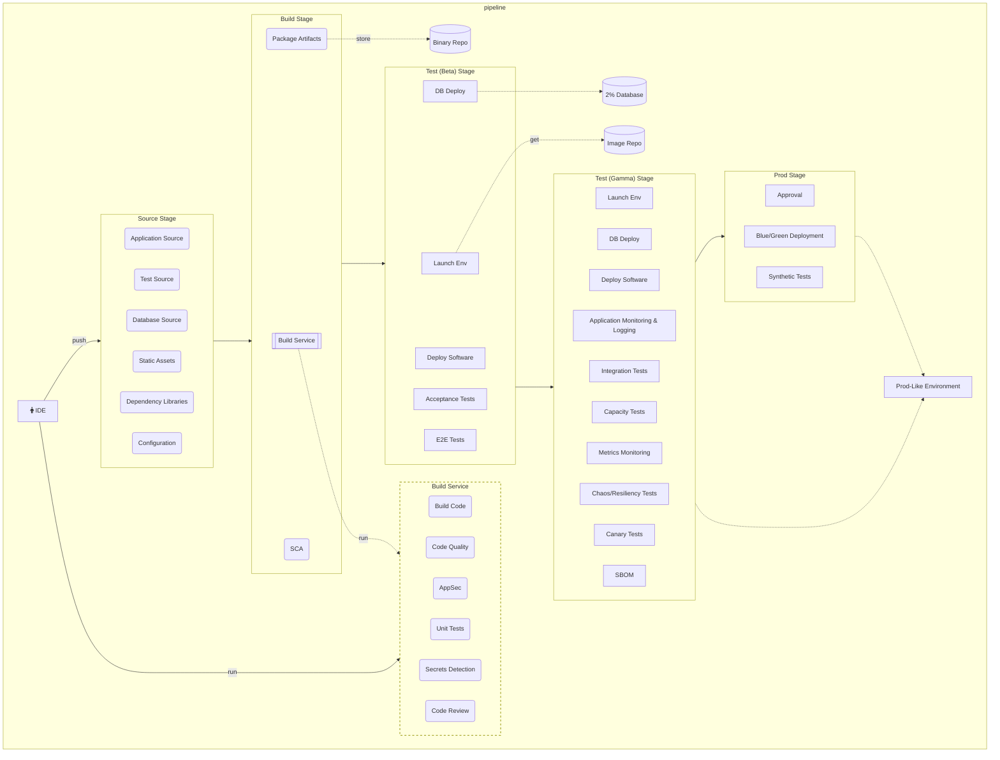

# Application Pipeline

Applications and Services are the most common use case for a deployment pipeline. In this pipeline type, it will get application source code files, tests, static analysis, database deployment, configuration, and other code to perform build, test, deploy, and release processes. The pipeline launches an environment from the compute image artifacts generated in the compute image pipeline. Acceptance and other automated tests are run on the environment(s) as part of the deployment pipeline.

## Source

* Application Source Code
* Test Source Code
* Database Source Code
* Static Assets
* Dependency Libraries
* Configuration

All the above source code are versioned and securely accessed with role based access control with source code repositories such as AWS CodeCommit, GitHub, GitLab, Bitbucket, and others.

## Pre-Commit hooks

* *Secrets Detection* - Identify secrets such as usernames, passwords, and access keys in code and other files before they are published to a repository by using pre-commit hooks. When discovering secrets, the code push should fail immediately.
* *IDE Plugins* - Warn developers in their IDE using plugins and extensions such as. Examples could include markdown linters, yaml/json validators, and flake8/PEP8 code quality analyzers.

## Build

All actions run In this stage are also run on developers’ local environments prior to code commit and peer review. Actions in this stage should all run in less than 10 minutes so that developers can take action on quick feedback before moving on to their next task. If it’s taking more time, consider using more efficient tooling or moving some of the actions to latter stages. Each of the actions below are defined and run in code.

* *Build Code* - Convert code into artifacts that can be deployed to an environment. Most builds complete in seconds.
* *Code Quality* - Run various automated static analysis tools that generate reports on code quality, coding standards, security, code coverage, and other aspects according to the team and/or organization’s best practices. AWS recommends that teams alert other and fail the build when important practices are violated (e.g., a security violation is discovered in the code). These checks usually run in seconds. (e.g., SonarQube, Checkmarx)
* *Application Security* - Analyze code for application security violations such as XXE, SQLi, and XSS. Assess best practices for use of KMS, EC2 APIs and common crypto and TLS/SSL libraries (e.g., Amazon CodeGuru, Checkmarx, SonarQube)
* *Secrets Detection & Repo Cleansing* - Identify secrets such as usernames, passwords, and access keys in code and other files. When discovering secrets, the build fails and purges all secrets in the source code repo history. (e.g., Amazon CodeGuru, git-secrets, Checkov)
* *Unit Tests* - Run automated test code verify application code is performing according to expectations at the unit level. These are fast-running tests usually not taking more than a minute to run against a code base. These tests typically use assertion-based frameworks in defining the tests. (e.g., XUnit - JUnit, PyTest, jest, etc.)
* *Code Review* - Apply machine learning to evaluate common violations to industry best practices. When discovered, AWS recommends the build fails so that developers can fix the errors. (e.g., Amazon CodeGuru)
* *Software Composition Analysis* - Run software composition analysis (SCA) tools to find vulnerabilities to package repositories related to open source use, licensing, and security vulnerabilities. SCA tools also launch workflows to fix these vulnerabilities. (e.g., Snyk, Black Duck)
* *Package and Store Artifact(s)* - While the Build Code action should package most of the relevant artifacts, there may be additional steps to automate for packaged the code artifacts. Once packaged, automation is run in this action to store the artifacts in a binary repository. (e.g., AWS CodeArtifact)

## Test (Beta)

* *Launch Environment* - Consume the compute image from an image repository (e.g., AMI or a container repo) and launch an environment from the image (e.g., AWS CLI, AWS CDK/AWS CloudFormation, AWS CodePipeline, AWS CodeBuild)
* *Deploy Software* - Deploy software to the test environment.
* *Database deployment* - Apply changes to the database as code - i.e., the database structure and/or data (e.g., Liquibase, flywaydb)
* *Acceptance Tests* - Run automated tests that are linked to requirements on a non-production environment . They may come in the form of behavior-driven tests, automated acceptance tests, or automated tests linked to requirements and/or stories in a tracking system.

## Test (Gamma)

* *Launch Environment* - Consume the compute image from an image repository (e.g., AMI or a container repo) and launch an environment from the image (e.g., AWS CLI, AWS CDK/AWS CloudFormation, AWS CodePipeline, AWS CodeBuild)
* *Deploy Software* - Deploy software to a prod-like environment.
* *Integration Tests* - Run integration tests with other services.
* *End-to-End Functional (E2E) Tests* - Run automated functional tests from the users’ perspective on a non-production environment.
* *Capacity Tests* - Run longer-running automated capacity tests against environments that simulate production capacity. (e.g., BlazeMeter, JMeter, locust)
* *Chaos/Resiliency Experiments* - Inject failures into environments to identify improvements.
* *Metrics Monitoring* - Monitor deployments across regions and fail when threshold breached.
* *Rollback* - 1/ Ensure backwards compatible rollback is possible before deploying. a/ serializable writes and de-serializable reads b/ protocol changes c/ health checks and timeouts 2/ two-phase deployments a/prepare phase b/ activate phase.
* *Software Bill of Materials (SBOM)* - Generate a software bill of materials of all changes in code commit to support manual approvals and governance. (e.g. BlackDuck)

## Prod

* *Approval* - (Optional) As part of a automated workflow, obtain authorized human approval before completing deployment.
* *Deploy Software* - Deploy software into production environment using one of several deployment models: Blue/Green, Canary, Rolling Changes, or All At Once. Running the single command or clicking the button for the deployment may or may not be performed by a human.
* *Database deployment* - (Optional) Apply changes to the database as code to the production database.
* *Synthetic Tests* - Run automated tests that simulate end user workflow actions to discover issues before customers do.
