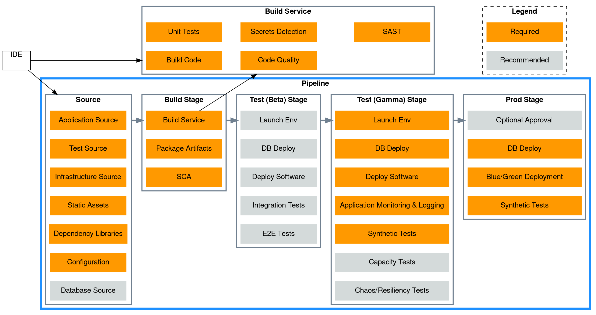

# Architecture 

Applications and Services are the most common use case for a deployment pipeline. In this pipeline type, it will get application source code files, tests, static analysis, database deployment, configuration, and other code to perform build, test, deploy, and release processes. The pipeline launches an environment from the compute image artifacts generated in the compute image pipeline. Integration and other automated tests are run on the environment(s) as part of the deployment pipeline.



## Source

???+ required "Application Source Code"
    Code that is compiled, transpiled or interpreted for the purpose of providing a capability.

???+ required "Test Source Code"
    Code that verifies the expected functionality of the *Application Source Code*. This includes source code for unit, integration, end-to-end, capacity, chaos, and synthetic testing. All *Test Source Code* is **required** to be stored in the same repository as the app to allow tests to be created and updated on the same lifecycle as the *Application Source Code*.

???+ required "Infrastructure Source Code"
    Code that defines the infrastructure necessary to run the *Application Source Code*. Examples of infrastructure source code include but are not limited to [AWS Cloud Development Kit](https://aws.amazon.com/cdk/), [AWS CloudFormation](https://aws.amazon.com/cloudformation/) and [HashiCorp Terraform](https://www.terraform.io/). All *Infrastructure Source Code* is **required** to be stored in the same repository as the app to allow infrastructure to be created and updated on the same lifecycle as the *Application Source Code*.

???+ required "Static Assets"
    Assets used by the *Application Source Code* such as html, css, and images.

???+ required "Dependency Libraries"
    References third-party code that is used by the *Application Source Code*. This could be libraries created by the same team, a separate team within the same organization, or from an external entity.

???+ required "Static Configuration"
    Files (e.g. JSON, XML, YAML or HCL) used to configure the behavior of the *Application Source Code*. Any configuration that is [environment](index.md#environment) specific should *not* be included in source and should be handled via [Dynamic Configuration Deployment Pipelines](../dynamic-configuration-deployment-pipeline).

???+ recommended "Database Source Code"
    Code that defines the schema and reference data of the database used by the *Application Source Code*. Examples of database source code include but are not limited to [Liquibase](https://www.liquibase.org/). If the *Application Source Code* uses a private database that no other application accesses, then the database source code is **required** to be stored in the same repository as the *Application Source Code*. This allows the *Application Source Code* and *Database Source Code* to be updated on the same lifecycle. However, if the database is shared by multiple applications then the *Database Source Code* should be maintained in a separate repository and managed by separate pipeline. It should be noted that this is undesireable as it introduces coupling between applications.

All the above source code is versioned and securely accessed through role based access control with source code repositories including but not limited to [AWS CodeCommit](https://aws.amazon.com/codecommit/), [GitHub](https://github.com), [GitLab](https://gitlab.com), and [Bitbucket](https://bitbucket.org).

## Pre-Commit hooks

???+ required "Secrets Detection"
    Identify secrets such as usernames, passwords, and access keys in code and other files before they are published to a repository by using pre-commit hooks. When discovering secrets, the code push should fail immediately. Examples of secret detection tools include but are not limited to [GitGuardian](https://www.gitguardian.com/) and [gitleaks](https://github.com/zricethezav/gitleaks). Examples of tools to configure and store pre-commit hooks as code include but are not limited to [husky](https://github.com/typicode/husky) and [pre-commit](https://pre-commit.com/#install).

???+ recommended "IDE Plugins"
    Warn developers of potential issues with their source code in their IDE using plugins and extensions including but not limited to [Visual Studio Code - Python Extension](https://code.visualstudio.com/docs/python/linting) and [IntelliJ IDEA - JavaScript linters](https://www.jetbrains.com/help/idea/linters.html).

## Build

All actions run in this stage are also run on developer's local environments prior to code commit and peer review. Actions in this stage should all run in less than 10 minutes so that developers can take action on fast feedback before moving on to their next task. If it’s taking more time, consider using more efficient tooling or moving some of the actions to latter stages. Each of the actions below are defined and run in code.

???+ required "Build Code"
    Convert code into artifacts that can be deployed to an environment. Most builds complete in seconds. Examples include but are not limited to [Maven](https://maven.apache.org/) and [tsc](https://www.typescriptlang.org/docs/handbook/compiler-options.html).

???+ required "Unit Tests"
    Run the test code to verify that individual functions and methods of classes, components or modules of the *Application Source Code* are performing according to expectations. These tests are fast-running tests with zero dependencies on external systems returning results in seconds. Examples of unit testing frameworks include but are not limited to [JUnit](https://junit.org/), [Jest](https://jestjs.io/), and [pytest](https://pytest.org/).

???+ required "Code Quality"
    Run various automated static analysis tools that generate reports on code quality, coding standards, security, code coverage, and other aspects according to the team and/or organization’s best practices. AWS recommends that teams fail the build when important practices are violated (e.g., a security violation is discovered in the code). These checks usually run in seconds. Examples of tools to measure code quality include but are not limited to [Amazon CodeGuru](https://aws.amazon.com/codeguru/), [SonarQube](https://www.sonarqube.org/), [black](https://github.com/psf/black), and [ESLint](https://eslint.org/).

    ```graphviz dot codequality.png
digraph G {
    rankdir=LR

    subgraph cluster_pipeline {
        label=<<b>Pipeline</b>>
        fontname="Helvetica,Arial,sans-serif"
        graph[color="black" style="dashed" fontcolor="black"]
        node [fontname="Helvetica,Arial,sans-serif" shape=box style=filled fontcolor="black" width=2]
        edge [fontname="Helvetica,Arial,sans-serif" color="black" fontcolor="black"]

        source[label="Application Source Code" color="#d4dada"] 
        iac[label="Infrastructure Source Code" color="#d4dada"] 
        quality[label="Static Analysis Tools" color="#d4dada" fontcolor="black"] 

        quality -> source [label="analyze"]
        quality -> iac [label="analyze"]
    }
}
```

???+ required "Secrets Detection"
    Identify secrets such as usernames, passwords, and access keys in code. When discovering secrets, the build should fail immediately. Examples of secret detection tools include but are not limited to [GitGuardian](https://www.gitguardian.com/) and [gitleaks](https://github.com/zricethezav/gitleaks).

    ```graphviz dot secrets.png
digraph G {
    rankdir=LR

    subgraph cluster_pipeline {
        label=<<b>Pipeline</b>>
        fontname="Helvetica,Arial,sans-serif"
        graph[color="black" style="dashed" fontcolor="black"]
        node [fontname="Helvetica,Arial,sans-serif" shape=box style=filled fontcolor="black" width=2]
        edge [fontname="Helvetica,Arial,sans-serif" color="black" fontcolor="black"]

        source[label="Application Source Code" color="#d4dada"] 
        iac[label="Application Source Code" color="#d4dada"] 
        secrets[label="Secrets Detection" color="#d4dada" fontcolor="black"] 

        secrets -> source [label="analyze"]
        secrets -> iac [label="analyze"]
    }
}
```

???+ required "Static Application Security Testing (SAST)"
    Analyze code for application security violations such as [XML External Entity Processing](https://owasp.org/www-community/vulnerabilities/XML_External_Entity_(XXE)_Processing), [SQL Injection](https://owasp.org/www-community/attacks/SQL_Injection), and [Cross Site Scripting](https://owasp.org/www-community/attacks/xss/). Examples of tools to perform static application security testing include but are not limited to [Amazon CodeGuru](https://aws.amazon.com/codeguru/), [SonarQube](https://www.sonarqube.org/), and [Checkmarx](https://checkmarx.com/).

    ```graphviz dot sast.png
digraph G {
    rankdir=LR

    subgraph cluster_pipeline {
        label=<<b>Pipeline</b>>
        fontname="Helvetica,Arial,sans-serif"
        graph[color="black" style="dashed" fontcolor="black"]
        node [fontname="Helvetica,Arial,sans-serif" shape=box style=filled fontcolor="black" width=2]
        edge [fontname="Helvetica,Arial,sans-serif" color="black" fontcolor="black"]

        source[label="Application Source Code" color="#d4dada"] 
        sast[label="SAST" color="#d4dada" fontcolor="black"] 

        sast -> source [label="analyze"]
    }
}
```

???+ required "Package and Store Artifact(s)"
    While the *Build Code* action will package most of the relevant artifacts, there may be additional steps to automate for packaging the code artifacts. Artifacts should only be built and packaged once and then deployed to various environments to validate the artifact. Artfiacts should never be rebuilt during subsequent deploy stages. Once packaged, automation is run in this action to store the artifacts in an artifact repository for future deployments. Examples of artifact repositories include but are not limited to [AWS CodeArtifact](https://aws.amazon.com/codeartifact/), [Amazon ECR](https://aws.amazon.com/ecr/), and [JFrog Artifactory](https://jfrog.com/artifactory/).

    ```graphviz dot artifact.png
digraph G {
    rankdir=LR

    node [fontname="Helvetica,Arial,sans-serif" shape=box style=filled fontcolor="black" width=2]

    subgraph cluster_pipeline {
        label=<<b>Pipeline</b>>
        fontname="Helvetica,Arial,sans-serif"
        graph[color="black" style="dashed" fontcolor="black"]
        node [fontname="Helvetica,Arial,sans-serif" shape=box style=filled fontcolor="black" width=2]
        edge [fontname="Helvetica,Arial,sans-serif" color="black" fontcolor="black"]

        source[label="Application Source Code" color="#d4dada"] 
        artifact[label="Packaged Artifact" color="#d4dada" fontcolor="black"] 

        source -> artifact [label="package"]
    }

    repo[label="Artifact Repository" color="#d4dada" fontcolor="black"]

    artifact -> repo [label="store" fontname="Helvetica,Arial,sans-serif" color="black" fontcolor="black"]
}
```

???+ required "Software Composition Analysis (SCA)"
    Run software composition analysis (SCA) tools to find vulnerabilities to package repositories related to open source use, licensing, and security vulnerabilities. SCA tools also launch workflows to fix these vulnerabilities. These tools also require a software bill of materials (SBOM) exist in the source code. Examples of bill of materials include but are not limited to Java `pom.xml`, JavaScript `yarn.lock`, and Ruby `Gemfile.lock`. Example SCA tools include but are not limited to [Dependabot](https://github.com/dependabot), [Snyk](https://snyk.io/product/open-source-security-management/), and [Blackduck](https://www.blackducksoftware.com/).
    ```graphviz dot sca.png
digraph G {
    rankdir=LR

    subgraph cluster_pipeline {
        label=<<b>Pipeline</b>>
        fontname="Helvetica,Arial,sans-serif"
        graph[color="black" style="dashed" fontcolor="black"]
        node [fontname="Helvetica,Arial,sans-serif" shape=box style=filled fontcolor="black" width=2]
        edge [fontname="Helvetica,Arial,sans-serif" color="black" fontcolor="black"]

        artifact[label="Packaged Artifact" color="#d4dada"] 
        sca[label="SCA" color="#d4dada" fontcolor="black"] 

        sca -> artifact [label="analyze"]
    }
}
```

## Test (Beta)

???+ recommended "Launch Environment"
    Consume the compute image from an image repository (e.g., AMI or a container repo) and launch an environment from the image using *Infrastructure Source Code*. The beta images is generally not accessible to pubic customers and is only used for internal software validaition. Beta environment should be in a different AWS Account from the tools used to run the deployment pipeline.  Access to the beta environment should be handled via [cross-account IAM roles](https://docs.aws.amazon.com/IAM/latest/UserGuide/tutorial_cross-account-with-roles.html) rather than long lived credentials from IAM users. Example tools for defining infrastructure code include but are not limited to [AWS Cloud Development Kit](https://aws.amazon.com/cdk/), [AWS CloudFormation](https://aws.amazon.com/cloudformation/) and [HashiCorp Terraform](https://www.terraform.io/).

    ```graphviz dot launch.png
digraph G {
    compound=true
    rankdir=LR

    node [fontname="Helvetica,Arial,sans-serif" shape=box style=filled fontcolor="black" width=2]
    edge [fontname="Helvetica,Arial,sans-serif" color="black" fontcolor="black"]
    subgraph cluster_pipeline {
        label=<<b>Pipeline</b>>
        fontname="Helvetica,Arial,sans-serif"
        graph[color="black" style="dashed" fontcolor="black"]
        node [fontname="Helvetica,Arial,sans-serif" shape=box style=filled fontcolor="black" width=2]
        edge [fontname="Helvetica,Arial,sans-serif" color="black" fontcolor="black"]

        iac[label="Infrastructure Source Code" color="#d4dada" fontcolor="black"]
    }
    subgraph cluster_env {
        label=<<b>Environment</b>>
        fontname="Helvetica,Arial,sans-serif"
        graph[color="black" style="dashed" fontcolor="black"]
    
        env[label="" style="invis"]
    }

    iac -> env [label="launch" fontcolor="black" color="black"]
}
```

???+ recommended "Database Deploy"
    Apply changes to the beta database using the *Database Source Code*. Best practice is to connect to the beta database through [cross-account IAM roles](https://docs.aws.amazon.com/IAM/latest/UserGuide/tutorial_cross-account-with-roles.html) and [IAM database authentication for RDS](https://docs.aws.amazon.com/AmazonRDS/latest/UserGuide/UsingWithRDS.IAMDBAuth.html) rather than long lived database credentials. If database credentials must be used, then they should be loaded from a secret manager such as [AWS Secrets Manager](https://aws.amazon.com/secrets-manager/). Changes to the database should be incremental, only applying the changes since the prior deployment. Examples of tools that apply incremental database changes include but are not limited to [Liquibase](https://www.liquibase.org/).

    ```graphviz dot db.png
digraph G {
    compound=true
    rankdir=LR

    node [fontname="Helvetica,Arial,sans-serif" shape=box style=filled fontcolor="black" width=2]
    edge [fontname="Helvetica,Arial,sans-serif" color="black" fontcolor="black"]
    subgraph cluster_pipeline {
        label=<<b>Pipeline</b>>
        fontname="Helvetica,Arial,sans-serif"
        graph[color="black" style="dashed" fontcolor="black"]
        node [fontname="Helvetica,Arial,sans-serif" shape=box style=filled fontcolor="black" width=2]
        edge [fontname="Helvetica,Arial,sans-serif" color="black" fontcolor="black"]

        db_source[label="Database Source Code" color="#d4dada" fontcolor="black"]
    }
    subgraph cluster_env {
        label=<<b>Environment</b>>
        fontname="Helvetica,Arial,sans-serif"
        graph[color="black" style="dashed" fontcolor="black"]
    
        db[label="Database" color="#d4dada" fontcolor="black"]
    }
    db_source -> db [label="deploy" fontcolor="black" color="black"]
}
```

???+ recommended "Deploy Software"
    Deploy software to the beta environment. Software is not deployed from source but rather the artifact that was packaged and stored in the *Build Stage* will be used for the deployment. Software deployments should be performed through *Infrastructure Source Code*. Access to the beta environment should be handled via [cross-account IAM roles](https://docs.aws.amazon.com/IAM/latest/UserGuide/tutorial_cross-account-with-roles.html) rather than long lived credentials from IAM users. Examples of tools to deploy software include but are not limited to [AWS CodeDeploy](https://aws.amazon.com/codedeploy/).
    ```graphviz dot software.png
digraph G {
    compound=true
    rankdir=LR

    node [fontname="Helvetica,Arial,sans-serif" shape=box style=filled fontcolor="black" width=2]
    edge [fontname="Helvetica,Arial,sans-serif" color="black" fontcolor="black"]
    subgraph cluster_pipeline {
        label=<<b>Pipeline</b>>
        fontname="Helvetica,Arial,sans-serif"
        graph[color="black" style="dashed" fontcolor="black"]
        node [fontname="Helvetica,Arial,sans-serif" shape=box style=filled fontcolor="black" width=2]
        edge [fontname="Helvetica,Arial,sans-serif" color="black" fontcolor="black"]

        iac[label="Infrastructure Source Code" color="#d4dada" fontcolor="black"]
    }
    subgraph cluster_env {
        label=<<b>Environment</b>>
        fontname="Helvetica,Arial,sans-serif"
        graph[color="black" style="dashed" fontcolor="black"]
    
        software[label="Application" color="#d4dada" fontcolor="black"]
    }
    repo[label="Artifact Repository" color="#d4dada" fontcolor="black"]
    repo -> iac[label="get artifact" fontcolor="black" color="black"]
    iac -> software [label="deploy" fontcolor="black" color="black"]
}
```

???+ recommended "Integration Tests"
    Run automated tests that verify if the application satisifes business requirements. These tests require the application to be running in the beta environment. Integration tests may come in the form of behavior-driven tests, automated acceptance tests, or automated tests linked to requirements and/or stories in a tracking system. Examples of tools to define integration tests include but are not limited to [Cucumber](https://cucumber.io) and [SoapUI](https://www.soapui.org).
    ```graphviz dot int.png
digraph G {
    compound=true
    rankdir=LR

    node [fontname="Helvetica,Arial,sans-serif" shape=box style=filled fontcolor="black" width=2]
    edge [fontname="Helvetica,Arial,sans-serif" color="black" fontcolor="black"]
    subgraph cluster_pipeline {
        label=<<b>Pipeline</b>>
        fontname="Helvetica,Arial,sans-serif"
        graph[color="black" style="dashed" fontcolor="black"]
        node [fontname="Helvetica,Arial,sans-serif" shape=box style=filled fontcolor="black" width=2]
        edge [fontname="Helvetica,Arial,sans-serif" color="black" fontcolor="black"]

        test_source[label="Test Source Code" color="#d4dada" fontcolor="black"]
    }
    subgraph cluster_env {
        label=<<b>Environment</b>>
        fontname="Helvetica,Arial,sans-serif"
        graph[color="black" style="dashed" fontcolor="black"]
    
        app[label="Application" color="#d4dada" fontcolor="black"]
    }
    test_source -> app [label="test" fontcolor="black" color="black"]
}
```

???+ recommended "End-to-End (E2E) Tests"
    Run automated end-to-end testing from the users’ perspective in the beta environment. These tests verify the user workflow, including when performed through a UI. These test are the slowest to run and hardest to maintain and therefore it is recommended to only have a few end-to-end tests that cover the most important application workflows. Examples of tools to define end-to-end tests include but are not limited to [Cypress](https://cypress.io) and [Selenium](https://selenium.dev).
    ```graphviz dot e2e.png
digraph G {
    compound=true
    rankdir=LR

    node [fontname="Helvetica,Arial,sans-serif" shape=box style=filled fontcolor="black" width=2]
    edge [fontname="Helvetica,Arial,sans-serif" color="black" fontcolor="black"]
    subgraph cluster_pipeline {
        label=<<b>Pipeline</b>>
        fontname="Helvetica,Arial,sans-serif"
        graph[color="black" style="dashed" fontcolor="black"]
        node [fontname="Helvetica,Arial,sans-serif" shape=box style=filled fontcolor="black" width=2]
        edge [fontname="Helvetica,Arial,sans-serif" color="black" fontcolor="black"]

        test_source[label="Test Source Code" color="#d4dada" fontcolor="black"]
    }
    subgraph cluster_env {
        label=<<b>Environment</b>>
        fontname="Helvetica,Arial,sans-serif"
        graph[color="black" style="dashed" fontcolor="black"]
    
        app[label="Application" color="#d4dada" fontcolor="black"]
    }
    test_source -> app [label="test" fontcolor="black" color="black"]
}
```

## Test (Gamma)

???+ required "Launch Environment"
    Consume the compute image from an image repository (e.g., AMI or a container repo) and launch an environment from the image using *Infrastructure Source Code*. Gamma environment should be in a different AWS Account from the tools used to run the deployment pipeline.  Access to the gamma environment should be handled via [cross-account IAM roles](https://docs.aws.amazon.com/IAM/latest/UserGuide/tutorial_cross-account-with-roles.html) rather than long lived credentials from IAM users. Example tools for defining infrastructure code include but are not limited to [AWS Cloud Development Kit](https://aws.amazon.com/cdk/), [AWS CloudFormation](https://aws.amazon.com/cloudformation/) and [HashiCorp Terraform](https://www.terraform.io/).
    ```graphviz dot launch.png
digraph G {
    compound=true
    rankdir=LR

    node [fontname="Helvetica,Arial,sans-serif" shape=box style=filled fontcolor="black" width=2]
    edge [fontname="Helvetica,Arial,sans-serif" color="black" fontcolor="black"]
    subgraph cluster_pipeline {
        label=<<b>Pipeline</b>>
        fontname="Helvetica,Arial,sans-serif"
        graph[color="black" style="dashed" fontcolor="black"]
        node [fontname="Helvetica,Arial,sans-serif" shape=box style=filled fontcolor="black" width=2]
        edge [fontname="Helvetica,Arial,sans-serif" color="black" fontcolor="black"]

        iac[label="Infrastructure Source Code" color="#d4dada" fontcolor="black"]
    }
    subgraph cluster_env {
        label=<<b>Environment</b>>
        fontname="Helvetica,Arial,sans-serif"
        graph[color="black" style="dashed" fontcolor="black"]
    
        env[label="" style="invis"]
    }

    iac -> env [label="launch" fontcolor="black" color="black"]
}
```

???+ required "Database Deploy"
    Apply changes to the gamma database using the *Database Source Code*. Best practice is to connect to the gamma database through [cross-account IAM roles](https://docs.aws.amazon.com/IAM/latest/UserGuide/tutorial_cross-account-with-roles.html) and [IAM database authentication for RDS](https://docs.aws.amazon.com/AmazonRDS/latest/UserGuide/UsingWithRDS.IAMDBAuth.html) rather than long lived database credentials. If database credentials must be used, then they should be loaded from a secret manager such as [AWS Secrets Manager](https://aws.amazon.com/secrets-manager/). Changes to the database should be incremental, only applying the changes since the prior deployment. Examples of tools that apply incremental database changes include but are not limited to [Liquibase](https://www.liquibase.org/).
    ```graphviz dot db.png
digraph G {
    compound=true
    rankdir=LR

    node [fontname="Helvetica,Arial,sans-serif" shape=box style=filled fontcolor="black" width=2]
    edge [fontname="Helvetica,Arial,sans-serif" color="black" fontcolor="black"]
    subgraph cluster_pipeline {
        label=<<b>Pipeline</b>>
        fontname="Helvetica,Arial,sans-serif"
        graph[color="black" style="dashed" fontcolor="black"]
        node [fontname="Helvetica,Arial,sans-serif" shape=box style=filled fontcolor="black" width=2]
        edge [fontname="Helvetica,Arial,sans-serif" color="black" fontcolor="black"]

        db_source[label="Database Source Code" color="#d4dada" fontcolor="black"]
    }
    subgraph cluster_env {
        label=<<b>Environment</b>>
        fontname="Helvetica,Arial,sans-serif"
        graph[color="black" style="dashed" fontcolor="black"]
    
        db[label="Database" color="#d4dada" fontcolor="black"]
    }
    db_source -> db [label="deploy" fontcolor="black" color="black"]
}
```

???+ required "Deploy Software"
    Deploy software to the gamma environment. Software is not deployed from source but rather the artifact that was packaged and stored in the *Build Stage* will be used for the deployment. Software deployments should be performed through *Infrastructure Source Code*. Access to the gamma environment should be handled via [cross-account IAM roles](https://docs.aws.amazon.com/IAM/latest/UserGuide/tutorial_cross-account-with-roles.html) rather than long lived credentials from IAM users. Examples of tools to deploy software include but are not limited to [AWS CodeDeploy](https://aws.amazon.com/codedeploy/).
    ```graphviz dot software.png
digraph G {
    compound=true
    rankdir=LR

    node [fontname="Helvetica,Arial,sans-serif" shape=box style=filled fontcolor="black" width=2]
    edge [fontname="Helvetica,Arial,sans-serif" color="black" fontcolor="black"]
    subgraph cluster_pipeline {
        label=<<b>Pipeline</b>>
        fontname="Helvetica,Arial,sans-serif"
        graph[color="black" style="dashed" fontcolor="black"]
        node [fontname="Helvetica,Arial,sans-serif" shape=box style=filled fontcolor="black" width=2]
        edge [fontname="Helvetica,Arial,sans-serif" color="black" fontcolor="black"]

        iac[label="Infrastructure Source Code" color="#d4dada" fontcolor="black"]
    }
    subgraph cluster_env {
        label=<<b>Environment</b>>
        fontname="Helvetica,Arial,sans-serif"
        graph[color="black" style="dashed" fontcolor="black"]
    
        software[label="Application" color="#d4dada" fontcolor="black"]
    }
    repo[label="Artifact Repository" color="#d4dada" fontcolor="black"]
    repo -> iac[label="get artifact" fontcolor="black" color="black"]
    iac -> software [label="deploy" fontcolor="black" color="black"]
}
```

???+ required "Application Monitoring & Logging"
    Monitor deployments across regions and fail when threshold breached. The thresholds for metric alarms should be defined in the *Infrastructure Source Code* and deployed along with the rest of the infrastructure in an environment. Ideally, deployments should be automatically failed and rolled back when error thresholds are breached. Examples of automated rollback include [AWS CloudFormation monitor & rollback](https://docs.aws.amazon.com/AWSCloudFormation/latest/UserGuide/using-cfn-rollback-triggers.html), [AWS CodeDeploy rollback](https://docs.aws.amazon.com/codedeploy/latest/userguide/deployments-rollback-and-redeploy.html) and [Flagger](https://flagger.app/).
    ```graphviz dot mon.png
digraph G {
    compound=true
    rankdir=LR

    node [fontname="Helvetica,Arial,sans-serif" shape=box style=filled fontcolor="black" width=2]
    edge [fontname="Helvetica,Arial,sans-serif" color="black" fontcolor="black"]
    subgraph cluster_pipeline {
        label=<<b>Pipeline</b>>
        fontname="Helvetica,Arial,sans-serif"
        graph[color="black" style="dashed" fontcolor="black"]
        node [fontname="Helvetica,Arial,sans-serif" shape=box style=filled fontcolor="black" width=2]
        edge [fontname="Helvetica,Arial,sans-serif" color="black" fontcolor="black"]

        iac[label="Infrastructure Source Code" color="#d4dada" fontcolor="black"]
    }
    subgraph cluster_env {
        label=<<b>Environment</b>>
        fontname="Helvetica,Arial,sans-serif"
        graph[color="black" style="dashed" fontcolor="black"]
        edge [fontname="Helvetica,Arial,sans-serif" color="black" fontcolor="black"]
    
        app[label="Application" color="#d4dada" fontcolor="black"]
        logs[label="Logs" color="#d4dada" fontcolor="black"]
        metrics[label="Metrics" color="#d4dada" fontcolor="black"]
        app -> logs
        app -> metrics
    }
    logs -> iac [label="monitor" fontcolor="black" color="black"]
    metrics -> iac [label="monitor" fontcolor="black" color="black"]
    iac -> app [label="rollback" fontcolor="black" color="black"]
}
```

???+ required "Synthetic Tests"
    Tests that run continuously in the background in a given environment to generate traffic and verify the system is healthy. These tests serve two purposes: 1/ Ensure there is always adequate traffic in the environment to trigger alarms if a deployment is unhealthy 2/ Test specific workflows and assert that the system is functioning correctly. Examples of tools that can be used for synthetic tests include but are not limited to [Amazon CloudWatch Synthetics](https://docs.aws.amazon.com/AmazonCloudWatch/latest/monitoring/CloudWatch_Synthetics_Canaries.html) and [Datadog Synthetic Monitoring](https://docs.datadoghq.com/synthetics/).
    ```graphviz dot synthetic.png
digraph G {
    compound=true
    rankdir=LR

    node [fontname="Helvetica,Arial,sans-serif" shape=box style=filled fontcolor="black" width=2]
    edge [fontname="Helvetica,Arial,sans-serif" color="black" fontcolor="black"]
    subgraph cluster_pipeline {
        label=<<b>Pipeline</b>>
        fontname="Helvetica,Arial,sans-serif"
        graph[color="black" style="dashed" fontcolor="black"]
        node [fontname="Helvetica,Arial,sans-serif" shape=box style=filled fontcolor="black" width=2]
        edge [fontname="Helvetica,Arial,sans-serif" color="black" fontcolor="black"]

        iac[label="Infrastructure Source Code" color="#d4dada" fontcolor="black"]
    }
    subgraph cluster_env {
        label=<<b>Environment</b>>
        fontname="Helvetica,Arial,sans-serif"
        graph[color="black" style="dashed" fontcolor="black"]
        edge [fontname="Helvetica,Arial,sans-serif" color="black" fontcolor="black"]
    
        app[label="Application" color="#d4dada" fontcolor="black"]
        synthetic[label="Synthetic Tests" color="#d4dada" fontcolor="black"]
        metrics[label="Metrics" color="#d4dada" fontcolor="black"]
        synthetic -> app[label="synthetic tests" color="black" fontcolor="black"]
        app -> metrics
    }
    metrics -> iac [label="monitor" fontcolor="black" color="black"]
    iac -> app [label="rollback" fontcolor="black" color="black"]
}
```

???+ recommended "Performance Tests"
    Run longer-running automated capacity tests against environments that simulate production capacity. Measure metrics such as the transaction success rates, response time and throughput. Determine if application meets performance requirements and compare metrics to past performance to look for performance degredation. Examples of tools that can be used for performance tests include but are not limited to [JMeter](https://jmeter.apache.org) and [Gatling](https://gatling.io).
    ```graphviz dot perf.png
digraph G {
    compound=true
    rankdir=LR

    node [fontname="Helvetica,Arial,sans-serif" shape=box style=filled fontcolor="black" width=2]
    edge [fontname="Helvetica,Arial,sans-serif" color="black" fontcolor="black"]
    subgraph cluster_pipeline {
        label=<<b>Pipeline</b>>
        fontname="Helvetica,Arial,sans-serif"
        graph[color="black" style="dashed" fontcolor="black"]
        node [fontname="Helvetica,Arial,sans-serif" shape=box style=filled fontcolor="black" width=2]
        edge [fontname="Helvetica,Arial,sans-serif" color="black" fontcolor="black"]

        tests[label="Test Source Code" color="#d4dada" fontcolor="black"]
    }
    subgraph cluster_env {
        label=<<b>Environment</b>>
        fontname="Helvetica,Arial,sans-serif"
        graph[color="black" style="dashed" fontcolor="black"]
        edge [fontname="Helvetica,Arial,sans-serif" color="black" fontcolor="black"]
    
        app[label="Application" color="#d4dada" fontcolor="black"]
        metrics[label="Metrics" color="#d4dada" fontcolor="black"]
        app -> metrics
    }
    tests -> app [label="execute tests" fontcolor="black" color="black"]
    metrics -> tests [label="monitor" fontcolor="black" color="black"]
}
```

???+ recommended "Chaos/Resiliency Tests"
    Inject failures into environments to identify areas of the application that are susceptible to failure. Tests are defined as code and applied to the environment while the system is under load. The success rate, response time and throughput are measured during the periods when the failures are injected and compared to periods without the failures. Any significant deviation should fail the pipeline. Examples of tools that can be used for chaos/resilience testing include but are not limited to [AWS Fault Injection Simulator](https://aws.amazon.com/fis/) and [ChaosToolkit](https://chaostoolkit.org/).
    ```graphviz dot chaos.png
digraph G {
    compound=true
    rankdir=LR

    node [fontname="Helvetica,Arial,sans-serif" shape=box style=filled fontcolor="black" width=2]
    edge [fontname="Helvetica,Arial,sans-serif" color="black" fontcolor="black"]
    subgraph cluster_pipeline {
        label=<<b>Pipeline</b>>
        fontname="Helvetica,Arial,sans-serif"
        graph[color="black" style="dashed" fontcolor="black"]
        node [fontname="Helvetica,Arial,sans-serif" shape=box style=filled fontcolor="black" width=2]
        edge [fontname="Helvetica,Arial,sans-serif" color="black" fontcolor="black"]

        tests[label="Test Source Code" color="#d4dada" fontcolor="black"]
    }
    subgraph cluster_env {
        label=<<b>Environment</b>>
        fontname="Helvetica,Arial,sans-serif"
        graph[color="black" style="dashed" fontcolor="black"]
        edge [fontname="Helvetica,Arial,sans-serif" color="black" fontcolor="black"]
    
        app[label="Application" color="#d4dada" fontcolor="black"]
        metrics[label="Metrics" color="#d4dada" fontcolor="black"]
        app -> metrics
    }
    tests -> app [label="inject faults" fontcolor="black" color="black"]
    metrics -> tests [label="monitor" fontcolor="black" color="black"]
}
```

## Prod

???+ required "Optional Approval"
    As part of a automated workflow, obtain authorized human approval before deploying to the production environment.

???+ required "Database Deploy"
    Apply changes to the production database using the *Database Source Code*. Best practice is to connect to the production database through [cross-account IAM roles](https://docs.aws.amazon.com/IAM/latest/UserGuide/tutorial_cross-account-with-roles.html) and [IAM database authentication for RDS](https://docs.aws.amazon.com/AmazonRDS/latest/UserGuide/UsingWithRDS.IAMDBAuth.html) rather than long lived database credentials. If database credentials must be used, then they should be loaded from a secret manager such as [AWS Secrets Manager](https://aws.amazon.com/secrets-manager/). Changes to the database should be incremental, only applying the changes since the prior deployment. Examples of tools that apply incremental database changes include but are not limited to [Liquibase](https://www.liquibase.org/).
    ```graphviz dot db.png
digraph G {
    compound=true
    rankdir=LR

    node [fontname="Helvetica,Arial,sans-serif" shape=box style=filled fontcolor="black" width=2]
    edge [fontname="Helvetica,Arial,sans-serif" color="black" fontcolor="black"]
    subgraph cluster_pipeline {
        label=<<b>Pipeline</b>>
        fontname="Helvetica,Arial,sans-serif"
        graph[color="black" style="dashed" fontcolor="black"]
        node [fontname="Helvetica,Arial,sans-serif" shape=box style=filled fontcolor="black" width=2]
        edge [fontname="Helvetica,Arial,sans-serif" color="black" fontcolor="black"]

        db_source[label="Database Source Code" color="#d4dada" fontcolor="black"]
    }
    subgraph cluster_env {
        label=<<b>Environment</b>>
        fontname="Helvetica,Arial,sans-serif"
        graph[color="black" style="dashed" fontcolor="black"]
    
        db[label="Database" color="#d4dada" fontcolor="black"]
    }
    db_source -> db [label="deploy" fontcolor="black" color="black"]
}
```

???+ required "Progressive Deployment"
    Deploy software into production environment using one of several progressive deployment models: Blue/Green, Canary, Rolling Changes, or All At Once. Software deployments should be performed through *Infrastructure Source Code*. Access to the production environment should be handled via [cross-account IAM roles](https://docs.aws.amazon.com/IAM/latest/UserGuide/tutorial_cross-account-with-roles.html) rather than long lived credentials from IAM users. Examples of tools to deploy software include but are not limited to [AWS CodeDeploy](https://aws.amazon.com/codedeploy/). Ideally, deployments should be automatically failed and rolled back when error thresholds are breached. Examples of automated rollback include [AWS CloudFormation monitor & rollback](https://docs.aws.amazon.com/AWSCloudFormation/latest/UserGuide/using-cfn-rollback-triggers.html), [AWS CodeDeploy rollback](https://docs.aws.amazon.com/codedeploy/latest/userguide/deployments-rollback-and-redeploy.html) and [Flagger](https://flagger.app/).
    ```graphviz dot progdep.png
digraph G {
    compound=true
    rankdir=LR

    node [fontname="Helvetica,Arial,sans-serif" shape=box style=filled fontcolor="black" width=2]
    edge [fontname="Helvetica,Arial,sans-serif" color="black" fontcolor="black"]
    subgraph cluster_pipeline {
        label=<<b>Pipeline</b>>
        fontname="Helvetica,Arial,sans-serif"
        graph[color="black" style="dashed" fontcolor="black"]
        node [fontname="Helvetica,Arial,sans-serif" shape=box style=filled fontcolor="black" width=2]
        edge [fontname="Helvetica,Arial,sans-serif" color="black" fontcolor="black"]

        iac[label="Infrastructure Source Code" color="#d4dada" fontcolor="black"]
    }
    subgraph cluster_env {
        label=<<b>Environment</b>>
        fontname="Helvetica,Arial,sans-serif"
        graph[color="black" style="dashed" fontcolor="black"]
        edge [fontname="Helvetica,Arial,sans-serif" color="black" fontcolor="black"]
    
        app[label="Application" color="#d4dada" fontcolor="black"]
        metrics[label="Metrics" color="#d4dada" fontcolor="black"]
        app -> metrics
    }
    metrics -> iac [label="monitor" fontcolor="black" color="black"]
    iac -> app [label="rollback" fontcolor="black" color="black"]
}
```

???+ recommended "Synthetic Tests"
    Tests that run continuously in the background in a givent environment to generate traffic and verify the system is healthy. These tests serve two purposes: 1/ Ensure there is always adequate traffic in the environment to trigger alarms if a deployment is unhealthy 2/ Test specific workflows and assert that the system is functioning correctly. Examples of tools that can be used for synthetic tests include but are not limited to [Amazon CloudWatch Synthetics](https://docs.aws.amazon.com/AmazonCloudWatch/latest/monitoring/CloudWatch_Synthetics_Canaries.html) and [Datadog Synthetic Monitoring](https://docs.datadoghq.com/synthetics/).

    ```graphviz dot synthetic.png
digraph G {
    compound=true
    rankdir=LR

    node [fontname="Helvetica,Arial,sans-serif" shape=box style=filled fontcolor="black" width=2]
    edge [fontname="Helvetica,Arial,sans-serif" color="black" fontcolor="black"]
    subgraph cluster_pipeline {
        label=<<b>Pipeline</b>>
        fontname="Helvetica,Arial,sans-serif"
        graph[color="black" style="dashed" fontcolor="black"]
        node [fontname="Helvetica,Arial,sans-serif" shape=box style=filled fontcolor="black" width=2]
        edge [fontname="Helvetica,Arial,sans-serif" color="black" fontcolor="black"]

        iac[label="Infrastructure Source Code" color="#d4dada" fontcolor="black"]
    }
    subgraph cluster_env {
        label=<<b>Environment</b>>
        fontname="Helvetica,Arial,sans-serif"
        graph[color="black" style="dashed" fontcolor="black"]
        edge [fontname="Helvetica,Arial,sans-serif" color="black" fontcolor="black"]
    
        app[label="Application" color="#d4dada" fontcolor="black"]
        synthetic[label="Synthetic Tests" color="#d4dada" fontcolor="black"]
        metrics[label="Metrics" color="#d4dada" fontcolor="black"]
        synthetic -> app[label="synthetic tests" color="black" fontcolor="black"]
        app -> metrics
    }
    metrics -> iac [label="monitor" fontcolor="black" color="black"]
    iac -> app [label="rollback" fontcolor="black" color="black"]
}
```
