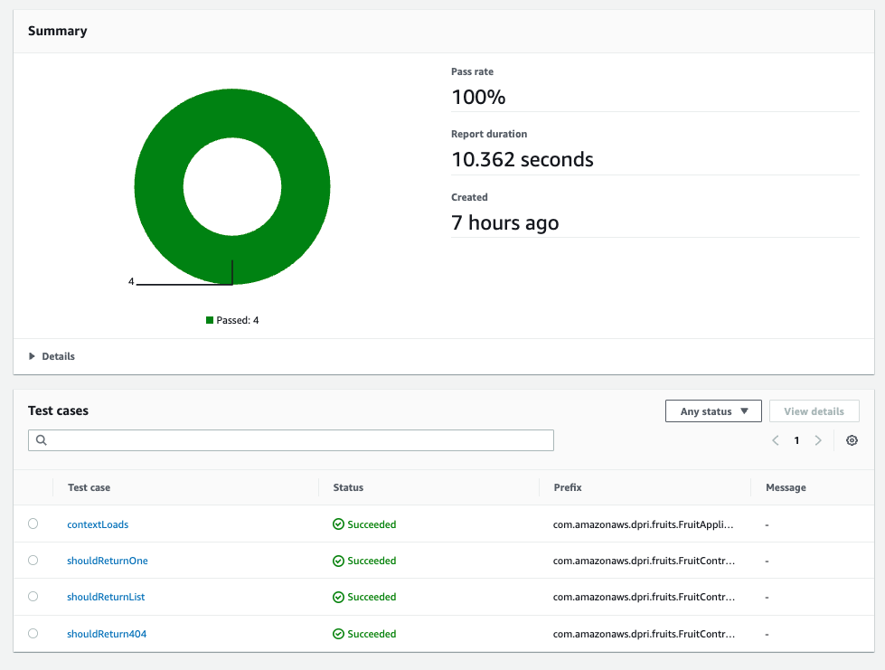
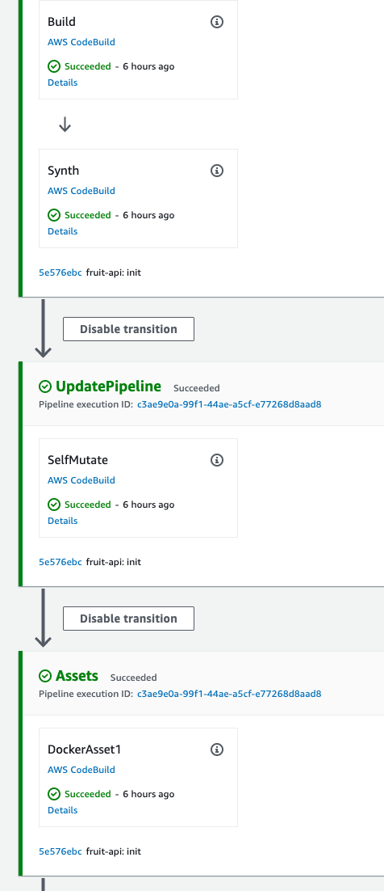
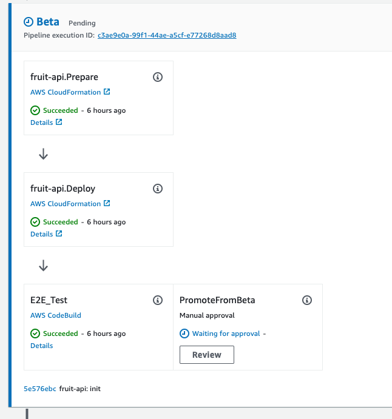
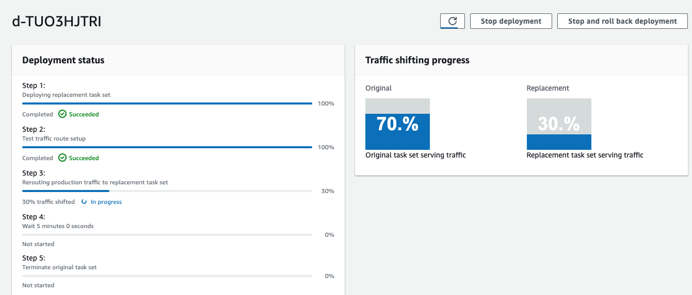
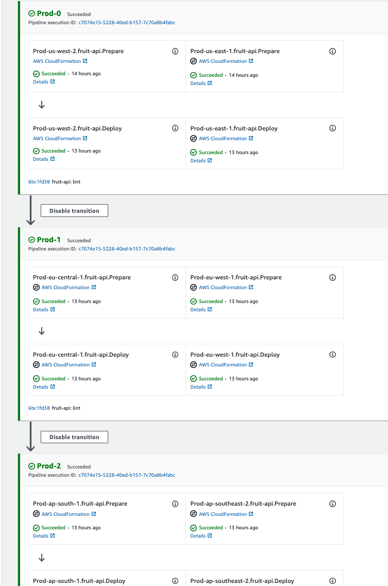

# CDK Pipeline

This presents a reference implementation of the [Application Pipeline](..) reference architecture. The pipeline is built with [AWS CodePipeline](https://aws.amazon.com/codepipeline/) and uses [AWS CodeBuild](https://aws.amazon.com/codebuild/) for building the software and performing testing tasks. All the infrastructure for this reference implementation is defined with [AWS Cloud Development Kit](https://aws.amazon.com/cdk/). The pipelines are defined using the [CDK Pipelines](https://docs.aws.amazon.com/cdk/api/v2/docs/aws-cdk-lib.pipelines-readme.html) L3 constructs. The source code for this reference implementation is available in [GitHub](https://github.com/aws-samples/aws-deployment-pipeline-reference-architecture/tree/main/examples/cdk-application-pipeline) for running in your own local account.


???+ danger "Disclaimer"
    This reference implementation is intended to serve as an example of how to accomplish the guidance in the reference architecture using [CDK Pipelines](https://docs.aws.amazon.com/cdk/api/v2/docs/aws-cdk-lib.pipelines-readme.html). The reference implementation has intentionally not followed the following [AWS Well-Architected](https://aws.amazon.com/architecture/well-architected/) best practices to make it accessible by a wider range of customers. Be sure to address these before using parts of this code for any workloads in your own environment:

    * [ ] **cdk bootstrap with AdministratorAccess** - the default policy used for `cdk bootstrap` is `AdministratorAccess` but should be replaced with a more appropriate policy with least priviledge in your account.
    * [ ] **TLS on HTTP endpoint** - the listener for the sample application uses HTTP instead of HTTPS to avoid having to create new ACM certificates and Route53 hosted zones. This should be replaced in your account with an `HTTPS` listener.

## Developer Workspace

Developers need fast-feedback for potential issues with their code. Automation should run in their developer workspace to give them feedback before the deployment pipeline runs.

???+ required "Pre-Commit Hooks"
    Pre-Commit hooks are scripts that are executed on the developer's workstation when they try to create a new commit. These hooks have an opportunity to inspect the state of the code before the commit occurs and abort the commit if tests fail. An example of pre-commit hooks are [Git hooks](https://git-scm.com/book/en/v2/Customizing-Git-Git-Hooks#_git_hooks).  Examples of tools to configure and store pre-commit hooks as code include but are not limited to [husky](https://github.com/typicode/husky) and [pre-commit](https://pre-commit.com/#install).

    The following `.pre-commit-config.yaml` is added to the repository that will build the code with [Maven](https://maven.apache.org/), run unit tests with [JUnit](https://junit.org), check for code quality with [Checkstyle](https://github.com/checkstyle/checkstyle), run static application security testing with [PMD](https://pmd.github.io/latest/index.html) and check for secrets in the code wwith [gitleaks](https://github.com/zricethezav/gitleaks).

    <!--codeinclude-->
    [](../../examples/cdk-application-pipeline/.pre-commit-config.yaml)
    <!--/codeinclude-->

## Source

???+ required "Application Source Code"
    The application source code can be found in the [src/main/java](https://github.com/aws-samples/aws-deployment-pipeline-reference-architecture/tree/main/examples/cdk-application-pipeline/src/main/java) directory. It is intended to serve only as a reference and should be replaced by your own application source code.

    This reference implementation includes a [Spring Boot](https://spring.io/projects/spring-boot) application that exposes a REST API and uses a database for persistence. The API is implemented in `FruitController.java`:

    <!--codeinclude-->
    [](../../examples/cdk-application-pipeline/src/main/java/com/amazonaws/dpri/fruits/FruitController.java) block:FruitController
    <!--/codeinclude-->


    The application source code is stored in [AWS CodeCommit](https://aws.amazon.com/codecommit/) repository that is created and initialized from the CDK application in the `CodeCommitSource` construct:

    <!--codeinclude-->
    [](../../examples/cdk-application-pipeline/infrastructure/src/codecommit-source/index.ts) inside_block:constructor
    <!--/codeinclude-->

???+ required "Test Source Code"
    The test source code can be found in the [src/test/java](https://github.com/aws-samples/aws-deployment-pipeline-reference-architecture/tree/main/examples/cdk-application-pipeline/src/test/java) directory. It is intended to serve only as a reference and should be replaced by your own test source code.

    The reference implementation includes source code for unit, integration and end-to-end testing. Unit and integration tests can be found in `src/test/java`. For example, `FruitControllerTest.java` performs unit tests of each API path with the [JUnit](https://junit.org/) testing library:

    <!--codeinclude-->
    [](../../examples/cdk-application-pipeline/src/test/java/com/amazonaws/dpri/fruits/FruitControllerTest.java) block:shouldReturnList
    <!--/codeinclude-->

    Acceptance tests are preformed with with [SoapUI](https://www.soapui.org/) and are defined in `fruit-api-soapui-project.xml`. They are executed by [Maven](https://maven.apache.org/) using plugins in `pom.xml`.

???+ required "Infrastructure Source Code"
    The infrastructure source code can be found in the [infrastructure](https://github.com/aws-samples/aws-deployment-pipeline-reference-architecture/tree/main/examples/cdk-application-pipeline/infrastructure) directory. It is intended to serve as a reference but much of the code can also be reused in your own CDK applications.

    Infrastructure source code defines both the deployment of the pipeline and the deployment of the application are stored in `infrastructure/` folder and uses [AWS Cloud Development Kit](https://aws.amazon.com/cdk/).

    <!--codeinclude-->
    [](../../examples/cdk-application-pipeline/infrastructure/src/deployment/index.ts) inside_block:constructor
    <!--/codeinclude-->

    Notice that the infrastructure code is written in [Typescript](https://www.typescriptlang.org/) which is different from the Application Source Code (Java). This was done intentionally to demonstrate that CDK allows defining infrastructure code in whatever language is most appropriate for the team that owns the use of CDK in the organization.

???+ required "Static Assets"
    There are no static assets used by the sample application.

???+ required "Dependency Manifests"
    All third-party dependencies used by the sample application are define in the `pom.xml`:

    ```xml
    <dependencies>
        <dependency>
            <groupId>org.springframework.boot</groupId>
            <artifactId>spring-boot-starter-web</artifactId>
        </dependency>
        <dependency>
            <groupId>org.springframework.boot</groupId>
            <artifactId>spring-boot-starter-data-jpa</artifactId>
        </dependency>
        <dependency>
            <groupId>org.springframework.boot</groupId>
            <artifactId>spring-boot-starter-actuator</artifactId>
        </dependency>
        <dependency>
            <groupId>org.liquibase</groupId>
            <artifactId>liquibase-core</artifactId>
        </dependency>
    </dependencies>
    ```

???+ required "Static Configuration"
    Static configuration for the application is defined in `src/main/resources/application.yml`:

    <!--codeinclude-->
    [](../../examples/cdk-application-pipeline/src/main/resources/application.yml)
    <!--/codeinclude-->

???+ required "Database Source Code"
    The database source code can be found in the [src/main/resources/db](https://github.com/aws-samples/aws-deployment-pipeline-reference-architecture/tree/main/examples/cdk-application-pipeline/src/main/resources/db) directory. It is intended to serve only as a reference and should be replaced by your own database source code.

    The code that manages the schema and initial data for the application is defined using [Liquibase](https://www.liquibase.org/) in `src/main/resources/db/changelog/db.changelog-master.yml`:

    <!--codeinclude-->
    [](../../examples/cdk-application-pipeline/src/main/resources/db/changelog/db.changelog-master.yaml)
    <!--/codeinclude-->
## Build

Actions in this stage all run in less than 10 minutes so that developers can take action on fast feedback before moving on to their next task. Each of the actions below are defined as code with [AWS Cloud Development Kit](https://aws.amazon.com/cdk/).

???+ required "Build Code"
    The Java source code is compiled, unit tested and packaged by [Maven](https://maven.apache.org/). A step is added to the pipeline through a CDK construct called `MavenBuild`:

    <!--codeinclude-->
    [](../../examples/cdk-application-pipeline/infrastructure/src/maven-build/index.ts) inside_block:constructor
    <!--/codeinclude-->

???+ required "Unit Tests"
    The unit tests are run by [Maven](https://maven.apache.org/) at the same time the `Build Code` action occurs. The results of the unit tests are uploaded to [AWS Code Build Test Reports](https://docs.aws.amazon.com/codebuild/latest/userguide/test-reporting.html) to track over time.

    

???+ required "Code Quality"
    A CDK construct was created to require that [Amazon CodeGuru](https://aws.amazon.com/codeguru/) performed a review on the most recent changes and that the recommendations don't exceed the severity thresholds. If no review was found or if the severity thresholds were exceeded, the pipeline fails. The construct is added to the pipeline with:

    <!--codeinclude-->
    [](../../examples/cdk-application-pipeline/infrastructure/src/pipeline.ts) block:CodeGuruReviewCheck
    <!--/codeinclude-->

    The `Filter` attribute can be customized to control what categories of recommendations are considered and what the thresholds are:

    ```typescript
    export enum CodeGuruReviewRecommendationCategory {
        AWS_BEST_PRACTICES = 'AWSBestPractices',
        AWS_CLOUDFORMATION_ISSUES = 'AWSCloudFormationIssues',
        CODE_INCONSISTENCIES = 'CodeInconsistencies',
        CODE_MAINTENANCE_ISSUES = 'CodeMaintenanceIssues',
        CONCURRENCY_ISSUES = 'ConcurrencyIssues',
        DUPLICATE_CODE = 'DuplicateCode',
        INPUT_VALIDATIONS = 'InputValidations',
        JAVA_BEST_PRACTICES = 'JavaBestPractices',
        PYTHON_BEST_PRACTICES = 'PythonBestPractices',
        RESOURCE_LEAKS = 'ResourceLeaks',
        SECURITY_ISSUES = 'SecurityIssues',
    }
    export class CodeGuruReviewFilter {
        // Limit which recommendation categories to include
        recommendationCategories!: CodeGuruReviewRecommendationCategory[];

        // Fail if more that this # of lines of code were suppressed aws-codeguru-reviewer.yml
        maxSuppressedLinesOfCodeCount?: number;

        // Fail if more than this # of CRITICAL recommendations were found
        maxCriticalRecommendations?: number;

        // Fail if more than this # of HIGH recommendations were found
        maxHighRecommendations?: number;

        // Fail if more than this # of MEDIUM recommendations were found
        maxMediumRecommendations?: number;

        // Fail if more than this # of INFO recommendations were found
        maxInfoRecommendations?: number;

        // Fail if more than this # of LOW recommendations were found
        maxLowRecommendations?: number;
    }
    ```


    This adds an action to CodePipeline for

    

    Additionally, [cdk-nag](https://github.com/cdklabs/cdk-nag) is run against both the pipeline stack and the deployment stack to identify any security issues with the resources being created. The pipeline will fail if any are detected. The following code demonstrates how cdk-nag is called as a part of the build stage. The code also demonstrates how to suppress findings.

    <!--codeinclude-->
    [](../../examples/cdk-application-pipeline/infrastructure/test/deployment.test.ts) inside_block:beforeEach
    <!--/codeinclude-->

???+ required "Secrets Detection"
    The same CDK construct that was created for *Code Quality* above is also used for secrets detection with [Amazon CodeGuru](https://aws.amazon.com/codeguru/).

???+ required "Static Application Security Testing (SAST)"
    The same CDK construct that was created for *Code Quality* above is also used for SAST with [Amazon CodeGuru](https://aws.amazon.com/codeguru/).

???+ required "Package and Store Artifact(s)"
    [AWS Cloud Development Kit](https://aws.amazon.com/cdk/) handles the packaging and storing of assets during the `Synth` action and `Assets` stage. The `Synth` action generates the CloudFormation templates to be deployed into the subsequent environments along with staging up the files necessary to create a docker image. The `Assets` stage then performs the docker build step to create a new image and push the image to [Amazon ECR](https://aws.amazon.com/ecr/) repositories in each environment account.

    

???+ required "Software Composition Analysis (SCA)"
    [Trivy](https://aquasecurity.github.io/trivy) is used to scan the source for vulnerabilities in its dependencies. The `pom.xml` and `Dockerfile` files are scanned for configuration issues or vulnerabilities in any dependencies. The scanning is accomplished by a CDK construct that creates a CodeBuild job to run `trivy`:

    <!--codeinclude-->
    [](../../examples/cdk-application-pipeline/infrastructure/src/pipeline.ts) block:TrivyScan
    <!--/codeinclude-->

    Trivy is also used within the `Dockerfile` to scan the image after it is built. The `docker build` will fail if Trivy finds any vulnerabilities in the final image:

    <!--codeinclude-->
    [](../../examples/cdk-application-pipeline/Dockerfile)
    <!--/codeinclude-->

???+ required "Software Bill of Materials (SBOM)"
    Trivy generates an SBOM in the form of a [CycloneDX](https://cyclonedx.org/) JSON report. The SBOM is saved as a CodePipeline asset.  Trivy supports additional SBOM formats such as [SPDX](https://spdx.dev/wp-content/uploads/sites/41/2020/08/SPDX-specification-2-2.pdf), and [SARIF](https://docs.oasis-open.org/sarif/sarif/v2.0/sarif-v2.0.html).

## Test (Beta)

???+ required "Launch Environment"
    The infrastructure for each environment is defined in [AWS Cloud Development Kit](https://aws.amazon.com/cdk/):

    <!--codeinclude-->
    [](../../examples/cdk-application-pipeline/infrastructure/src/deployment/index.ts) inside_block:constructor
    <!--/codeinclude-->

    The `DeploymentStack` construct is then instantiated for each environment:

    <!--codeinclude-->
    [](../../examples/cdk-application-pipeline/infrastructure/src/pipeline.ts) block:Beta
    <!--/codeinclude-->

???+ required "Database Deploy"
    Spring Boot is configured to run [Liquibase](https://www.liquibase.org/) on startup. This reads the configuration in `src/main/resources/db/changelog/db.changelog-master.yml` to define the tables and initial data for the database:

    <!--codeinclude-->
    [](../../examples/cdk-application-pipeline/src/main/resources/db/changelog/db.changelog-master.yaml)
    <!--/codeinclude-->

???+ required "Deploy Software"
    The *Launch Environment* action above creates a new [Amazon ECS Task Definition](https://docs.aws.amazon.com/AmazonECS/latest/developerguide/task_definitions.html) for the new docker image and then updates the Amazon ECS Service to use the new Task Definition.

???+ required "Integration Tests"
    Integration tests are preformed during the *Build Source* action. They are defined with with [SoapUI](https://www.soapui.org/) in `fruit-api-soapui-project.xml`. They are executed by [Maven](https://maven.apache.org/) in the `integration-test` phase using plugins in `pom.xml`.  Spring Boot is configure to start a local instance of the application with an H2 database during the `pre-integration-test` phase and then to terminate on the `post-integration-test` phase.  The results of the unit tests are uploaded to [AWS Code Build Test Reports](https://docs.aws.amazon.com/codebuild/latest/userguide/test-reporting.html) to track over time.

    ```xml
    <plugins>
        <plugin>
            <groupId>org.springframework.boot</groupId>
            <artifactId>spring-boot-maven-plugin</artifactId>
            <executions>
                <execution>
                    <id>pre-integration-test</id>
                    <goals>
                        <goal>start</goal>
                    </goals>
                </execution>
                <execution>
                    <id>post-integration-test</id>
                    <goals>
                        <goal>stop</goal>
                    </goals>
                </execution>
            </executions>
        </plugin>
        <plugin>
            <groupId>com.smartbear.soapui</groupId>
            <artifactId>soapui-maven-plugin</artifactId>
            <version>5.7.0</version>
            <configuration>
                <junitReport>true</junitReport>
                <outputFolder>target/soapui-reports</outputFolder>
                <endpoint>${soapui.endpoint}</endpoint>
            </configuration>
            <executions>
                <execution>
                    <phase>integration-test</phase>
                    <goals>
                        <goal>test</goal>
                    </goals>
                </execution>
            </executions>
        </plugin>
    </plugins>
    ```

???+ required "Acceptance Tests"
    Acceptance tests are preformed after the *Launch Environment* and *Deploy Software* actions:

    

    The tests are defined with with [SoapUI](https://www.soapui.org/) in `fruit-api-soapui-project.xml`. They are executed by [Maven](https://maven.apache.org/) with the endpoint overridden to the URL from the CloudFormation output. A CDK construct called `SoapUITest` was created to create the CodeBuild Project to run SoapUI.

    <!--codeinclude-->
    [](../../examples/cdk-application-pipeline/infrastructure/src/soapui-test/index.ts) inside_block:constructor
    <!--/codeinclude-->

    The results of the unit tests are uploaded to [AWS Code Build Test Reports](https://docs.aws.amazon.com/codebuild/latest/userguide/test-reporting.html) to track over time.

## Test (Gamma)

???+ required "Launch Environment"
    The infrastructure for each environment is defined in [AWS Cloud Development Kit](https://aws.amazon.com/cdk/):

    <!--codeinclude-->
    [](../../examples/cdk-application-pipeline/infrastructure/src/deployment/index.ts) inside_block:constructor
    <!--/codeinclude-->

    The `DeploymentStack` construct is then instantiated for each environment:

    <!--codeinclude-->
    [](../../examples/cdk-application-pipeline/infrastructure/src/pipeline.ts) block:Gamma
    <!--/codeinclude-->

???+ required "Database Deploy"
    Spring Boot is configured to run [Liquibase](https://www.liquibase.org/) on startup. This reads the configuration in `src/main/resources/db/changelog/db.changelog-master.yml` to define the tables and initial data for the database:

    <!--codeinclude-->
    [](../../examples/cdk-application-pipeline/src/main/resources/db/changelog/db.changelog-master.yaml)
    <!--/codeinclude-->

???+ required "Deploy Software"
    The *Launch Environment* action above creates a new [Amazon ECS Task Definition](https://docs.aws.amazon.com/AmazonECS/latest/developerguide/task_definitions.html) for the new docker image and then updates the Amazon ECS Service to use the new Task Definition.

???+ required "Application Monitoring & Logging"
    [Amazon ECS](https://aws.amazon.com/ecs/) uses [Amazon CloudWatch Metrics](https://docs.aws.amazon.com/AmazonCloudWatch/latest/monitoring/working_with_metrics.html) and [Amazon CloudWatch Logs](https://docs.aws.amazon.com/AmazonCloudWatch/latest/logs/WhatIsCloudWatchLogs.html) for observability by default.

???+ required "Synthetic Tests"
    [Amazon CloudWatch Synthetics](https://docs.aws.amazon.com/AmazonCloudWatch/latest/monitoring/CloudWatch_Synthetics_Canaries.html) is used to continuously deliver traffic to the application and assert that requests are successful and responses are received within a given threshold. The canary is defined via CDK:

    <!--codeinclude-->
    [](../../examples/cdk-application-pipeline/infrastructure/src/deployment/synthetic.ts) inside_block:constructor
    <!--/codeinclude-->

???+ required "Performance Tests"
    [Apache JMeter](https://jmeter.apache.org/) is used to run performance tests against the deployed application. The tests are stored in `src/test/jmeter` and added to the pipeline via CDK:

    <!--codeinclude-->
    [](../../examples/cdk-application-pipeline/infrastructure/src/pipeline.ts) block:JMeterTest
    <!--/codeinclude-->

???+ recommended "Resilience Tests"
    `Not Implemented`

???+ recommended "Dynamic Application Security Testing (DAST)"
    `Not Implemented`

## Prod

???+ required "Manual Approval"
    A manual approval step is added to the end of the `Gamma` stage. The step is added at the end to keep the environment in a stable state while manual testing is performed. Once the step is approved, the pipeline continues execution to the next stage.

    ```typescript
        new PipelineEnvironment(pipeline, Gamma, (deployment, stage) => {
            stage.addPost(
                new JMeterTest('Performance Test', {
                source: source.codePipelineSource,
                endpoint: deployment.apiUrl,
                threads: 300,
                duration: 300,
                throughput: 6000,
                cacheBucket,
                }),
                new ManualApprovalStep('PromoteFromGamma'),
            );
        });
    ```

    When a manual approval step is used, [IAM permissions](https://docs.aws.amazon.com/codepipeline/latest/userguide/approvals-iam-permissions.html) should be used restrict which principals can approve actions and stages to enforce least priviledge.

    ```json
        {
            "Effect": "Allow",
            "Action": [
                "codepipeline:PutApprovalResult"
            ],
            "Resource": "arn:aws:codepipeline:us-east-2:80398EXAMPLE:MyFirstPipeline/MyApprovalStage/MyApprovalAction"
        }
    ```

???+ required "Database Deploy"
    Spring Boot is configured to run [Liquibase](https://www.liquibase.org/) on startup. This reads the configuration in `src/main/resources/db/changelog/db.changelog-master.yml` to define the tables and initial data for the database:

    <!--codeinclude-->
    [](../../examples/cdk-application-pipeline/src/main/resources/db/changelog/db.changelog-master.yaml)
    <!--/codeinclude-->

???+ required "Progressive Deployment"
    Progressive deployment is implemented with [AWS CodeDeploy](https://aws.amazon.com/codedeploy/) for ECS. CodeDeploy performs a [linear blue/green](https://docs.aws.amazon.com/AmazonECS/latest/developerguide/deployment-type-bluegreen.html) by deploying the new task definition as a new task with a separate target group and then shifting 10% of traffic every minute until all traffic is shifted. A CloudWatch alarm is monitored by CodeDeploy and an automatic rollback is triggered if the alarm exceeds the threshold.

    

    Implementation of this type deployment presents challenges due to the following limitations:

    * [aws/aws-cdk #1559](https://github.com/aws/aws-cdk/issues/1559) - Lack of support for Blue/Green ECS Deployment in CDK. This was dependend on [aws-cloudformation/cloudformation-coverage-roadmap #37](https://github.com/aws-cloudformation/cloudformation-coverage-roadmap/issues/37) and [aws-cloudformation/cloudformation-coverage-roadmap #483)(https://github.com/aws-cloudformation/cloudformation-coverage-roadmap/issues/483) which have been fixed.
    * [aws/aws-cdk #19163](https://github.com/aws/aws-cdk/issues/19163) - CDK Pipelines aren't intended to be used with CodeDeploy actions.
    * [AWS CloudFormation User Guide](https://docs.aws.amazon.com/AWSCloudFormation/latest/UserGuide/blue-green.html#blue-green-considerations) - The use of `AWS::CodeDeploy::BlueGreen` hooks and `AWS::CodeDeployBlueGreen` restricts the types of changes that can be made. Additionally, you can't use auto-rollback capabilities of CodeDeploy.
    * [aws/aws-cdk #5170](https://github.com/aws/aws-cdk/issues/5170) - CDK doesn't support defining CloudFormation rollback triggers. This rules out CloudFormation based blue/green deployments.

    The solution was to create an [AWS CloudFormation Custom Resource](https://docs.aws.amazon.com/AWSCloudFormation/latest/UserGuide/template-custom-resources.html) to handle the creation of a CodeDeploy deployment.

    <!--codeinclude-->
    [](../../examples/cdk-application-pipeline/infrastructure/src/blue-green-deploy/lambda/index.ts) block:onEvent
    <!--/codeinclude-->

    The custom resource is then created in CDK:

    ```typescript
    const deployment = new BlueGreenEcsDeployment(this, 'DeploymentWait', {
      deploymentGroup: deploymentGroup,
      taskDefinition: service.taskDefinition,
      timeout: Duration.minutes(60),
    });

    new CfnOutput(this, 'DeploymentId', {
      value: deployment.deploymentId,
    }).overrideLogicalId('DeploymentId');
    ```

    Deployments are made incrementally across regions using the [CDK Pipeline - Wave](https://docs.aws.amazon.com/cdk/api/v2/docs/aws-cdk-lib.pipelines.Wave.html) construct. Each wave contains a list of regions to deploy to in parallel. One wave must fully complete before the next wave starts. The diagram below shows how each wave deploys to 2 regions at a time.

    

    Environments are configured in CDK with the list of waves:

    ```typescript
    // BETA environment is 1 wave with 1 region
    export const Beta: EnvironmentConfig = {
        name: 'Beta',
        account: accounts.beta,
        waves: [
            ['us-west-2'],
        ],
    };

    // GAMMA environment is 1 wave with 2 regions
    export const Gamma: EnvironmentConfig = {
        name: 'Gamma',
        account: accounts.gamma,
        waves: [
            ['us-west-2', 'us-east-1'],
        ],
    };

    // PROD environment is 3 wave with 2 regions each wave
    export const Prod: EnvironmentConfig = {
        name: 'Prod',
        account: accounts.production,
        waves: [
            ['us-west-2', 'us-east-1'],
            ['eu-central-1', 'eu-west-1'],
            ['ap-south-1', 'ap-southeast-2'],
        ],
    };
    ```

    A `PipelineEnvironment` class is responsible for loading the `EnvironmentConfig` into CodePipeline stages:

    <!--codeinclude-->
    [](../../examples/cdk-application-pipeline/infrastructure/src/pipeline.ts) block:PipelineEnvironment
    <!--/codeinclude-->

???+ required "Synthetic Tests"
    [Amazon CloudWatch Synthetics](https://docs.aws.amazon.com/AmazonCloudWatch/latest/monitoring/CloudWatch_Synthetics_Canaries.html) is used to continuously deliver traffic to the application and assert that requests are successful and responses are received within a given threshold. The canary is defined via CDK:

    <!--codeinclude-->
    [](../../examples/cdk-application-pipeline/infrastructure/src/deployment/synthetic.ts) inside_block:constructor
    <!--/codeinclude-->

## Frequently Asked Questions

???+ faq "What [operating models](https://docs.aws.amazon.com/wellarchitected/latest/operational-excellence-pillar/operating-model.html) does this reference implementation support?"

    This reference implementation can accomodate any operation model with minor updates:

    * [Fully Separated](https://docs.aws.amazon.com/wellarchitected/latest/operational-excellence-pillar/fully-separated-operating-model.html) - Restrict the role that CDK uses for CloudFormation execution to only create resources from approved product portfolios in [AWS Service Catalog](https://aws.amazon.com/servicecatalog/). Ownership of creating the products in Service Catalog is owned by the **Platform Engineering** team and operational support of Service Catalog is owned by the **Platform Operations** team. The **Platform Engineering** team should publish CDK constructs internally that provision AWS resources through Service Catalog. Update the CDK app in the `infrastructure/` directory to use CDK constructs provided by the `Platform Engineering` team. Use a [CODEOWNERS](https://docs.github.com/en/repositories/managing-your-repositorys-settings-and-features/customizing-your-repository/about-code-owners) file to require all changes to the `infrastructure/` directory be approved by the **Application Operations** team. Additionally, restrict permissions to the **Manual Approval** action to only allow members of the **Application Operations** to approve.
    * [Separated AEO and IEO with Centralized Governance](https://docs.aws.amazon.com/wellarchitected/latest/operational-excellence-pillar/separated-aeo-and-ieo-with-centralized-governance.html) - Restrict the role that CDK uses for CloudFormation execution to only create resources from approved product portfolios in [AWS Service Catalog](https://aws.amazon.com/servicecatalog/). Ownership of creating the products in Service Catalog is owned by the **Platform Engineering** team and operational support of Service Catalog is owned by the **Platform Engineering** team. The **Platform Engineering** team should publish CDK constructs internally that provision AWS resources through Service Catalog. Update the CDK app in the `infrastructure/` directory to use CDK constructs provided by the `Platform Engineering` team.
    * [Separated AEO and IEO with Deentralized Governance](https://docs.aws.amazon.com/wellarchitected/latest/operational-excellence-pillar/separated-aeo-and-ieo-with-decentralized-governance.html) - The **Platform Engineering** team should publish CDK constructs internally that provision AWS resources in manner that achieve organizational compliance. Update the CDK app in the `infrastructure/` directory to use CDK constructs provided by the `Platform Engineering` team.

???+ faq "Where is manual testing performed in this pipeline?"
    Ideally, all testing is accomplished through automation in the **Integration Tests** and **Acceptance Tests** actions. If an organization relies on people manually executing tests then these tests would be performed in the **Gamma Stage**. The **Manual Approval** action would be required and the approval would be granted by a Quality Assurance team member once the manual testing completes successfully.
