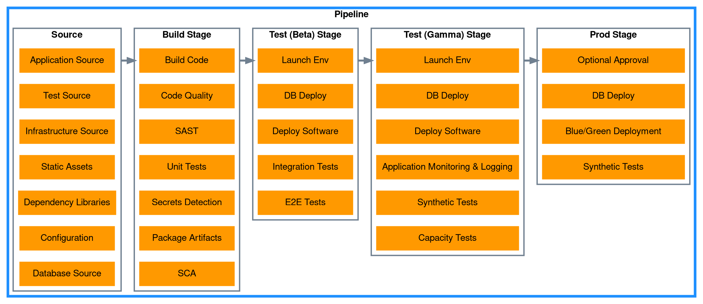

# CDK Pipeline

This presents a reference implementation of the [Application Pipeline](..) reference architecture. The pipeline is built with [AWS CodePipeline](https://aws.amazon.com/codepipeline/) and uses [AWS CodeBuild](https://aws.amazon.com/codebuild/) for building the software and performing testing tasks. All the infrastructure for this reference implementation is defined with [AWS Cloud Development Kit](https://aws.amazon.com/cdk/). The pipelines are defined using the [CDK Pipelines](https://docs.aws.amazon.com/cdk/api/v2/docs/aws-cdk-lib.pipelines-readme.html) L3 constructs. The source code for this reference implementation is available in [GitHub](https://github.com/aws-samples/aws-deployment-pipeline-reference-architecture/tree/main/examples/cdk-application-pipeline) for running in your own local account.



## Source

???+ required "Application Source Code"
    This reference implementation includes a [Spring Boot](https://spring.io/projects/spring-boot) application that exposes a REST API and uses a database for persistence. The API is implemented in `FruitController.java`:

    <!--codeinclude-->
    [](../../examples/cdk-application-pipeline/src/main/java/com/amazonaws/dpri/fruits/FruitController.java) block:FruitController
    <!--/codeinclude-->


    The application source code is stored in [AWS CodeCommit](https://aws.amazon.com/codecommit/) repository that is created and initialized from the CDK application in the `CodeCommitSource` construct:

    <!--codeinclude-->
    [](../../examples/cdk-application-pipeline/infrastructure/src/codecommit-source/index.ts) inside_block:constructor
    <!--/codeinclude-->

???+ required "Test Source Code"
    The reference implementation includes source code for unit, integration and end-to-end testing. Unit and integration tests can be found in `src/test/java`. For example, `FruitControllerTest.java` performs unit tests of each API path with the [JUnit](https://junit.org/) testing library:

    <!--codeinclude-->
    [](../../examples/cdk-application-pipeline/src/test/java/com/amazonaws/dpri/fruits/FruitControllerTest.java) block:shouldReturnList
    <!--/codeinclude-->

    End-to-end tests are preformed with with [SoapUI](https://www.soapui.org/) and are defined in `fruit-api-soapui-project.xml`. They are executed by [Maven](https://maven.apache.org/) using plugins in `pom.xml`. 

???+ required "Infrastructure Source Code"
    Code that defines both the deployment of the pipeline and the deployment of the application are stored in `infrastructure/` folder and uses [AWS Cloud Development Kit](https://aws.amazon.com/cdk/).

    <!--codeinclude-->
    [](../../examples/cdk-application-pipeline/infrastructure/src/deployment/index.ts) inside_block:constructor
    <!--/codeinclude-->

???+ required "Static Assets"
    There are no static assets used by the sample application.

???+ required "Dependency Libraries"
    All third-party libraries used by the sample application are define in the `pom.xml`:

    ```xml
    <dependencies>
		<dependency>
			<groupId>org.springframework.boot</groupId>
			<artifactId>spring-boot-starter-web</artifactId>
		</dependency>
		<dependency>
			<groupId>org.springframework.boot</groupId>
			<artifactId>spring-boot-starter-data-jpa</artifactId>
		</dependency>
		<dependency>
			<groupId>org.springframework.boot</groupId>
			<artifactId>spring-boot-starter-actuator</artifactId>
		</dependency>
		<dependency>
			<groupId>org.liquibase</groupId> 
			<artifactId>liquibase-core</artifactId>
		</dependency>
    </dependencies>
    ```

???+ required "Static Configuration"
    Static configuration for the application is defined in `src/main/resources/application.yml`:

    <!--codeinclude-->
    [](../../examples/cdk-application-pipeline/src/main/resources/application.yml)
    <!--/codeinclude-->

???+ required "Database Source Code"
    The code that manages the schema and initial data for the application is defined using [Liquibase](https://www.liquibase.org/) in `src/main/resources/db/changelog/db.changelog-master.yml`:

    <!--codeinclude-->
    [](../../examples/cdk-application-pipeline/src/main/resources/db/changelog/db.changelog-master.yaml)
    <!--/codeinclude-->

## Build

Actions in this stage all run in less than 10 minutes so that developers can take action on fast feedback before moving on to their next task. Each of the actions below are defined as code with [AWS Cloud Development Kit](https://aws.amazon.com/cdk/).

???+ required "Build Code"
    The Java source code is compiled, unit tested and packaged by [Maven](https://maven.apache.org/). A step is added to the pipeline through a CDK construct called `MavenBuild`:

    <!--codeinclude-->
    [](../../examples/cdk-application-pipeline/infrastructure/src/maven-build/index.ts) inside_block:constructor
    <!--/codeinclude-->

???+ required "Unit Tests"
    The unit tests are run by [Maven](https://maven.apache.org/) at the same time the `Build Code` action occurs. The results of the unit tests are uploaded to [AWS Code Build Test Reports](https://docs.aws.amazon.com/codebuild/latest/userguide/test-reporting.html) to track over time.

    

???+ required "Code Quality"
    A CDK construct was created to require that [Amazon CodeGuru](https://aws.amazon.com/codeguru/) performed a review on the most recent changes and that the recommendations don't exceed the severity thresholds. If no review was found or if the severity thresholds were exceeded, the pipeline fails. The construct is added to the pipeline with:

    <!--codeinclude-->
    [](../../examples/cdk-application-pipeline/infrastructure/src/pipeline.ts) block:CodeGuruReviewCheck
    <!--/codeinclude-->

    The `Filter` attribute can be customized to control what categories of recommendations are considered and what the thresholds are:

    ```typescript
    export enum CodeGuruReviewRecommendationCategory {
        AWS_BEST_PRACTICES = 'AWSBestPractices',
        AWS_CLOUDFORMATION_ISSUES = 'AWSCloudFormationIssues',
        CODE_INCONSISTENCIES = 'CodeInconsistencies',
        CODE_MAINTENANCE_ISSUES = 'CodeMaintenanceIssues',
        CONCURRENCY_ISSUES = 'ConcurrencyIssues',
        DUPLICATE_CODE = 'DuplicateCode',
        INPUT_VALIDATIONS = 'InputValidations',
        JAVA_BEST_PRACTICES = 'JavaBestPractices',
        PYTHON_BEST_PRACTICES = 'PythonBestPractices',
        RESOURCE_LEAKS = 'ResourceLeaks',
        SECURITY_ISSUES = 'SecurityIssues',
    }
    export class CodeGuruReviewFilter { 
        // Limit which recommendation categories to include
        recommendationCategories!: CodeGuruReviewRecommendationCategory[];

        // Fail if more that this # of lines of code were suppressed aws-codeguru-reviewer.yml
        maxSuppressedLinesOfCodeCount?: number;

        // Fail if more than this # of CRITICAL recommendations were found
        maxCriticalRecommendations?: number;

        // Fail if more than this # of HIGH recommendations were found
        maxHighRecommendations?: number;

        // Fail if more than this # of MEDIUM recommendations were found
        maxMediumRecommendations?: number;

        // Fail if more than this # of INFO recommendations were found
        maxInfoRecommendations?: number;

        // Fail if more than this # of LOW recommendations were found
        maxLowRecommendations?: number;
    }
    ```


    This adds an action to CodePipeline for 

    

    Additionally, [cdk-nag](https://github.com/cdklabs/cdk-nag) is run against both the pipeline stack and the deployment stack to identify any security issues with the resources being created. The pipeline will fail if any are detected. The following code demonstrates how cdk-nag is called as a part of the build stage. The code also demonstrates how to suppress findings.

    <!--codeinclude-->
    [](../../examples/cdk-application-pipeline/infrastructure/test/deployment.test.ts) inside_block:beforeEach
    <!--/codeinclude-->

???+ required "Secrets Detection"
    The same CDK construct that was created for *Code Quality* above is also used for secrets detection with [Amazon CodeGuru](https://aws.amazon.com/codeguru/).

???+ required "Static Application Security Testing (SAST)"
    The same CDK construct that was created for *Code Quality* above is also used for SAST with [Amazon CodeGuru](https://aws.amazon.com/codeguru/).

???+ required "Package and Store Artifact(s)"
    [AWS Cloud Development Kit](https://aws.amazon.com/cdk/) handles the packaging and storing of assets during the `Synth` action and `Assets` stage. The `Synth` action generates the CloudFormation templates to be deployed into the subsequent environments along with staging up the files necessary to create a docker image. The `Assets` stage then performs the docker build step to create a new image and push the image to [Amazon ECR](https://aws.amazon.com/ecr/) repositories in each environment account.

    

???+ required "Software Composition Analysis (SCA)"
    [Trivy](https://aquasecurity.github.io/trivy) is used to scan the source for vulnerabilities in its dependencies. The `pom.xml` and `Dockerfile` files are scanned for configuration issues or vulnerabilities in any dependencies. The scanning is accomplished by a CDK construct that creates a CodeBuild job to run `trivy`:

    <!--codeinclude-->
    [](../../examples/cdk-application-pipeline/infrastructure/src/pipeline.ts) block:TrivyScan
    <!--/codeinclude-->

    Trivy is also used within the `Dockerfile` to scan the image after it is built. The `docker build` will fail if Trivy finds any vulnerabilities in the final image:

    <!--codeinclude-->
    [](../../examples/cdk-application-pipeline/Dockerfile)
    <!--/codeinclude-->

## Test (Beta)

???+ required "Launch Environment"
    The infrastructure for each environment is defined in [AWS Cloud Development Kit](https://aws.amazon.com/cdk/):

    <!--codeinclude-->
    [](../../examples/cdk-application-pipeline/infrastructure/src/deployment/index.ts) inside_block:constructor
    <!--/codeinclude-->

    The `DeploymentStack` construct is then instantiated for each environment:

    ```typescript
    export const constants = {
        APP_NAME: 'fruit-api',
        TOOLCHAIN_ENV: { account: '000000000', region: 'us-west-2' },
        BETA_ENV: { account: '111111111', region: 'us-west-2' },
        GAMMA_ENV: { account: '222222222', region: 'us-west-2' },
        PROD_ENV: { account: '333333333', region: 'us-west-2' },
    } as const;

    const betaStage = new DeploymentStage(this, 'Beta', {
      env: constants.BETA_ENV,
    });
    pipeline.addStage(betaStage);
    ```

???+ required "Database Deploy"
    Spring Boot is configured to run [Liquibase](https://www.liquibase.org/) on startup. This reads the configuration in `src/main/resources/db/changelog/db.changelog-master.yml` to define the tables and initial data for the database:

    <!--codeinclude-->
    [](../../examples/cdk-application-pipeline/src/main/resources/db/changelog/db.changelog-master.yaml)
    <!--/codeinclude-->


???+ required "Deploy Software"
    The *Launch Environment* action above creates a new [Amazon ECS Task Definition](https://docs.aws.amazon.com/AmazonECS/latest/developerguide/task_definitions.html) for the new docker image and then updates the Amazon ECS Service to use the new Task Definition. for the new docker image and then updates the Amazon ECS Service to use the new Task Definition. for the new docker image and then updates the Amazon ECS Service to use the new Task Definition.

???+ required "Integration Tests"
    Integration tests are preformed during the *Build Source* action. They are defined with with [SoapUI](https://www.soapui.org/) in `fruit-api-soapui-project.xml`. They are executed by [Maven](https://maven.apache.org/) in the `integration-test` phase using plugins in `pom.xml`.  Spring Boot is configure to start a local instance of the application with an H2 database during the `pre-integration-test` phase and then to terminate on the `post-integration-test` phase.  The results of the unit tests are uploaded to [AWS Code Build Test Reports](https://docs.aws.amazon.com/codebuild/latest/userguide/test-reporting.html) to track over time.

    ```xml
        <plugins>
			<plugin>
				<groupId>org.springframework.boot</groupId>
				<artifactId>spring-boot-maven-plugin</artifactId>
				<executions>
					<execution>
					  <id>pre-integration-test</id>
					  <goals>
						<goal>start</goal>
					  </goals>
					</execution>
					<execution>
					  <id>post-integration-test</id>
					  <goals>
						<goal>stop</goal>
					  </goals>
					</execution>
				  </executions>
			</plugin>
			<plugin>
				<groupId>com.smartbear.soapui</groupId>
				<artifactId>soapui-maven-plugin</artifactId>
				<version>5.7.0</version>
				<configuration>
					<junitReport>true</junitReport>
					<outputFolder>target/soapui-reports</outputFolder>
					<endpoint>${soapui.endpoint}</endpoint>
				</configuration>
				<executions>
					<execution>
						<phase>integration-test</phase>
						<goals>
							<goal>test</goal>
						</goals>
					</execution>
				</executions>
			</plugin>
		</plugins>
    ```

???+ required "End-to-End (E2E) Tests"
    End-to-End tests are preformed after the *Launch Environment* and *Deploy Software* actions:

    
    
    The tests are defined with with [SoapUI](https://www.soapui.org/) in `fruit-api-soapui-project.xml`. They are executed by [Maven](https://maven.apache.org/) with the endpoint overridden to the URL from the CloudFormation output. A CDK construct called `SoapUITest` was created to create the CodeBuild Project to run SoapUI. 

    <!--codeinclude-->
    [](../../examples/cdk-application-pipeline/infrastructure/src/soapui-test/index.ts) inside_block:constructor
    <!--/codeinclude-->
    
    The results of the unit tests are uploaded to [AWS Code Build Test Reports](https://docs.aws.amazon.com/codebuild/latest/userguide/test-reporting.html) to track over time.

## Test (Gamma)

???+ required "Launch Environment"
    The infrastructure for each environment is defined in [AWS Cloud Development Kit](https://aws.amazon.com/cdk/):

    <!--codeinclude-->
    [](../../examples/cdk-application-pipeline/infrastructure/src/deployment/index.ts) inside_block:constructor
    <!--/codeinclude-->

    The `DeploymentStack` construct is then instantiated for each environment:

    ```typescript
    export const constants = {
        APP_NAME: 'fruit-api',
        TOOLCHAIN_ENV: { account: '000000000', region: 'us-west-2' },
        BETA_ENV: { account: '111111111', region: 'us-west-2' },
        GAMMA_ENV: { account: '222222222', region: 'us-west-2' },
        PROD_ENV: { account: '333333333', region: 'us-west-2' },
    } as const;

    const gammaStage = new DeploymentStage(this, 'Gamma', {
      env: constants.GAMMA_ENV,
    });
    pipeline.addStage(gammaStage);
    ```

???+ required "Database Deploy"
    Spring Boot is configured to run [Liquibase](https://www.liquibase.org/) on startup. This reads the configuration in `src/main/resources/db/changelog/db.changelog-master.yml` to define the tables and initial data for the database:

    <!--codeinclude-->
    [](../../examples/cdk-application-pipeline/src/main/resources/db/changelog/db.changelog-master.yaml)
    <!--/codeinclude-->

???+ required "Deploy Software"
    The *Launch Environment* action above creates a new [Amazon ECS Task Definition](https://docs.aws.amazon.com/AmazonECS/latest/developerguide/task_definitions.html) for the new docker image and then updates the Amazon ECS Service to use the new Task Definition. for the new docker image and then updates the Amazon ECS Service to use the new Task Definition. for the new docker image and then updates the Amazon ECS Service to use the new Task Definition.

???+ required "Application Monitoring & Logging"
    [Amazon ECS](https://aws.amazon.com/ecs/) uses [Amazon CloudWatch Metrics](https://docs.aws.amazon.com/AmazonCloudWatch/latest/monitoring/working_with_metrics.html) and [Amazon CloudWatch Logs](https://docs.aws.amazon.com/AmazonCloudWatch/latest/logs/WhatIsCloudWatchLogs.html) for observability by default.

???+ required "Synthetic Tests"
    [Amazon CloudWatch Synthetics](https://docs.aws.amazon.com/AmazonCloudWatch/latest/monitoring/CloudWatch_Synthetics_Canaries.html) is used to continuously deliver traffic to the application and assert that requests are successful and responses are received within a given threshold. The canary is defined via CDK:

    <!--codeinclude-->
    [](../../examples/cdk-application-pipeline/infrastructure/src/deployment/synthetic.ts) inside_block:constructor
    <!--/codeinclude-->

???+ required "Performance Tests"
    [Apache JMeter](https://jmeter.apache.org/) is used to run performance tests against the deployed application. The tests are stored in `src/test/jmeter` and added to the pipeline via CDK:

    <!--codeinclude-->
    [](../../examples/cdk-application-pipeline/infrastructure/src/pipeline.ts) block:JMeterTest
    <!--/codeinclude-->

???+ recommended "Chaos/Resiliency Tests"
    `Not Implemented`
    

## Prod

???+ required "Optional Approval"
    A manual approval step is added to the end of the `Beta` and `Gamma` stages. The step is added at the end to keep the environment in a stable state while manual testing is performed. Once the step is approved, the pipeline continues execution to the next stage.

    ```typescript
        pipeline.addStage(betaStage, {
            post: [
                new SoapUITest(this, 'E2E Test', {
                    source: source.codePipelineSource,
                    endpoint: betaStage.apiUrl,
                }),
                new ManualApprovalStep('PromoteFromBeta'),
            ],
        });
    ```

???+ required "Database Deploy"
    Spring Boot is configured to run [Liquibase](https://www.liquibase.org/) on startup. This reads the configuration in `src/main/resources/db/changelog/db.changelog-master.yml` to define the tables and initial data for the database:

    <!--codeinclude-->
    [](../../examples/cdk-application-pipeline/src/main/resources/db/changelog/db.changelog-master.yaml)
    <!--/codeinclude-->

???+ required "Progressive Deployment"
    `TODO: add blue/green deployment with CodeDeploy`

???+ required "Synthetic Tests"
    [Amazon CloudWatch Synthetics](https://docs.aws.amazon.com/AmazonCloudWatch/latest/monitoring/CloudWatch_Synthetics_Canaries.html) is used to continuously deliver traffic to the application and assert that requests are successful and responses are received within a given threshold. The canary is defined via CDK:

    <!--codeinclude-->
    [](../../examples/cdk-application-pipeline/infrastructure/src/deployment/synthetic.ts) inside_block:constructor
    <!--/codeinclude-->
