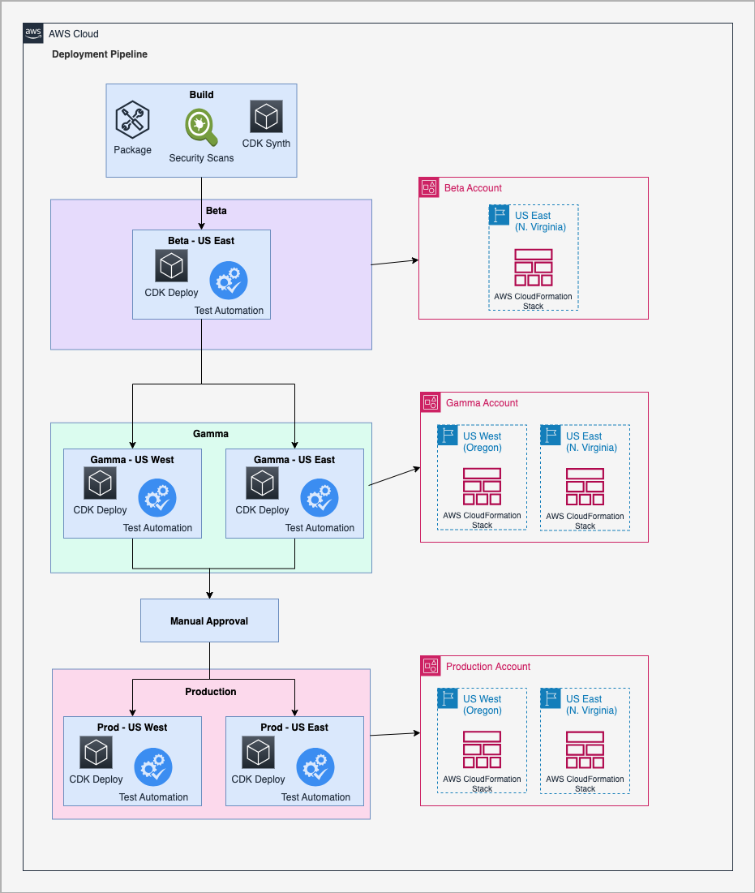
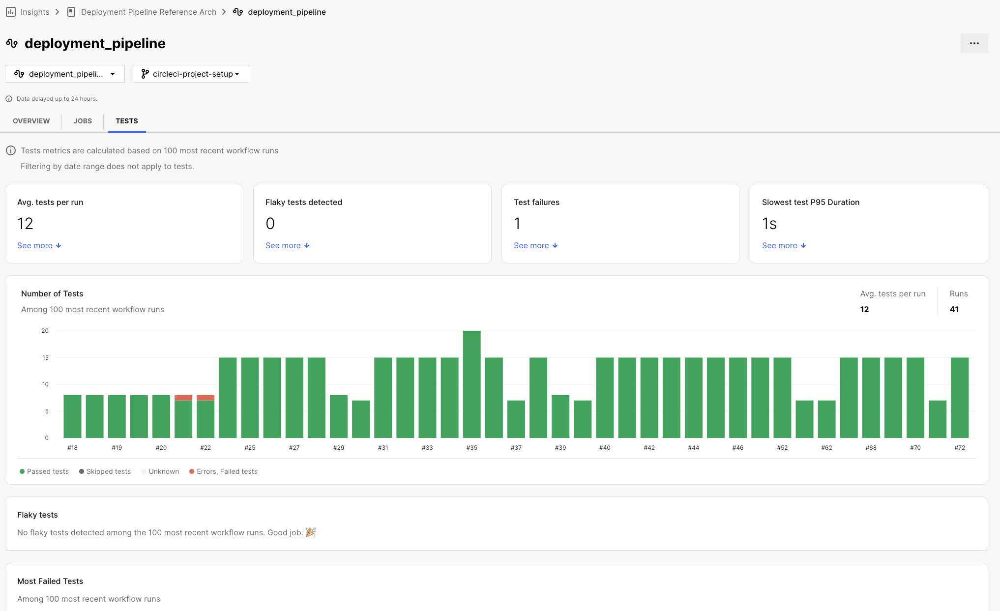
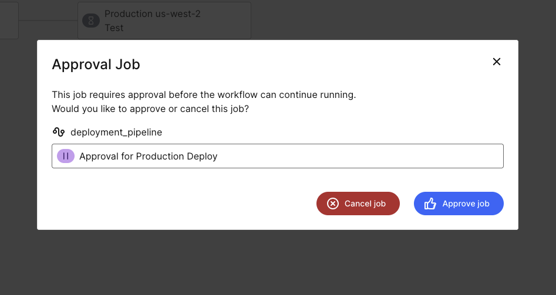

# CircleCI Pipeline

This presents a reference implementation of the [Application Pipeline](..) reference architecture. The pipeline is created with [CircleCI](https://circleci.com/) for building the software and performing testing tasks. All the infrastructure for this reference implementation is defined with [AWS Cloud Development Kit](https://aws.amazon.com/cdk/). The source code for this reference implementation is available in [GitHub](https://github.com/aws-samples/aws-deployment-pipeline-reference-architecture/tree/main/examples/circleci-application-pipeline) for review.

This reference implementation can be utilized by forking this repository and onboarding the project to CircleCI. Once you've forked the repo, you can use the provided CircleCI configuration file to set up your CI/CD pipeline and start automating your builds, tests, and deployments on CircleCI.

Additionally, you will need to create [CircleCI contexts](https://circleci.com/docs/contexts) to securely store credentials and environment variables. These contexts will allow your pipeline to interact with CircleCI and any third-party services required by the project.

Lastly, establish an [OIDC connection](https://circleci.com/docs/openid-connect-tokens/) between CircleCI and AWS to enable secure, identity-based access. Once the necessary IAM role has been created, update the CircleCI configuration parameters with your AWS account ID and the role’s ARN to complete the setup.


???+ danger "Disclaimer"
    This reference implementation is intended to serve as an example of how to accomplish the guidance in the reference architecture using [CircleCI](https://circleci.com/). The reference implementation has intentionally not followed the following [AWS Well-Architected](https://aws.amazon.com/architecture/well-architected/) best practices to make it accessible by a wider range of customers. Be sure to address these before using parts of this code for any workloads in your own environment:

    * [ ] **cdk bootstrap with AdministratorAccess** - the default policy used for `cdk bootstrap` is `AdministratorAccess` but should be replaced with a more appropriate policy with least privilege in your account.
    * [ ] **TLS on HTTP endpoint** - the listener for the sample application uses HTTP instead of HTTPS to avoid having to create new ACM certificates and Route53 hosted zones. This should be replaced in your account with an `HTTPS` listener.



## Local Development

Developers need fast-feedback for potential issues with their code. Automation should run in their developer workspace to give them feedback before the deployment pipeline runs.

???+ required "Pre-Commit Hooks"
    Pre-Commit hooks are scripts that are executed on the developer's workstation when they try to create a new commit. These hooks have an opportunity to inspect the state of the code before the commit occurs and abort the commit if tests fail. An example of pre-commit hooks are [Git hooks](https://git-scm.com/book/en/v2/Customizing-Git-Git-Hooks#_git_hooks).  Examples of tools to configure and store pre-commit hooks as code include but are not limited to [husky](https://github.com/typicode/husky) and [pre-commit](https://pre-commit.com/#install).

    The following `.pre-commit-config.yaml` is added to the repository that will build the code with [Maven](https://maven.apache.org/), run unit tests with [JUnit](https://junit.org), check for code quality with [Checkstyle](https://github.com/checkstyle/checkstyle), run static application security testing with [PMD](https://pmd.github.io/latest/index.html) and check for secrets in the code with [gitleaks](https://github.com/zricethezav/gitleaks).

    <!--codeinclude-->
    [](../../examples/circleci-application-pipeline/.pre-commit-config.yaml)
    <!--/codeinclude-->

## Source

???+ required "Application Source Code"
    The application source code can be found in the [src/main/java](https://github.com/aws-samples/aws-deployment-pipeline-reference-architecture/tree/main/examples/circleci-application-pipeline/src/main/java) directory. It is intended to serve only as a reference and should be replaced by your own application source code.

    This reference implementation includes a [Spring Boot](https://spring.io/projects/spring-boot) application that exposes a REST API and uses a database for persistence. The API is implemented in `FruitController.java`:

    <!--codeinclude-->
    [](../../examples/circleci-application-pipeline/src/main/java/com/amazonaws/dpri/fruits/FruitController.java) block:FruitController
    <!--/codeinclude-->


    The application source code is stored in the version control system (VCS) you link to CircleCI. To get started quickly, simply fork this repository and connect it to CircleCI to begin setting up your CI/CD pipeline.

???+ required "Test Source Code"
    The test source code can be found in the [src/test/java](https://github.com/aws-samples/aws-deployment-pipeline-reference-architecture/tree/main/examples/circleci-application-pipeline/src/test/java) directory. It is intended to serve only as a reference and should be replaced by your own test source code.

    The reference implementation includes source code for unit, integration and end-to-end testing. Unit and integration tests can be found in `src/test/java`. For example, `FruitControllerWithoutClassificationTest.java` performs unit tests of each API path with the [JUnit](https://junit.org/) testing library:

    <!--codeinclude-->
    [](../../examples/circleci-application-pipeline/src/test/java/com/amazonaws/dpri/fruits/FruitControllerWithoutClassificationTest.java) block:shouldReturnList
    <!--/codeinclude-->

    Acceptance tests are preformed with [SoapUI](https://www.soapui.org/) and are defined in `fruit-api-soapui-project.xml`. They are executed by [Maven](https://maven.apache.org/) using plugins in `pom.xml`.

???+ required "Infrastructure Source Code"
    The infrastructure source code can be found in the [infrastructure](https://github.com/aws-samples/aws-deployment-pipeline-reference-architecture/tree/main/examples/circleci-application-pipeline/infrastructure) directory. It is intended to serve as a reference but much of the code can also be reused in your own CDK applications.

    Infrastructure source code defines the deployment of the application are stored in `infrastructure/` folder and uses [AWS Cloud Development Kit](https://aws.amazon.com/cdk/).

    <!--codeinclude-->
    [](../../examples/circleci-application-pipeline/infrastructure/src/deployment.ts) inside_block:constructor
    <!--/codeinclude-->

    Notice that the infrastructure code is written in [Typescript](https://www.typescriptlang.org/) which is different from the Application Source Code (Java). This was done intentionally to demonstrate that CDK allows defining infrastructure code in whatever language is most appropriate for the team that owns the use of CDK in the organization.

???+ required "Static Assets"
    There are no static assets used by the sample application.

???+ required "Dependency Manifests"
    All third-party dependencies used by the sample application are define in the `pom.xml`:

    ```xml
    <dependencies>
        <dependency>
            <groupId>org.springframework.boot</groupId>
            <artifactId>spring-boot-starter-web</artifactId>
        </dependency>
        <dependency>
            <groupId>org.springframework.boot</groupId>
            <artifactId>spring-boot-starter-data-jpa</artifactId>
        </dependency>
        <dependency>
            <groupId>org.springframework.boot</groupId>
            <artifactId>spring-boot-starter-actuator</artifactId>
        </dependency>
        <dependency>
            <groupId>org.liquibase</groupId>
            <artifactId>liquibase-core</artifactId>
        </dependency>
    </dependencies>
    ```

???+ required "Static Configuration"
    Static configuration for the application is defined in `src/main/resources/application.yml`:

    <!--codeinclude-->
    [](../../examples/circleci-application-pipeline/src/main/resources/application.yml)
    <!--/codeinclude-->

???+ required "Database Source Code"
    The database source code can be found in the [src/main/resources/db](https://github.com/aws-samples/aws-deployment-pipeline-reference-architecture/tree/main/examples/circleci-application-pipeline/src/main/resources/db) directory. It is intended to serve only as a reference and should be replaced by your own database source code.

    The code that manages the schema and initial data for the application is defined using [Liquibase](https://www.liquibase.org/) in `src/main/resources/db/changelog/db.changelog-master.yml`:

    <!--codeinclude-->
    [](../../examples/circleci-application-pipeline/src/main/resources/db/changelog/db.changelog-master.yaml)
    <!--/codeinclude-->

## Build

Actions in this stage are designed to complete in under 3 minutes, allowing developers to quickly receive feedback and address any issues before moving on to their next task. Each of the actions below is defined as code using the [CircleCI configuration file](https://circleci.com/docs/configuration-reference) to ensure consistency and repeatability.

???+ required "Build Code"
    The Java source code is compiled, unit tested and packaged by [Maven](https://maven.apache.org/). An action is added to the workflow to build and package the source code:

    ```yaml
      package:
        docker:
          - image: cimg/openjdk:17.0
        working_directory: << pipeline.parameters.working-dir >>
        environment:
          TRIVY_DB_REPOSITORY: public.ecr.aws/aquasecurity/trivy-db
        steps:
          - checkout:
              path: ~/aws-deployment-pipeline-reference-architecture
          - restore_cache:
              keys:
                - maven-repo-v1-{{ checksum "pom.xml" }}
          - run:
              name: Run Maven Verify
              command: mvn verify --batch-mode --no-transfer-progress
          - save_cache:
              paths:
                - ~/.m2/repository
              key: maven-repo-v1-{{ checksum "pom.xml" }}
          - trivy/scan:
              scan-type: fs
              ignore-unfixed: true
              format: spdx-json
              output: << pipeline.parameters.working-dir >>/dependency-results.sbom.json
          - store_test_results:
              path: << pipeline.parameters.working-dir >>/target/surefire-reports
          - store_test_results:
              path: << pipeline.parameters.working-dir >>/target/soapui-reports
          - store_artifacts:
              path: << pipeline.parameters.working-dir >>/dependency-results.sbom.json
          - store_artifacts:
              path: << pipeline.parameters.working-dir >>/target/spotbugsXml.xml    
          - store_artifacts:
              path: << pipeline.parameters.working-dir >>/target/jmeter/results
          - store_artifacts:
              path: << pipeline.parameters.working-dir >>/target/fruit-api.jar
          - persist_to_workspace:
              root: << pipeline.parameters.working-dir >>
              paths:
                - target/fruit-api.jar
    ```

???+ required "Unit Tests"
    The unit tests are run by [Maven](https://maven.apache.org/) simultaneously with the `Build Code` step. The results of the unit tests are then uploaded to [CircleCI Test Insights](https://circleci.com/docs/insights) to track test performance and trends over time. CircleCI Test Insights provides visibility into test results, helping you monitor for any regressions and improve the efficiency of your testing process.

  

???+ required "Code Quality"
    Code quality is enforced through the [PMD](https://maven.apache.org/plugins/maven-pmd-plugin/) and [Checkstyle](https://maven.apache.org/plugins/maven-checkstyle-plugin/) Maven plugins:

    ```xml
        <plugin>
            <artifactId>maven-pmd-plugin</artifactId>
            <configuration>
                <printFailingErrors></printFailingErrors>
            </configuration>
            <executions>
                <execution>
                    <phase>test</phase>
                    <goals>
                        <goal>check</goal>
                    </goals>
                </execution>
            </executions>
        </plugin>
        <plugin>
            <artifactId>maven-checkstyle-plugin</artifactId>
            <configuration>
                <printFailingErrors></printFailingErrors>
            </configuration>
            <executions>
                <execution>
                    <phase>test</phase>
                    <goals>
                        <goal>check</goal>
                    </goals>
                </execution>
            </executions>
        </plugin>
    ```

    Additionally, [cdk-nag](https://github.com/cdklabs/cdk-nag) is run against the deployment stack to identify any security issues with the resources being created. The pipeline will fail if any are detected. The following code demonstrates how cdk-nag is called as a part of the build stage. The code also demonstrates how to suppress findings.

    <!--codeinclude-->
    [](../../examples/circleci-application-pipeline/infrastructure/test/deployment.test.ts) inside_block:beforeEach
    <!--/codeinclude-->

???+ required "Secrets Detection"
    [Trivy](https://aquasecurity.github.io/trivy) is used to scan the source for secrets. The [Trivy CircleCI Orb](https://circleci.com/developer/orbs/orb/cci-labs/trivy) is used in the CircleCI workflow to perform the scan:

    ```yaml
      trivy:
        docker:
          - image: cimg/base:2024.11
        working_directory: << pipeline.parameters.working-dir >>
        steps:
          - checkout:
              path: ~/aws-deployment-pipeline-reference-architecture
          - trivy/scan:
              scan-type: fs
              ignore-unfixed: true
              format: sarif
              output: << pipeline.parameters.working-dir >>/report.sarif
              scanners: vuln,secret,misconfig,license
          - store_artifacts:
              path: << pipeline.parameters.working-dir >>/report.sarif
        environment:
          TRIVY_DB_REPOSITORY: public.ecr.aws/aquasecurity/trivy-db
    ```

???+ required "Static Application Security Testing (SAST)"
    The [SpotBugs](https://spotbugs.github.io/) Maven plugin is used along with the [Find Security Bugs](https://find-sec-bugs.github.io/) plugin to identify OWASP Top 10 and CWE vulnerabilities in the application source code.

???+ required "Package and Store Artifact(s)"

    CircleCI utilizes [workspaces](https://circleci.com/docs/workspaces) to transfer artifacts between jobs in the pipeline, allowing seamless handoff from one job to the next. For logs, scan reports, and other assets users want to keep for reference, CircleCI’s [artifact storage](https://circleci.com/docs/artifacts/) can be used to retain these files.

    The [AWS Cloud Development Kit (CDK)](https://aws.amazon.com/cdk/) is then leveraged to use the artifacts generated earlier in the CircleCI pipeline in the deployment jobs. This process includes building Docker images and publishing them to [Amazon ECR](https://aws.amazon.com/ecr/) repositories, ensuring all assets are readily available for deployment across environments.

???+ required "Software Composition Analysis (SCA)"
    [Trivy](https://aquasecurity.github.io/trivy) is used to scan the source for vulnerabilities in its dependencies. The `pom.xml` and `Dockerfile` files are scanned for configuration issues or vulnerabilities in any dependencies. The scanning is accomplished by a CircleCI Orb that runs Trivy CLI:

    ```yaml
      trivy:
        docker:
          - image: cimg/base:2024.11
        working_directory: << pipeline.parameters.working-dir >>
        steps:
          - checkout:
              path: ~/aws-deployment-pipeline-reference-architecture
          - trivy/scan:
              scan-type: fs
              ignore-unfixed: true
              format: sarif
              output: << pipeline.parameters.working-dir >>/report.sarif
              scanners: vuln,secret,misconfig,license
          - store_artifacts:
              path: << pipeline.parameters.working-dir >>/report.sarif
        environment:
          TRIVY_DB_REPOSITORY: public.ecr.aws/aquasecurity/trivy-db
    ```

    Trivy is also used within the `Dockerfile` to scan the image after it is built. The `docker build` will fail if Trivy finds any vulnerabilities in the final image:

    <!--codeinclude-->
    [](../../examples/circleci-application-pipeline/Dockerfile)
    <!--/codeinclude-->

???+ required "Software Bill of Materials (SBOM)"
    Trivy generates an SBOM in the form of a [SPDX](https://spdx.dev/wp-content/uploads/sites/41/2020/08/SPDX-specification-2-2.pdf) JSON report. The SBOM is saved as a CircleCI artifact.  Trivy supports additional SBOM formats such as [CycloneDX](https://cyclonedx.org/), and [SARIF](https://docs.oasis-open.org/sarif/sarif/v2.0/sarif-v2.0.html).

    Immortally, the Trivy scan to generate the SBOM happens in the same job as the building of the application. This ensures that the software and dependencies used to build the artifact are tracked.

    ```yaml
      package:
        docker:
          - image: cimg/openjdk:17.0
        working_directory: << pipeline.parameters.working-dir >>
        environment:
          TRIVY_DB_REPOSITORY: public.ecr.aws/aquasecurity/trivy-db
        steps:
          - checkout:
              path: ~/aws-deployment-pipeline-reference-architecture
          - restore_cache:
              keys:
                - maven-repo-v1-{{ checksum "pom.xml" }}
          - run:
              name: Run Maven Verify
              command: mvn verify --batch-mode --no-transfer-progress
          - save_cache:
              paths:
                - ~/.m2/repository
              key: maven-repo-v1-{{ checksum "pom.xml" }}
          - trivy/scan:
              scan-type: fs
              ignore-unfixed: true
              format: spdx-json
              output: << pipeline.parameters.working-dir >>/dependency-results.sbom.json
          - store_test_results:
              path: << pipeline.parameters.working-dir >>/target/surefire-reports
          - store_test_results:
              path: << pipeline.parameters.working-dir >>/target/soapui-reports
          - store_artifacts:
              path: << pipeline.parameters.working-dir >>/dependency-results.sbom.json
          - store_artifacts:
              path: << pipeline.parameters.working-dir >>/target/spotbugsXml.xml    
          - store_artifacts:
              path: << pipeline.parameters.working-dir >>/target/jmeter/results
          - store_artifacts:
              path: << pipeline.parameters.working-dir >>/target/fruit-api.jar
          - persist_to_workspace:
              root: << pipeline.parameters.working-dir >>
              paths:
                - target/fruit-api.jar
    ```

## Test (Beta)

???+ required "Launch Environment"
    

    The infrastructure for each environment is defined in [AWS Cloud Development Kit](https://aws.amazon.com/cdk/):

    <!--codeinclude-->
    [](../../examples/circleci-application-pipeline/infrastructure/src/deployment.ts) inside_block:constructor
    <!--/codeinclude-->

    The CDK deployment is then performed for each environment. The deployment steps are the same for each environment with only the defined parameters changing like `environment` and `region`. Using CircleCI's reusable config, you can defined the deployment job once and use that job for other deployments. 

    Here is the generic deployment job:

    ```yaml
      deploy:
          docker:
            - image: cimg/aws:2024.03
          parameters:
            environment:
              type: string
              default: Beta
            stack-name:
              type: string
              default: fruit-api
            region:
              type: string
              default: us-east-1
            cdk-context:
              type: string
              default: deploymentConfigurationName=CodeDeployDefault.ECSCanary10Percent5Minutes
          working_directory: << pipeline.parameters.working-dir >>
          steps:
            - checkout:
                path: ~/aws-deployment-pipeline-reference-architecture
            - attach_workspace:
                at: << pipeline.parameters.working-dir >>
            - setup_remote_docker:
                docker_layer_caching: true
            - aws-cli/setup:
                profile_name: default
                role_arn: << pipeline.parameters.aws-role-arn >>
                role_session_name: default
            - install-cdk
            - run:
                name: Set CDK Env Vars
                command: |
                  echo "export CDK_DEFAULT_ACCOUNT=<< pipeline.parameters.aws-account-id >>" >> $BASH_ENV
                  echo "export CDK_DEFAULT_REGION=<< parameters.region >>" >> $BASH_ENV
            - run:
                name: Bootstrap CDK Environment
                command: cdk bootstrap aws://$CDK_DEFAULT_ACCOUNT/$CDK_DEFAULT_REGION
            - run:
                name: Deploy CDK Stack << parameters.stack-name >>
                command: |
                  cdk deploy << parameters.stack-name >> \
                    --region << parameters.region >> \
                    --outputs-file cdk-output.json \
                    --context << parameters.cdk-context >> \
                    --require-approval never
                no_output_timeout: 20m
            - run:
                command: cat cdk-output.json
            - store_artifacts:
                path: << pipeline.parameters.working-dir >>/cdk-output.json
            - persist_to_workspace:
                root: << pipeline.parameters.working-dir >>
                paths:
                  - cdk-output.json
    ```

    For deploying to the Beta environment the follow job is used:

    ```yaml
        - deploy:
            name: Beta Deploy
            requires:
              - Verify CDK Synth
              - Run Trivy Scan
              - Build Application
              - Scanning for Secrets with GitGuardian
    ```

???+ required "Database Deploy"
    Spring Boot is configured to run [Liquibase](https://www.liquibase.org/) on startup. This reads the configuration in `src/main/resources/db/changelog/db.changelog-master.yml` to define the tables and initial data for the database:

    <!--codeinclude-->
    [](../../examples/circleci-application-pipeline/src/main/resources/db/changelog/db.changelog-master.yaml)
    <!--/codeinclude-->

???+ required "Deploy Software"
    The *Launch Environment* action above creates a new [Amazon ECS Task Definition](https://docs.aws.amazon.com/AmazonECS/latest/developerguide/task_definitions.html) for the new docker image and then updates the Amazon ECS Service to use the new Task Definition.

???+ required "Integration Tests"
    Integration tests are preformed during the *Build Source* action. They are defined with [SoapUI](https://www.soapui.org/) in `fruit-api-soapui-project.xml`. They are executed by [Maven](https://maven.apache.org/) in the `integration-test` phase using plugins in `pom.xml`.  Spring Boot is configure to start a local instance of the application with an H2 database during the `pre-integration-test` phase and then to terminate on the `post-integration-test` phase.  The results of the unit tests are then uploaded to [CircleCI Test Insights](https://circleci.com/docs/insights) to track test performance and trends over time.

    ```xml
    <plugins>
        <plugin>
            <groupId>org.springframework.boot</groupId>
            <artifactId>spring-boot-maven-plugin</artifactId>
            <executions>
                <execution>
                    <id>pre-integration-test</id>
                    <goals>
                        <goal>start</goal>
                    </goals>
                </execution>
                <execution>
                    <id>post-integration-test</id>
                    <goals>
                        <goal>stop</goal>
                    </goals>
                </execution>
            </executions>
        </plugin>
        <plugin>
            <groupId>com.smartbear.soapui</groupId>
            <artifactId>soapui-maven-plugin</artifactId>
            <version>5.7.0</version>
            <configuration>
                <junitReport>true</junitReport>
                <outputFolder>target/soapui-reports</outputFolder>
                <endpoint>${soapui.endpoint}</endpoint>
            </configuration>
            <executions>
                <execution>
                    <phase>integration-test</phase>
                    <goals>
                        <goal>test</goal>
                    </goals>
                </execution>
            </executions>
        </plugin>
    </plugins>
    ```

???+ required "Acceptance Tests"
    Acceptance tests are preformed after the *Launch Environment* and *Deploy Software* actions:

    The tests are defined with [SoapUI](https://www.soapui.org/) in `fruit-api-soapui-project.xml`. They are executed by [Maven](https://maven.apache.org/) with the endpoint overridden to the URL from the CloudFormation output. A test job is added after each deployment in the CircleCI workflow to run SoapUI.

    Just like the deployment, you can use CircleCI's reusable config, have a generic test job. The test steps are the same for each environment with only the defined parameters changing like `environment` and `region`.

    Here is the generic test job:

    ```yaml
      test:
          docker:
            - image: cimg/openjdk:17.0
          parameters:
            environment:
              type: string
              default: Beta
            region:
              type: string
              default: us-east-1
            threads:
              type: integer
              default: 300
            duration:
              type: integer
              default: 300
            throughput:
              type: integer
              default: 6000
          working_directory: << pipeline.parameters.working-dir >>
          steps:
            - checkout:
                path: ~/aws-deployment-pipeline-reference-architecture
            - attach_workspace:
                at: << pipeline.parameters.working-dir >>
            - run:
                name: Extract endpointUrl from CDK Output
                command: |
                  # Extract the endpointUrl from the CDK output JSON
                  if [ -f cdk-output.json ]; then
                    endpoint_url=$(jq -r '.["fruit-api"].endpointUrl' cdk-output.json)
                    echo "export ENDPOINT_URL=$endpoint_url" >> $BASH_ENV
                    echo "Endpoint URL extracted: $endpoint_url"
                  else
                    echo "CDK output file not found."
                    exit 1
                  fi
            - restore_cache:
                keys:
                  - maven-repo-v1-{{ checksum "pom.xml" }}
            - run:
                name: Run SoapUI Tests against << parameters.environment >>
                command: mvn --batch-mode --no-transfer-progress soapui:test -Dsoapui.endpoint=${ENDPOINT_URL}
            - run:
                name: Run JMeter Tests against << parameters.environment >>
                command: mvn --batch-mode --no-transfer-progress compile jmeter:jmeter jmeter:results -Djmeter.endpoint=${ENDPOINT_URL} -Djmeter.threads=<< parameters.threads >> -Djmeter.duration=<< parameters.duration >> -Djmeter.throughput=<< parameters.throughput >>
            - save_cache:
                paths:
                  - ~/.m2/repository
                key: maven-repo-v1-{{ checksum "pom.xml" }}      
            - store_test_results:
                path: << pipeline.parameters.working-dir >>/target/soapui-reports
            - store_artifacts:
                path: << pipeline.parameters.working-dir >>/target/jmeter/results
    ```

    For testing to the Beta environment the follow job is used:
    
    ```yaml
        - test:
            name: Beta Test
            environment: Beta
            requires:
              - "Beta Deploy"
    ```

    The results of the unit tests are uploaded to [CircleCI Test Insights](https://circleci.com/docs/insights) to be tracked over time.

## Test (Gamma)

???+ required "Launch Environment"
    

    The infrastructure for each environment is defined in [AWS Cloud Development Kit](https://aws.amazon.com/cdk/):

    <!--codeinclude-->
    [](../../examples/circleci-application-pipeline/infrastructure/src/deployment.ts) inside_block:constructor
    <!--/codeinclude-->

    The CDK deployment is then performed for each environment. Since the deployment is the same as Beta, but with the `environment` and `region` parameters changed, you can refer back to the Beta deployment for the CircleCI config.

    Here is the unique Gamma deployment job: 

    ```yaml
        - deploy:
            name: "<< matrix.environment >> << matrix.region>> Deploy"
            matrix:
              parameters:
                environment: [Gamma]
                region: [us-east-1, us-west-2]
            requires:
              - "Beta Test"
            filters:
              branches:
                only:
                  - main
    ```

???+ required "Database Deploy"
    Spring Boot is configured to run [Liquibase](https://www.liquibase.org/) on startup. This reads the configuration in `src/main/resources/db/changelog/db.changelog-master.yml` to define the tables and initial data for the database:

    <!--codeinclude-->
    [](../../examples/circleci-application-pipeline/src/main/resources/db/changelog/db.changelog-master.yaml)
    <!--/codeinclude-->

???+ required "Deploy Software"
    The *Launch Environment* action above creates a new [Amazon ECS Task Definition](https://docs.aws.amazon.com/AmazonECS/latest/developerguide/task_definitions.html) for the new docker image and then updates the Amazon ECS Service to use the new Task Definition.

???+ required "Application Monitoring & Logging"
    [Amazon ECS](https://aws.amazon.com/ecs/) uses [Amazon CloudWatch Metrics](https://docs.aws.amazon.com/AmazonCloudWatch/latest/monitoring/working_with_metrics.html) and [Amazon CloudWatch Logs](https://docs.aws.amazon.com/AmazonCloudWatch/latest/logs/WhatIsCloudWatchLogs.html) for observability by default.

???+ required "Synthetic Tests"
    [Amazon CloudWatch Synthetics](https://docs.aws.amazon.com/AmazonCloudWatch/latest/monitoring/CloudWatch_Synthetics_Canaries.html) is used to continuously deliver traffic to the application and assert that requests are successful and responses are received within a given threshold. The canary is defined via CDK using the [@cdklabs/cdk-ecs-codedeploy](https://constructs.dev/packages/@cdklabs/cdk-ecs-codedeploy) construct:

    ```ts
    const service = new ApplicationLoadBalancedCodeDeployedFargateService(this, 'Api', {
      ...

      apiCanaryTimeout: Duration.seconds(5),
      apiTestSteps: [{
        name: 'getAll',
        path: '/api/fruits',
        jmesPath: 'length(@)',
        expectedValue: 5,
      }],
    ```

???+ required "Performance Tests"
    [Apache JMeter](https://jmeter.apache.org/) is used to run performance tests against the deployed application. The tests are stored in `src/test/jmeter` and added to the CircleCI workflow:

    Just like the deployment, you can use CircleCI's reusable config, have a generic test job. Since the testing is the same as Beta, but with the `environment` and `region` parameters changed, you can refer back to the Beta testing for the CircleCI config.
    
    
     The test steps are the same for each environment with only the defined parameters changing like `environment` and `region`.

    Here is the unique Gamma deployment job: 

    ```yaml
      - test:
      name: "<< matrix.environment >> << matrix.region>> Test"
      matrix:
        parameters:
          environment: [Gamma]
          region: [us-east-1, us-west-2]
      requires:
        - << matrix.environment >> << matrix.region>> Deploy
      filters:
        branches:
          only:
            - main
    ```

???+ recommended "Resilience Tests"
    `Not Implemented`

???+ recommended "Dynamic Application Security Testing (DAST)"
    `Not Implemented`

## Prod

???+ required "Manual Approval"
    For manual approvals, you can use CircleCI’s [hold job](https://circleci.com/docs/workflows/#holding-a-workflow-for-a-manual-approval), which pauses the pipeline and waits for someone to approve it before proceeding. In this reference architecture, manual approvals are used to gate deployments to production. If code is pushed to a development or non-production branch, the pipeline will run all jobs up to the Gamma deployment stage. For production branches (in this case, `main`), the pipeline will deploy to Gamma, and if successful, a manual approval gate will activate. Once a designated individual or group approves this job, the pipeline will continue to deploy to production.
    



???+ required "Database Deploy"
    Spring Boot is configured to run [Liquibase](https://www.liquibase.org/) on startup. This reads the configuration in `src/main/resources/db/changelog/db.changelog-master.yml` to define the tables and initial data for the database:

    <!--codeinclude-->
    [](../../examples/circleci-application-pipeline/src/main/resources/db/changelog/db.changelog-master.yaml)
    <!--/codeinclude-->

???+ required "Progressive Deployment"
    Progressive deployment is implemented with [AWS CodeDeploy](https://aws.amazon.com/codedeploy/) for ECS. CodeDeploy performs a [linear blue/green](https://docs.aws.amazon.com/AmazonECS/latest/developerguide/deployment-type-bluegreen.html) by deploying the new task definition as a new task with a separate target group and then shifting 10% of traffic every minute until all traffic is shifted. A CloudWatch alarm is monitored by CodeDeploy and an automatic rollback is triggered if the alarm exceeds the threshold.

    

    Implementation of this type deployment presents challenges due to the following limitations:

    * [aws/aws-cdk #19163](https://github.com/aws/aws-cdk/issues/19163) - CDK Pipelines aren't intended to be used with CodeDeploy actions.
    * [AWS CloudFormation User Guide](https://docs.aws.amazon.com/AWSCloudFormation/latest/UserGuide/blue-green.html#blue-green-considerations) - The use of `AWS::CodeDeploy::BlueGreen` hooks and `AWS::CodeDeployBlueGreen` restricts the types of changes that can be made. Additionally, you can't use auto-rollback capabilities of CodeDeploy.
    * [aws/aws-cdk #5170](https://github.com/aws/aws-cdk/issues/5170) - CDK doesn't support defining CloudFormation rollback triggers. This rules out CloudFormation based blue/green deployments.

    The solution was to use the [@cdklabs/cdk-ecs-codedeploy](https://constructs.dev/packages/@cdklabs/cdk-ecs-codedeploy) construct from the Construct Hub which addresses [aws/aws-cdk #1559](https://github.com/aws/aws-cdk/issues/1559) - Lack of support for Blue/Green ECS Deployment in CDK. 

    ```typescript
    const service = new ApplicationLoadBalancedCodeDeployedFargateService(this, 'Api', {
      cluster,
      capacityProviderStrategies: [
        {
          capacityProvider: 'FARGATE_SPOT',
          weight: 1,
        },
      ],
      minHealthyPercent: 50,
      maxHealthyPercent: 200,
      desiredCount: 3,
      cpu: 512,
      memoryLimitMiB: 1024,
      taskImageOptions: {
        image,
        containerName: 'api',
        containerPort: 8080,
        family: appName,
        logDriver: AwsLogDriver.awsLogs({
          logGroup: appLogGroup,
          streamPrefix: 'service',
        }),
        secrets: {
          SPRING_DATASOURCE_USERNAME: Secret.fromSecretsManager( dbSecret, 'username' ),
          SPRING_DATASOURCE_PASSWORD: Secret.fromSecretsManager( dbSecret, 'password' ),
        },
        environment: {
          SPRING_DATASOURCE_URL: `jdbc:mysql://${db.clusterEndpoint.hostname}:${db.clusterEndpoint.port}/${dbName}`,
        },
      },
      deregistrationDelay: Duration.seconds(5),
      responseTimeAlarmThreshold: Duration.seconds(3),
      healthCheck: {
        healthyThresholdCount: 2,
        unhealthyThresholdCount: 2,
        interval: Duration.seconds(60),
        path: '/actuator/health',
      },
      deploymentConfig,
      terminationWaitTime: Duration.minutes(5),
      apiCanaryTimeout: Duration.seconds(5),
      apiTestSteps: [{
        name: 'getAll',
        path: '/api/fruits',
        jmesPath: 'length(@)',
        expectedValue: 5,
      }],
    });

    this.apiUrl = new CfnOutput(this, 'endpointUrl', {
      value: `http://${service.listener.loadBalancer.loadBalancerDnsName}`,
    });
    ```rrideLogicalId('DeploymentId');
    ```

    Deployments are rolled out incrementally across regions in waves using CircleCI’s [matrix](https://circleci.com/docs/using-matrix-jobs/) and [parallelism](https://circleci.com/docs/parallelism-faster-jobs). Each wave consists of a set of regions to deploy to in parallel, allowing you to deploy to multiple regions simultaneously within each wave. Once a wave completes, the pipeline will proceed to the next wave, ensuring a controlled, staggered deployment across regions.

???+ required "Synthetic Tests"
    [Amazon CloudWatch Synthetics](https://docs.aws.amazon.com/AmazonCloudWatch/latest/monitoring/CloudWatch_Synthetics_Canaries.html) is used to continuously deliver traffic to the application and assert that requests are successful and responses are received within a given threshold. The canary is defined via CDK using the [@cdklabs/cdk-ecs-codedeploy](https://constructs.dev/packages/@cdklabs/cdk-ecs-codedeploy) construct:

    ```ts
    const service = new ApplicationLoadBalancedCodeDeployedFargateService(this, 'Api', {
      ...

      apiCanaryTimeout: Duration.seconds(5),
      apiTestSteps: [{
        name: 'getAll',
        path: '/api/fruits',
        jmesPath: 'length(@)',
        expectedValue: 5,
      }],
    ```

## Frequently Asked Questions

???+ faq "What [operating models](https://docs.aws.amazon.com/wellarchitected/latest/operational-excellence-pillar/operating-model.html) does this reference implementation support?"

    This reference implementation can accommodate any operation model with minor updates:

    * [Fully Separated](https://docs.aws.amazon.com/wellarchitected/latest/operational-excellence-pillar/fully-separated-operating-model.html) - Restrict the role that CDK uses for CloudFormation execution to only create resources from approved product portfolios in [AWS Service Catalog](https://aws.amazon.com/servicecatalog/). Ownership of creating the products in Service Catalog is owned by the **Platform Engineering** team and operational support of Service Catalog is owned by the **Platform Operations** team. The **Platform Engineering** team should publish CDK constructs internally that provision AWS resources through Service Catalog. Update the CDK app in the `infrastructure/` directory to use CDK constructs provided by the `Platform Engineering` team. Use a [CODEOWNERS](https://docs.github.com/en/repositories/managing-your-repositorys-settings-and-features/customizing-your-repository/about-code-owners) file to require all changes to the `infrastructure/` directory be approved by the **Application Operations** team. Additionally, restrict permissions to the **Manual Approval** action to only allow members of the **Application Operations** to approve.
    * [Separated AEO and IEO with Centralized Governance](https://docs.aws.amazon.com/wellarchitected/latest/operational-excellence-pillar/separated-aeo-and-ieo-with-centralized-governance.html) - Restrict the role that CDK uses for CloudFormation execution to only create resources from approved product portfolios in [AWS Service Catalog](https://aws.amazon.com/servicecatalog/). Ownership of creating the products in Service Catalog is owned by the **Platform Engineering** team and operational support of Service Catalog is owned by the **Platform Engineering** team. The **Platform Engineering** team should publish CDK constructs internally that provision AWS resources through Service Catalog. Update the CDK app in the `infrastructure/` directory to use CDK constructs provided by the `Platform Engineering` team.
    * [Separated AEO and IEO with Decentralized Governance](https://docs.aws.amazon.com/wellarchitected/latest/operational-excellence-pillar/separated-aeo-and-ieo-with-decentralized-governance.html) - The **Platform Engineering** team should publish CDK constructs internally that provision AWS resources in manner that achieve organizational compliance. Update the CDK app in the `infrastructure/` directory to use CDK constructs provided by the `Platform Engineering` team.
