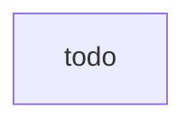

# Compute Image Pipeline

The compute image pipeline applies infrastructure as code to create compute images that can be used by application/service deployment pipelines to launch environments from code. As part of an image baking deployment pipeline, run image scanning and infrastructure analysis to identify vulnerable configuration code (e.g., container manifests) or vulnerable runtime images (e.g. EC2 instances and containers). Use static analysis and fully-managed services for preventative and detective controls. On AWS, the output artifacts are often Amazon Machine Images (AMIs) or Container Images published to a container registry.

## Source

* Test source code
* Infrastructure as code
* Configuration

## Pre-Commit hooks

* *Secrets Detection* - Identify secrets such as usernames, passwords, and access keys in code and other files before they are published to a repository by using pre-commit hooks. When discovering secrets, the code push should fail immediately.
* *IDE Plugins* - Warn developers in their IDE using plugins and extensions such as. Examples could include markdown linters, yaml/json validators, and flake8/PEP8 code quality analyzers.

## Build

All actions run In this stage are also run on developers’ local environments prior to code commit and peer review.

* *Policy as Code* - Run preventative automated checks are run to ensure that the code and environments conform to organization/team policy. For example, these checks might alert when code defines volumes or buckets as not encrypted, services not enabled, or endpoints not protected. When policies are violated, AWS recommends the build fails so that developers can fix the errors. (e.g., cfn_nag, CloudFormation Guard, OPA, IAM Access Analyzer, Amazon Inspector Network Reachability, VPC Reachability Analyzer)
* *Secrets Detection & Repo Cleansing* - Identify secrets such as usernames, passwords, and access keys. When secrets are discovered, the build fails and all secrets in the source code repo history are purged. (e.g., Amazon CodeGuru Secrets Detection, git-secrets)
* *Vulnerability Assessment* - Collects events from vulnerability intelligence sources such as CVE, the National Vulnerability Database (NVD), and MITRE and alert on vulnerabilities. (e.g., Amazon Inspector)
* *IaC Unit Tests* - Run automated test-driven infrastructure based on requirements (e.g., Cucumber/Gherkin, Rego)

## Test (Multiple Stages)

* *Build Environment* - Launch an environment from IaC templates (e.g., EC2 Image Builder, Packer)
* *Integration Tests* - Run tests against the launched environment to check for errors (e.g., AWS TaskCat)
* *Approval* - Optional action as part of a automated workflow, obtain authorized human approval before completing deployment. (e.g., CodePipeline Approval)

## Prod

* *Generate Service Catalog Product* - Provide shared services through a service catalog so that teams can obtain the software through self-service means in a controlled manner. IAM policies ensure only the necessary access is applied to principals.
* *Package and Store Artifact(s)* - Generate AMI or Container Image and store in a binary repository so that it can be consumed by an application/service pipeline. (e.g., AWS AMI, Amazon Elastic Container Registry, Docker Hub, Amazon S3)
