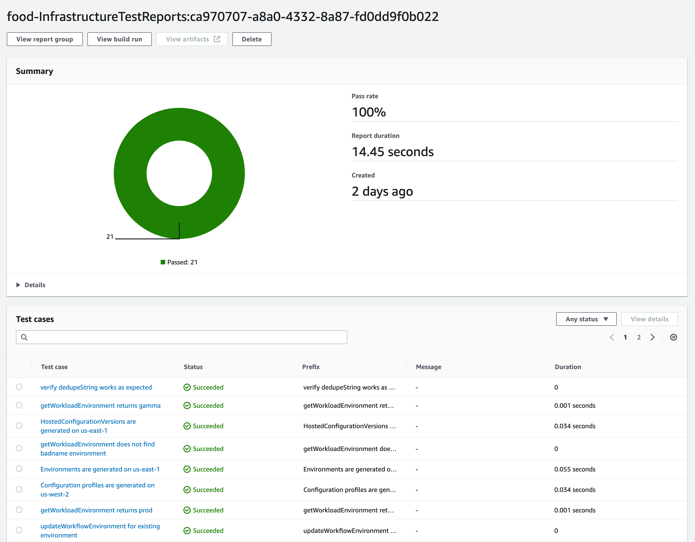
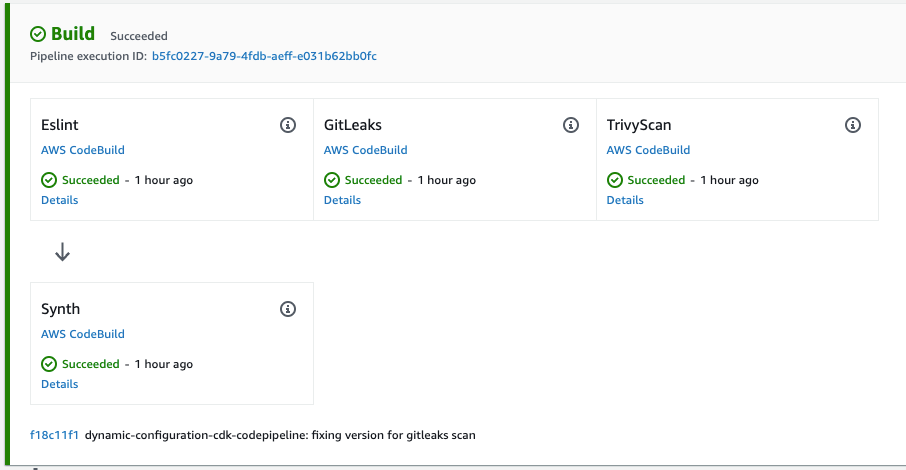

# Dynamic Config Pipeline reference implementation

This presents a reference implementation of the [Dynamic Configuration Pipeline](..) reference architecture. All infrastructure for this reference implementation is defined using the [AWS Cloud Development Kit (CDK)](https://aws.amazon.com/cdk/). The pipeline is defined using [CDK Pipelines](https://docs.aws.amazon.com/cdk/api/v2/docs/aws-cdk-lib.pipelines-readme.html), which provisions the pipeline in [AWS CodePipeline](https://aws.amazon.com/codepipeline/). The source code for this reference implementation is available in [GitHub](https://github.com/aws-samples/aws-deployment-pipeline-reference-architecture/tree/main/examples/dynamic-configuration-cdk-codepipeline) for running in your own AWS accounts.

This reference implementation follows the following architecture:


## Local Development

Developers need fast feedback for potential issues with their code. Automation should run in their developer workspace to give them feedback before the deployment pipeline runs.

???+ required "Pre-Commit Hooks"
    Pre-Commit hooks are scripts that are executed on the developer's workstation when they try to create a new commit. These hooks have an opportunity to inspect the state of the code before the commit occurs and abort the commit if tests fail. An example of pre-commit hooks are [Git hooks](https://git-scm.com/book/en/v2/Customizing-Git-Git-Hooks#_git_hooks).  Examples of tools to configure and store pre-commit hooks as code include but are not limited to [husky](https://github.com/typicode/husky) and [pre-commit](https://pre-commit.com/#install).

    <!--codeinclude-->
    [](../../examples/dynamic-configuration-cdk-codepipeline/.pre-commit-config.yaml)
    <!--/codeinclude-->

## Source

???+ required "Infrastructure Source Code"
    The infrastructure source code can be found in the [infrastructure](https://github.com/aws-samples/aws-deployment-pipeline-reference-architecture/tree/main/examples/dynamic-configuration-cdk-codepipeline/infrastructure) directory. It is intended to serve as a reference, but much of the code can also be reused in your own CDK applications.

    The infrastructure source code defines both the deployment pipeline ([AWS CodePipeline](https://aws.amazon.com/codepipeline/) and the infrastructure that allows to store, manage and access the configuration ([AWS AppConfig](https://docs.aws.amazon.com/appconfig/). 

    <!--codeinclude-->
    [](../../examples/dynamic-configuration-cdk-codepipeline/infrastructure/src/security/dynamic-configuration-security-stack.ts) inside_block:constructor
    <!--/codeinclude-->

    Please note that the infrastructure code is written in [Typescript](https://www.typescriptlang.org/), which is one of six (as of April 2023) programming languages supported by CDK.

???+ required "IaC Unit Test Code"
    The infrastructure as code unit test source code can be found in the [infrastructure/test](https://github.com/aws-samples/aws-deployment-pipeline-reference-architecture/tree/main/examples/dynamic-configuration-cdk-codepipeline/infrastructure/test) directory. It is intended to serve as a reference but much of the code can also be reused in your own CDK applications.

    <!--codeinclude-->
    [](../../examples/dynamic-configuration-cdk-codepipeline/infrastructure/test/dynamic-configuration-core-stack.test.ts) inside_block:codeIncludeReference
    <!--/codeinclude-->

???+ required "Feature Flags"
    [Feature Flags](https://aws.amazon.com/blogs/mt/using-aws-appconfig-feature-flags/) are stored in [AWS AppConfig](https://docs.aws.amazon.com/appconfig/), which is part of [AWS Systems Manager](https://aws.amazon.com/systems-manager/). Feature Flags are defined in the [config/features](https://github.com/aws-samples/aws-deployment-pipeline-reference-architecture/tree/main/examples/dynamic-configuration-cdk-codepipeline/config/features) directory. Within that directory you will see 2 files, one for the feature flag definitions and the other for the values:

    **definitions.yaml:** defines all feature flag and their types.

    <!--codeinclude-->
    [](../../examples/dynamic-configuration-cdk-codepipeline/config/features/definitions.yaml)
    <!--/codeinclude-->

    **values.yaml:** Defines the values of all feature flags. Feature Flags are not intended to be used for environment- or region-specific configuration, e.g. enabling a feature only in production or enabling specific features in specific regions. Feature Flags are intended to enable separating release from deployment, so feature flag changes are released in the same way a software release version would be released. For every change to the Feature Flag values in this file, AppConfig creates a new version, which resembles the sum of all feature flag values. This version is deployed to the environments following the Software Development Lifecycle, i.e. to Beta first, then to Gamma and then to Production.

    <!--codeinclude-->
    [](../../examples/dynamic-configuration-cdk-codepipeline/config/features/values.yaml)
    <!--/codeinclude-->

???+ required "Operational Configuration"
    Operational Configuration is stored in [AWS AppConfig](https://docs.aws.amazon.com/appconfig/) as well. Operational Configuration is defined in the [config/operations](https://github.com/aws-samples/aws-deployment-pipeline-reference-architecture/tree/main/examples/dynamic-configuration-cdk-codepipeline/config/operations) directory. Within that directory, there is a JSON Schema file that defines the requires structure of operational configuration in every environment as well as environment-specific YAML files defining the configuration values per environment.

    **schema.json:** defines the JSON schema that the Operational Configuration for each environment needs to satisfy.

    <!--codeinclude-->
    [](../../examples/dynamic-configuration-cdk-codepipeline/config/operations/schema.json)
    <!--/codeinclude-->

    **{environmentName}.yaml:** stores the operational configuration values, whereas`{environmentName}` matches the `name` parameter of the `workloadEnvironments` within the `cdk.json` file.

    <!--codeinclude-->
    [](../../examples/dynamic-configuration-cdk-codepipeline/config/operations/prod.yaml)
    <!--/codeinclude-->

## Build

Actions in this stage all run in less than 10 minutes so that developers can take action on fast feedback before moving on to their next task. Each of the actions below are defined as code with [AWS Cloud Development Kit](https://aws.amazon.com/cdk/).

???+ required "Synthesize Code"
    Uses your [AWS Cloud Development Kit](https://aws.amazon.com/cdk/) code to generate the [AWS CloudFormation](https://aws.amazon.com/cloudformation/) templates for your pipeline and resources.

???+ required "IaC Unit Tests"
    The unit tests are run by [npm](https://docs.npmjs.com/) at the same time the `synth` action occurs. The results of the unit tests are uploaded to [AWS Code Build Test Reports](https://docs.aws.amazon.com/codebuild/latest/userguide/test-reporting.html) to be able to track them over time.

    

???+ required "Code Quality"
    [ESLint](https://eslint.org/) statically analyzes your code to quickly find issues. You can use [ESLint](https://eslint.org/) to create a series of assertions (called lint rules) that define how your code should look or behave. [ESLint](https://eslint.org/) also has auto-fixer suggestions to help you improve your code. The pipeline will fail if any errors are found.

    

    Additionally, [cdk-nag](https://github.com/cdklabs/cdk-nag) is run to identify any security issues with the resources being created. The pipeline will fail if any are detected. The following code demonstrates how cdk-nag is called as a part of the build stage. The code also demonstrates how to suppress findings.

    <!--codeinclude-->
    [](../../examples/dynamic-configuration-cdk-codepipeline/infrastructure/src/index.ts)
    <!--/codeinclude-->

???+ required "Secrets Detection"
    [Gitleaks](https://github.com/gitleaks/gitleaks) is used for secrets detection. The scanning is accomplished by a CDK CodeBuild job to run `Gitleaks`:

    <!--codeinclude-->
    [](../../examples/dynamic-configuration-cdk-codepipeline/infrastructure/src/pipeline-stack.ts) inside_block:codeIncludeReferenceGitLeaks
    <!--/codeinclude-->

???+ required "Static Application Security Testing (SAST)"
    The CodeBuild jobs for [Gitleaks](https://github.com/gitleaks/gitleaks) and [Trivy](https://aquasecurity.github.io/trivy) are also used for SAST.

???+ required "Software Composition Analysis (SCA)"
    [Trivy](https://aquasecurity.github.io/trivy) is used to scan the source for vulnerabilities in its dependencies. The configuration files are scanned for configuration issues or vulnerabilities in any dependencies. The scanning is accomplished by a CDK construct that creates a CodeBuild job to run `trivy`:

    <!--codeinclude-->
    [](../../examples/dynamic-configuration-cdk-codepipeline/infrastructure/src/pipeline-stack.ts) block:TrivyScan
    <!--/codeinclude-->

???+ required "Software Bill of Materials (SBOM)"
    Trivy generates an SBOM in the form of a [CycloneDX](https://cyclonedx.org/) JSON report. The SBOM is saved as a CodePipeline asset.  Trivy supports additional SBOM formats such as [SPDX](https://spdx.dev/wp-content/uploads/sites/41/2020/08/SPDX-specification-2-2.pdf), and [SARIF](https://docs.oasis-open.org/sarif/sarif/v2.0/sarif-v2.0.html).

## Deployments

This reference implementations contains multiple CloudFormation stack deployments.

### Core

Creates the [AppConfig](https://docs.aws.amazon.com/appconfig/latest/userguide/what-is-appconfig.html) [application](https://docs.aws.amazon.com/appconfig/latest/userguide/appconfig-creating-application.html), [deployment strategy](https://docs.aws.amazon.com/appconfig/latest/userguide/appconfig-creating-deployment-strategy.html), [environments](https://docs.aws.amazon.com/appconfig/latest/userguide/appconfig-creating-environment.html), [feature flags and operational configurations](https://docs.aws.amazon.com/appconfig/latest/userguide/appconfig-creating-configuration-and-profile.html) and stores their references in the System Manager [Parameter Store](https://docs.aws.amazon.com/systems-manager/latest/userguide/systems-manager-parameter-store.html) for all regions listed in `cdk.json` under `workloadEnvironments`. It also generates [IAM Policies](https://docs.aws.amazon.com/IAM/latest/UserGuide/access_policies_managed-vs-inline.html#aws-managed-policies) for access to those resources in preparation for the deployment stage.

`workloadEnvironments` is populated by the [bootstrap.ts](https://github.com/aws-samples/aws-deployment-pipeline-reference-architecture/tree/main/examples/dynamic-configuration-cdk-codepipeline/scripts/bootstrap.ts) script and may also be edited manually.

```json
{
"workloadEnvironments": [
    {
        "name": "alpha",
        "workloadOrganizationPath": "o-orgid/r-rootid/ou-rootid-ouid/ou-abcd-aaaaaaa0",
        "waves": [
            {
                "name": "alpha",
                "regions": ["us-west-2"]
            }
        ]
    },
    {
        "name": "beta",
        "workloadOrganizationPath": "o-orgid/r-rootid/ou-rootid-ouid/ou-abcd-aaaaaaa0",
        "waves": [
            {
                "name": "beta",
                "regions": ["us-west-2"]
            }
        ]
    },
    {
        "name": "gamma",
        "workloadOrganizationPath": "o-orgid/r-rootid/ou-rootid-ouid/ou-abcd-bbbbbbb0",
        "waves": [
            {
                "name": "gamma",
                "regions": ["eu-central-1", "us-east-1"]
            }
        ]
    },
    {
        "name": "prod",
        "workloadOrganizationPath": "o-orgid/r-rootid/ou-rootid-ouid/ou-abcd-ccccccc0",
        "waves": [
            {
                "name": "Prod-Americas",
                "regions": ["us-east-1", "us-west-2"]
            },
            {
                "name": "Prod-Europe",
                "regions": ["eu-central-1", "eu-west-1"]
            }
        ]
    }
],
}
```

The `name` property represents the workload environment name to be used.

The `workloadOrganizationPath` property is the [organizational unit path](https://docs.aws.amazon.com/organizations/latest/userguide/orgs_manage_ous.html#create_ou) used to [share your AWS resources with groups of AWS accounts in AWS Organizations](https://aws.amazon.com/blogs/security/iam-share-aws-resources-groups-aws-accounts-aws-organizations/).

The `waves` array defines the number of wave deployments each environment will have. Each wave will have a `name` and list of `regions` where the deployment will happen. Deployments will be done in the order specified in `workloadEnvironments` in `cdk.json` file.

See [Automating safe, hands-off deployments](https://aws.amazon.com/builders-library/automating-safe-hands-off-deployments/) for more details about wave deployments.

### Global

Generates one [role](https://docs.aws.amazon.com/IAM/latest/UserGuide/id_roles.html) per [environment](https://docs.aws.amazon.com/appconfig/latest/userguide/appconfig-creating-environment.html), and attaches the managed policies created by the `core` stage pertinent to that specific environment.

<!--codeinclude-->
[](../../examples/dynamic-configuration-cdk-codepipeline/infrastructure/src/security/dynamic-configuration-security-stack.ts) inside_block:constructor
<!--/codeinclude-->

### Service Discovery

Adds the ARN of the roles created by the `Global` stage to the parameter store within the tools account, so they can be referenced by the application pipeline.

<!--codeinclude-->
[](../../examples/dynamic-configuration-cdk-codepipeline/infrastructure/src/service-discovery/service-discovery-stack.ts) inside_block:constructor
<!--/codeinclude-->

### Environment

Deploys the configuration (Feature Flags and Operational Configuration) to [AWS AppConfig](https://docs.aws.amazon.com/appconfig/) for all regions listed in the `cdk.json` under `workloadEnvironments`.

The `waves` array defines the number of Waves for  each environment. Each Wave has a `name` and list of `regions` where the deployment will happen. Deployments will be done in the order specified in `workloadEnvironments` in `cdk.json`.

See [Automating safe, hands-off deployments](https://aws.amazon.com/builders-library/automating-safe-hands-off-deployments/) for more details about wave deployments.
