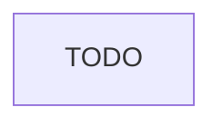

# Machine Learning Pipeline

TODO, reference architecture has not completed design & review process.

Reference Materials:
* https://aws.amazon.com/blogs/machine-learning/mlops-foundation-roadmap-for-enterprises-with-amazon-sagemaker/
* https://github.com/aws-samples/sagemaker-custom-project-templates/tree/main/mlops-multi-account-cdk
* https://docs.aws.amazon.com/whitepapers/latest/ml-best-practices-healthcare-life-sciences/ml-best-practices-healthcare-life-sciences.pdf?did=wp_card&trk=wp_card
* https://github.com/aws-samples/sagemaker-mlops-with-terraform

## Source

## Pre-Commit hooks

## Build

## Test (beta)

## Test (Gamma)

## Prod
