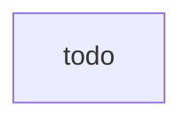

# Machine Learning Pipeline

WIP
AWS implementation:
Using step functions or [Amazon MWAA](https://aws.amazon.com/managed-workflows-for-apache-airflow/)

https://aws.amazon.com/blogs/big-data/building-complex-workflows-with-amazon-mwaa-aws-step-functions-aws-glue-and-amazon-emr/

Work with [Bhushan Chirmade](https://app.slack.com/team/W017PJLJTEG)

## Source

## Pre-Commit hooks

## Build

## Test (beta)

## Test (Gamma)

## Prod

