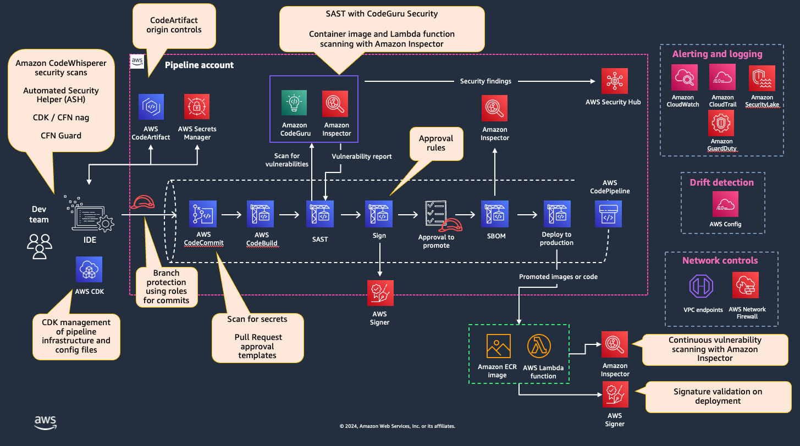

# Mitigating OWASP Top 10 Secure CI/CD Risks using AWS services

## Introduction 

Adoption of cloud has been driven significantly by organizations having 
unlocked ability to increase the velocity of which they release their
applications to their customers. Continuous Integration and Continuous
Deployment (CI/CD) pipelines have become a foundational engine which our
customers use to develop, build, test, and release their code into
production in an automated and repeatable manner. These characteristics
have also introduced new attack vectors which organizations need to be
aware of to maintain the confidentiality, integrity, and availability of
their code. In October 2022, the Open Web Application Security Project
(OWASP) released a [Top 10 on CI/CD
risks](https://owasp.org/www-project-top-10-ci-cd-security-risks/)
highlighting specific security risks affecting software build and
deployment infrastructure.  

This blog series will focus primarily on how AWS Developer Tools and
Security Services can be architected and configured to reduce the
likelihood and impact of the threats highlighted by OWASP. This blog
post will be the first in a series of three posts on the topic. Please
note, the guidance and implementation options do not constitute an
exhaustive list of all possible ways to mitigate the risks identified by
the OWASP guidance, rather it is intended to demonstrate some good
practices you can apply to your CI/CD environments using AWS services.

This blog post will focus primarily on how AWS services can be
configured to mitigate these risks as highlighted by OWASP. However, in
some instances, open-source tooling may be referenced as well.  

## Overview 

The risks identified by OWASP range from a lack of branch protection on
software source code repositories to inadequate visibility and
monitoring throughout the deployment pipelines. AWS Developer Tools are
a suite of AWS managed services that include source code management,
continuous integration, and continuous deployment capabilities. These
services, working alongside our Security services such as [AWS
Inspector,](https://aws.amazon.com/inspector/) [Amazon
CodeGuru](https://aws.amazon.com/codeguru/), [Amazon
GuardDuty,](https://aws.amazon.com/guardduty/) [AWS
SecurityHub](https://aws.amazon.com/security-hub/), and [AWS Identity
and Access Management (IAM)](https://aws.amazon.com/iam/) can be used
effectively to reduce the risks identified by OWASP by automating the
reasoning of software properties, and helping builders to develop
release at scale in a secure manner. The diagram below illustrates an
example pipeline architecture that can be used as a guide to implement
the aforementioned AWS services for secure software build and release:

*
 Figure 1: Example Pipeline Architecture
*

The following sections will highlight the main risks associated with each
threat from the OWASP Top 10 for CI/CD pipelines, discuss
recommendations to mitigate that risk, and provide implementation
examples using a combination of people, process, and technologies. 

#### CICID-SEC-1: Insufficient Flow Control Mechanisms

**Risk description**

Flow control mechanisms are preventive security controls that enforce
the flow of software changes through different stages of the software
build and release process --- compilation, build, testing, and
eventually, release to non-production and production environments. As
software source code changes progress through each stage of the
pipeline, code reviews, unit testing, and approvals need to be
implemented in order to ensure that software is released in a secure,
consistent, repeatable, and automated fashion that leads to more
resilient and secure software. A more specific example of a flow control
mechanism is requiring an approval to merge software changes to a main
branch associated with a production environment. The absence of robust
flow control mechanisms within a system can introduce opportunities for
threat actors to inject malicious or unexpected code directly into
critical and sensitive environments without appropriate safeguards and
checks. This could result in degraded or negatively impacted business
operations or loss of sensitive information.  

**Recommendations**

To effectively address this security risk within the AWS environment,
organizations should implement the following recommendations:

-   **Define a pipeline configuration based on least privilege:** Create a pipeline configuration that enforces least
    privilege principles and deploys access control mechanisms
    throughout the CI/CD pipeline to limit unauthorized interactions and
    minimize the attack surface.

-   **Deploy pull request approval mechanisms:** Incorporate
    defined approval rules for critical junctures or for higher risk
    environments such as production pipelines where it makes sense.
    Manual approvals act as a vital checkpoint, allowing designated
    individuals to review and authorize code changes before they are
    deployed into sensitive environments.

-   **Implement automated actions based on security checks:** Integrate
    security checks in your CI/CD pipeline, with a policy which defines
    when to pass the build. Examples for checks are: static code
    scanning, software composition analysis and security testing.

**Implementation**

To put these recommendations into practice within the AWS environment,
organizations can utilize the following:

-   **Use AWS CodeCommit:** [AWS CodeCommit](https://aws.amazon.com/codecommit/) is a fully managed source control service that provides secure and scalable code
    hosting. It allows organizations to implement robust version control
    mechanisms for their codebase and supported granular identity based
    policies. 

    -   **Branching and Merging:**  AWS CodeCommit allows for branching
        and merging of code changes. Developers can work on separate
        branches and merge their changes into the main codebase when
        ready.

    -   **Version Control:** AWS CodeCommit allows you to store and
        manage versions of your source code and related assets. It uses
        Git as its underlying version control system.

    -   **Pull Requests:** AWS CodeCommit offers a Pull Request (PR)
        feature that allows developers to propose and review changes.
        This facilitates code reviews, collaboration, and ensures that
        code changes meet quality standards before being merged into the
        main branch. PRs can help enforce a controlled flow of code
        changes.

-   **Restrict access to sensitive branches:** Limit pushes and merges
    to sensitive branches such as the main branch. This is accomplished
    by defining explicit deny statements in an IAM policy associated to
    the Amazon Resource Name (ARN) of the repository that contains the
    branch for which you want to restrict access. By restricting access
    to these critical branches, organizations can prevent unauthorized
    software changes from entering sensitive environments.

-   **Use approval rule templates:** Use approval rule templates in
    CodeCommit to designate specific individuals or roles as approvers
    who must review and approve code changes before changes are merged
    into the main branch. 

-   **Notify on sensitive pushes:** Introduce alerts for pushes to the
    CodeCommit repository using CodeCommit triggers.  Alerts to
    development teams should be triggered when commits are merged into
    sensitive branches such as main. Alerts on critical events like
    pushes to sensitive branches serve as a defense-in-depth control.

-   **Implement custom approvals:** Implement AWS CodePipeline with
    custom approval actions to automate approvals based on security
    check results in AWS CodeBuild.

**References**

For detailed guidance on implementing these recommendations,
organizations can refer to the following AWS documentation resources:

-   **Conditional Branching in AWS CodeCommit:** 
<https://docs.aws.amazon.com/codecommit/latest/userguide/how-to-conditional-branch.html>

-   **Authentication and Access Control for AWS
    CodeCommit:** 
    <https://docs.aws.amazon.com/codecommit/latest/userguide/auth-and-access-control.html>

-   **CodeCommit
    Triggers:** 
    <https://docs.aws.amazon.com/codecommit/latest/userguide/how-to-notify.html>

-   **Approval Rules in AWS CodeCommit:**
<https://docs.aws.amazon.com/codecommit/latest/userguide/how-to-create-pull-request-approval-rule.html>

-   **Approval rule templates in AWS CodeCommit:** 
<https://docs.aws.amazon.com/codecommit/latest/userguide/approval-rule-templates.html>

-   **Create a notification rule in AWS CodeCommit:** 
<https://docs.aws.amazon.com/codecommit/latest/userguide/notification-rule-create.html>

-   **Manage approval actions in AWS CodePipeline:** 
<https://docs.aws.amazon.com/codepipeline/latest/userguide/approvals.html>

#### CICID-SEC-2: Inadequate IAM

**Risk Description**

Inadequate Identity and Access Management (IAM) arises from the
challenges of managing myriad identities used from source control to
software deployment.  Access for both programmatic and human principals
need to be provisioned and de-provisioned in a manner consistent with
organizational security policies and risk thresholds. Orphaned or stale
identities provide a threat vector for actors to use to gain
unauthorized access to sensitive environments and information. 
Furthermore, identities have a tendency to become more permissive over
their lifetimes (e.g., permissions creep), making regular access reviews
and effective permissions reduction necessary to maintain least
privilege access.  

**Recommendations**

To effectively address this security risk within the AWS environment,
organizations should implement the following recommendations:

-   **Federate identities:** Federate identities into AWS for
    centralized identity management, avoiding the creation of local IAM
    users. Ensure that users no longer requiring access are disabled or
    removed and that security policies align with the organization's
    standards.

-   **Continuously analyze AWS identities:** Implement continuous
    monitoring and analysis of all identities with access to AWS Code
    services. This includes mapping the identity provider, assessing
    permissions granted, and verifying permissions actually utilized.
    Ensure coverage of all programmatic access methods within AWS.

-   **Optimize permissions:** Optimize permissions for IAM users, roles,
    and policies across various AWS services to align with the principle
    of least privilege.

-   **Remove stale identities:** Establish an acceptable timeframe for
    disabling or removing inactive IAM identities within AWS and enforce
    the deactivation of identities that surpass this predetermined
    period of inactivity.

-   **Share resources securely with third party:** Long-term credentials
    should be deprecated in favor of cross-account roles or IAM Roles
    Anywhere. Continuously monitor and anticipate changes in third-party
    needs, and access patterns, and be prepared to revoke access as
    necessary. Implement detection methods to alert you to unexpected
    changes and measure the impact of revocation operations.

**Implementation**

To put these recommendations into practice within the AWS environment,
organizations can utilize the following:

-   **Use AWS Identity Center:** Integrate AWS IAM Identity Center and
    federated identities to AWS Code services, with centralized identity
    providers for streamlined identity management. 

-   **Continuous monitor AWS CloudTrail logs:** Use AWS CloudTrail to
    continuously monitor AWS API calls to AWS Code services and collect
    data for identity and access analysis.

-   **Optimize IAM permissions across principals involved in the
    pipeline:** Leverage AWS IAM to manage and optimize permissions
    across AWS Code services. Use IAM Access Analyzer to automate least
    privilege policy generation based on access activity.

**References**

For detailed guidance on implementing these recommendations,
organizations can refer to the following AWS documentation resources:

-   **Logging AWS CodeCommit API Calls with AWS CloudTrail:** 
<https://docs.aws.amazon.com/codecommit/latest/userguide/integ-cloudtrail.html>

-   **Federated Multi-Account Access for AWS CodeCommit:**
 <https://aws.amazon.com/blogs/devops/federated-multi-account-access-for-aws-codecommit/>

-   **IAM Access Analyzer Makes It Easier to Implement Least Privilege
    Permissions by Generating IAM Policies Based on Access
    Activity:** 
    <https://aws.amazon.com/blogs/security/iam-access-analyzer-makes-it-easier-to-implement-least-privilege-permissions-by-generating-iam-policies-based-on-access-activity/>

-   **Share resources securely with a third party:**
 <https://docs.aws.amazon.com/wellarchitected/latest/security-pillar/sec_permissions_share_securely_third_party.html>

#### CICID-SEC-3: Dependency Chain Abuse

**Risk Description**

Dependency chain abuse risks refer to the potential for attackers to
exploit vulnerabilities related to how engineering workstations and
build environments fetch code dependencies. This type of abuse can occur
when malicious packages are inadvertently fetched and executed locally
during the dependency retrieval process.

**Recommendations**

To effectively address this security risk within the AWS environment,
organizations should implement the following recommendations:

-   **Establish an internal package management solution:** Restrict
    developers from pulling packages from untrusted or unknown sources
    on the internet. Instead, deploy an internal package management
    solution and have developers pull dependencies from there.  This
    allows you to have greater control over the packages used in your
    projects and reduce the risk of fetching malicious packages from
    external sources.

-   **Establish a security review process for third-party packages:**
    Establish a process for developers to request a security review of
    third-party packages.  Use a software composition analysis (SCA)
    scanning tool to identify vulnerabilities.  After thorough vetting
    of vulnerabilities, third-party packages may be added to the
    internal package management solution.

-   **Scan container images for vulnerabilities:** Enhance container
    image security by implementing automated vulnerability scanning.
    Continuously assess container images for known vulnerabilities using
    specialized tools integrated into your CI/CD pipeline. Promptly
    address and remediate identified vulnerabilities, ensuring the
    security of your applications dependencies throughout their
    lifecycle.

-   **Integrate SCA scanning into pipelines:**  Instrument your
    software build pipelines with SCA scanning (along with static
    analysis security testing) to surface vulnerabilities earlier on the
    software development lifecycle. This allows your developers to find
    and fix vulnerabilities in third-party code before software gets
    deployed.  

**Implementation**

To put these recommendations into practice within the AWS environment,
organizations can utilize the following:

-   **Scan for Vulnerabilities using Amazon Inspector and
    ECR:** Utilize Inspector enhanced ECR Image Scanning and Inspector Code Scanning to find CVEs in third-party packages included in container images and
    Lambda functions. Amazon Inspector also allows you to embed container image scanning directly in your CICD pipeline

-   **Use AWS CodeArtifact:** Consider using AWS CodeArtifact to manage
    and store dependencies securely. This allows you to have greater
    control over the packages used in your AWS projects and reduce the
    risk of fetching malicious packages from external sources. 

-   **Define package origin control settings:** in AWS CodeArtifact to
    reduce the risk of dependency substitution. 

-   **Scan dependencies for vulnerabilities:** Utilize third-party tools
    for vulnerability scanning of dependencies stored in AWS
    CodeArtifact. Regularly scan packages for known vulnerabilities to
    proactively identify and mitigate risks. Open-source tools such as
    Automated Security Helper (ASH) to facilitate security scanning in
    your pipelines and local development environments.

**References**

For detailed guidance on implementing these recommendations,
organizations can refer to the following AWS documentation resources:

- **Integrating Amazon Inspector scans into your CICD pipeline** 
<https://docs.aws.amazon.com/inspector/latest/user/scanning-cicd.html>

-   **ECR Image Scanning:** 
<https://docs.aws.amazon.com/AmazonECR/latest/userguide/image-scanning.html>

-   **Scanning AWS Lambda functions with Amazon Inspector:** 
<https://docs.aws.amazon.com/inspector/latest/user/scanning-lambda.html>

-   **Integrating Open-source Security Tools with the AWS Code     Services:** <https://catalog.workshops.aws/ash-tool/en-US>

-   **How to Automate Your Software Composition Analysis on AWS:**
<https://aws.amazon.com/blogs/infrastructure-and-automation/how-to-automate-your-software-composition-analysis-on-aws/>

-   **Leverage ASH with open-source tools to scan your code:** 
<https://github.com/aws-samples/automated-security-helper>

-   **CodeArtifact package origin controls:** 
<https://docs.aws.amazon.com/codeartifact/latest/ug/package-origin-controls.html>

#### CICID-SEC-4: Poisoned Pipeline Execution

**Risk Description**

Poisoned Pipeline Executions result in unauthorized modifications to key
configuration files which build systems rely on to force the execution
of malicious commands in the build process. For example, making
malicious changes to a GitActions file, Jenkinsfile, or CodeBuild
BuildSpec files which are used for fetching and defining the build
stages. This could result in a threat actor obtaining the same level of
privileges as the build job and performing unauthorized commands. 

**Recommendations**

To effectively address this security risk within the AWS environment,
organizations should implement the following recommendations:

-   **Introduce reviews of configuration files:** Implement reviews
    against any configuration files used as part of the build
    process.**  **This can be done through as part of merge or branch
    control reviews. This includes code tests and other files used to
    pull down and run automated tests. 

-   **Implement access control:** Restrict access to manual actions that
    can trigger new builds, or override actions to introduce new and
    unreviewed config files 

-   **Isolate development environments:** Deploy unreviewed code to
    isolated container environments / development environments first to
    confirm expected behavior, and then push to production once
    conditions are satisfied. 

**Implementation**

To put these recommendations into practice within the AWS environment,
organizations can utilize the following:

-   **Implement separation of duties using AWS IAM:** Within AWS
    CodeBuild, separate IAM permissions from the CodeBuild service role
    to the role adopted by the developer. For the role assumed by the
    developer, ensure least privilege actions. Limit CodeBuild project
    actions based on request tags. For example, you may want to restrict
    a user's ability to perform the StartBuild action on a build that is
    tagged with 'Production'.

-   **Separate CodeBuild jobs for branches and pull requests (PRs) from
    the production \'main\' branch:** For the codebuild job for branches
    and PRs, you can define the buildspec directly in the codebuild
    project. However, for the \'main\' branch codebuild job, have the
    buildspec added as part of the pipeline CloudFormation/CDK/Terraform
    specification.

-   **Implement CodeBuild webhooks:** Avoid the use of developers having
    direct access to trigger StartBuild actions, instead implement a
    CodeBuild webhook event which will start a build once code has been
    merged to a specific branch.

-   **Monitor repositories with Amazon EventBridge:** When using
    CodeCommit connected to an external repository, you can also use
    Amazon EventBridge to monitor for state changes of that repository
    (i.e., when there is a new push). This can also be used to trigger
    CodeBuild to start a build. 

**References**

For detailed guidance on implementing these recommendations,
organizations can refer to the following AWS documentation resources:

-   **Using identity-based policies for AWS CodeBuild:** 
<https://docs.aws.amazon.com/codebuild/latest/userguide/auth-and-access-control-iam-identity-based-access-control.html>

-   **Monitoring CodeCommit events in Amazon EventBridge and Amazon
    CloudWatch Events:** 
    <https://docs.aws.amazon.com/codecommit/latest/userguide/monitoring-events.html>

-   **Using webhooks with AWS CodeBuild:** 
<https://docs.aws.amazon.com/codebuild/latest/userguide/webhooks.html>

-   **Storing buildspec file in S3:** 
<https://docs.aws.amazon.com/codebuild/latest/userguide/build-spec-ref.html#build-spec-ref-name-storage> 

-   **Balancing governance and agility with AWS CodeBuild:**
 <https://aws.amazon.com/blogs/devops/balancing-governance-and-agility-with-aws-codebuild/> 

#### CICD-SEC-5: Insufficient Pipeline-based Access Control (PBAC) 

The infrastructure with which the pipeline uses to execute commands
often have access to numerous resources and systems. Threat actors with
unauthorized access to these pipeline environments can abuse the high
levels of permissions granted to this infrastructure to move outside of
the scope of the pipeline execution environment, look for hard-coded
credentials, or modify configurations across other resources and
environments. 

**Recommendations:**

To effectively address this security risk within the AWS environment,
organizations should implement the following recommendations:

-   **Control access to secrets:** Create tightly bound secrets for
    execution environments, scoping them so that the pipeline only has
    access to the secrets it requires.

-   **Use ephemeral infrastructure:** Rely on ephemeral infrastructure
    for the pipeline execution environment, ensuring builds from a known
    good image, and that the execution environment is torn down after
    each build.

-   **Use secure dependency sources:** Ensure any dependencies needed
    for the execution environment are introduced from a controlled
    repository such as CodeArtifact, rather than being fetched from
    untrusted repositories on the public internet.

-   **Avoid hardcoded secrets:** Protect environment variables within
    the build environment by referencing secrets rather than hardcoding
    in plaintext.

**Implementation:**

To put these recommendations into practice within the AWS environment,
organizations can utilize the following:

-   **Deploy from hardened build environments:** AWS CodeBuild allows
    you to specify a build environment. A *build environment* represents
    a combination of operating system, programming language runtime, and
    tools that CodeBuild uses to run a build. You can choose from
    pre-defined Docker images which AWS maintains, or you can define
    your own custom image which can be stored in ECR and then referenced
    from your project configuration.

-   **Restrict privileged mode:** Avoid running builds in Privileged
    mode so that the Docker container is not able to run over-privileged
    actions.

-   **Leverage VPC endpoints:** Configure the use of a VPC endpoint to
    grant the ability to retrieve dependencies from self-hosted
    repositories, or even access S3 buckets over private networking. 

-   **Use Secrets-Manager:** Leverage the env/secrets-manager variable
    within CodePipeline BuildSpec to retrieve custom environment
    variables stored in Secrets Manager 

-   **Segregate who can control artifacts:** Using tags, control access
    to CodeArtifact resources. You can define which users can perform
    actions on a domain or repository resource, based on their relevant
    tags.

**References:**

For detailed guidance on implementing these recommendations,
organizations can refer to the following AWS documentation resources:

-   **Docker images provided by CodeBuild:**
 <https://docs.aws.amazon.com/codebuild/latest/userguide/build-env-ref-available.html>

-   **CodeBuild VPC support:**
<https://docs.aws.amazon.com/codebuild/latest/userguide/vpc-support.html>

-   **CodeBuild Secrets Manager environment variable:**
<https://docs.aws.amazon.com/codebuild/latest/userguide/build-spec-ref.html#build-spec.env.secrets-manager>

-   **Pulling dependencies from CodeArtifact using CodeBuild:** 
<https://docs.aws.amazon.com/codeartifact/latest/ug/codebuild.html>

- **Using tags to control access to CodeArtifact resources:**
<https://docs.aws.amazon.com/codeartifact/latest/ug/tag-based-access-control.html>

#### CICD-SEC-6: Insufficient Credential Hygiene

**Risk Description**

Insufficient credential hygiene refers to the insecure management of API
tokens, passwords, and secrets contained in software source code,
configuration files, and container images. CI/CD infrastructure will
have privileged access to myriad software and environments (including
production) by virtue of its integral role in orchestrating software,
build, test and release.  Insecure management of secrets can lead to
credentials being compromised by an external actor.  Leaked credentials
are one of top three attack vectors
([Verizon](https://www.verizon.com/business/resources/infographics/2023-dbir-infographic.pdf),
2023) to gain unauthorized access.

**Recommendations**

To effectively address this security risk within the AWS environment,
organizations should implement the following recommendations:

-   **Use a secret vaulting solution:** Secrets should not be stored in
    source code, configuration files, or container image manifests where
    possible. Utilize a centralized solution for secure storage and
    retrieval.  Where not feasible to use a centralized vault, secrets
    in source code repositories can be stored in securely in an
    encrypted format and then decrypted at time of use with encryption
    keys stored in a secure fashion.  

-   **Rotate secrets regularly:** Secrets should be rotated to minimize
    risk of exposure in the event they are leaked.  However, it's
    strongly recommended that your organization use ephemeral
    credentials where technical feasible (e.g., IAM roles).

-   **Use ephemeral credentials:** Use short-lived credentials such as
    IAM roles in lieu of long-lived credentials for human access, and
    where possible, programmatic access. This simplifies secrets
    management processes and results ultimately in increased security.

-   **Hunt for hardcoded secrets:** Establish automated mechanisms to
    regularly hunt for plaintext secret in public source code
    repositories such as GitHub.  Integrate this capability into core
    security operations capabilities for timely detection, response and
    containment in the event that secrets are leaked.

**Implementation:**

To put these recommendations into practice within the AWS environment,
organizations can utilize the following:

-   **Use AWS Secrets Manager or Systems Manager Parameter Store:** In
    lieu of hard coded credentials, utilize either AWS Secrets Manager
    or Systems Manager Parameter Store to store and dynamically retrieve
    secrets from a centralized vault at execution time.  Both solutions
    can be used to centrally store and encrypt secrets but AWS Secrets
    Manager offer automatic rotation capabilities but comes with an
    extra cost.

-   **Leverage AWS IAM roles anywhere:** For workloads hosted outside of
    AWS, consider using IAM roles anywhere to use certificate-based
    authentication to trade temporary credentials. 

-   **Use CodeGuru Secrets Detector:** Enable scanning for hardcoded
    secrets in source code repositories.

**References:**

For detailed guidance on implementing these recommendations,
organizations can refer to the following AWS documentation resources:

-   **Use AWS Secrets Manager to store and manage secrets in on-premises
    or hybrid workloads:**
<https://aws.amazon.com/blogs/security/use-aws-secrets-manager-to-store-and-manage-secrets-in-on-premises-or-multicloud-workloads/>

-   **Use AWS Secrets Manager secrets in Amazon Elastic Kubernetes Service (EKS):**
   <https://docs.aws.amazon.com/secretsmanager/latest/userguide/integrating_csi_driver.html>

-   **Use Parameter Store to Securely Access Secrets and Config Data in AWS CodeDeploy:**
    <https://aws.amazon.com/blogs/mt/use-parameter-store-to-securely-access-secrets-and-config-data-in-aws-codedeploy/>

-   **AWS CodeBuild EnvironmentVariable Data Type:**
    <https://docs.aws.amazon.com/codebuild/latest/APIReference/API_EnvironmentVariable.html>

-   **AWS Modernization with Docker:** <https://docker.awsworkshop.io/41_codepipeline/20_codebuild_codepipeline.html>

-   **IAM roles anywhere:** 
<https://docs.aws.amazon.com/rolesanywhere/latest/userguide/introduction.html>

-   **Amazon CodeGuru Reviewer Introduces Secrets Detector to Identify
    Hardcoded Secrets and Secure Them with AWS Secrets Manager:**
    <https://aws.amazon.com/blogs/aws/codeguru-reviewer-secrets-detector-identify-hardcoded-secrets/>

#### CICD-SEC-7: Insecure System Configuration

**Risk Description**

The supporting operating systems and software that comprise CI/CD
infrastructure need to be security hardened in accordance with industry
standard benchmarks and best practices.  This includes modifying
operating system and software settings and configurations to prevent
exploitation by external actors.  Insecure configurations and settings
represent flaws that can be easily exploited by external actors to gain
initial access or gain a deeper foothold within your organization's
infrastructure.  

**Recommendations**

To effectively address this security risk within the AWS environment,
organizations should implement the following recommendations:

-   **Utilize software-as-a-service (SaaS) solutions:** Develop a deep
    understanding of the shared responsibility matrix. Offload as much
    as the responsibility of security hardening supporting systems and
    software by adopting SaaS-based CI/CD capabilities.  Harden the SaaS
    platform using vendor or industry-recommended security best
    practices.

-   **Harden underlying systems and software:**  For portions of your
    infrastructure that are not SaaS-based, create security "hardened"
    golden operating system images and deploy them as the foundation of
    your CI/CD infrastructure.  Install and configure CI/CD software in
    line with industry- and vendor-recommended security best practices
    on top of these hardened virtual machines.

-   **Continuously scan for misconfigurations and vulnerabilities:**
    Find and fix security misconfigurations and vulnerabilities on an
    on-going, regular basis.  Remediation work to address these security
    issues should happen in line with your organization's policies and
    risk thresholds.  

**Implementation**

To put these recommendations into practice within the AWS environment,
organizations can utilize the following:

-   **Use CodeBuild and CodePipeline for CI/CD orchestration:**
    CodeBuild and CodePipeline are AWS managed continuous integration
    and continuous deployment services.  

-   **Use curated Docker images in CodeBuild:**  CodeBuild provides
    standard Docker images for meet the needs of different build
    environments, including runtimes.  Where possible, you should try to
    use these curated images.  Where customized build environments are
    required, start with these images as your base image, and then add
    additional image layers on top to fit your specific needs.  

-   **Enable AWS Security Hub on accounts running CI/CD infrastructure:** Security Hub is a cloud security posture management service that automates best practice checks, aggregates alerts, and can be used to support automated remediation. In a
    multi-account environment where CI/CD infrastructure is hosted in one or more AWS accounts, enable Security Hub checks and aggregate those findings into a centralized account.

-   **Scan for misconfigurations in CI/CD pipeline:** utilize open
    source tools such as Cloudformation Guard and Automated Security
    Helper (ASH) to scan for misconfigurations in infrastructure-as-code
    templates and configuration files in your CI/CD pipeline. 

-    **Use Amazon Inspecto**r: Amazon Inspector will scan ECR images for
    vulnerabilities and unintended network exposure.

**References**

For detailed guidance on implementing these recommendations,
organizations can refer to the following AWS documentation resources:

-   **AWS CodeBuild docker images repository:**
<https://github.com/aws/aws-codebuild-docker-images>

-   **Enable Security Hub PCI DSS standard across your organization and disable specific controls:**
    <https://aws.amazon.com/blogs/security/enable-security-hub-pci-dss-standard-across-your-organization-and-disable-specific-controls/>

-   **Consolidating Controls in Security Hub: The New Controls View and Consolidated
    Findings:**
    <https://aws.amazon.com/blogs/security/consolidating-controls-in-security-hub-the-new-controls-view-and-consolidated-findings/>

-   **Automated Response and Remediation with AWS Security Hub:**
<https://aws.amazon.com/blogs/security/automated-response-and-remediation-with-aws-security-hub/>

-   **AWS CloudFormation Guard Code Repository:**
<https://github.com/aws-cloudformation/cloudformation-guard>

-   **ASH Code Repository:**
<https://github.com/aws-samples/automated-security-helper>

-   **Amazon Inspector for ECR:**
 <https://docs.aws.amazon.com/inspector/latest/user/scanning-ecr.html>

#### CICD-SEC-8: Ungoverned Usage of 3rd Party Services

**Risk Description**

The software build and release process requires the orchestration of
myriad different tools working in concert with one another. CI/CD
tooling such as source code management and continuous integration
software will often include multiple third-party software, services, and
infrastructure that require access, to and between, tools in this
complex ecosystem.  

**Recommendations**

To effectively address this security risk within the AWS environment,
organizations should implement the following recommendations:

-   **Enforce least privilege access:** Teams involved in provisioning
    third-party access to CI/CD infrastructure should provision access
    with least privilege in mind.  

-   **Restrict outbound network traffic to third-parties:** Implement
    egress network traffic controls to prevent CodeBuild from accessing
    untrusted or unknown third-parties.  

-   **Perform regular cleanup of third-party access:** Maintain an
    accurate and current inventory of CI/CD tooling used and perform
    regular audits to revoke access where access is no longer required.

-   **Monitor IAM events for potential threats:** Use threat detection
    tools to monitor for potential anomalous access that could be
    indicative of a potential threat in the environment.

**Implementation**

To put these recommendations into practice within the AWS environment,
organizations can utilize the following:

-   **Use IAM Access Analyzer to enforce least privilege access:** AWS
    IAM Access Analyzer generates IAM policies based on access activity
    in AWS CloudTrail logs, helping you to implement least privilege
    policies. 

- **Embed IAM Access Analyzer directly into the CICD pipeline:** Identify when builds provide new permissions to existing policies, or where permissions matched against a list of blocked actions is attempted to be added to a policy. 

-   **Restrict CodeBuild VPC outbound traffic:** Configure CodeBuild
    projects to run inside a VPC and use Network Firewall to restrict
    third-party access.

-   **Enable GuardDuty threat detection:** Enable AWS GuardDuty for
    real-time threat detection using machine learning techniques. 
    GuardDuty monitors CloudTrail events to analyze IAM actions via
    CloudTrail and will alert customers upon identifying potential
    unusual access by an IAM principal against a resource.  Develop and
    test incident response playbooks to ensure timely and appropriate
    triage, containment and recovery steps.  

**References**

For detailed guidance on implementing these recommendations,
organizations can refer to the following AWS documentation resources:

-   **Secure your VPC's outbound network traffic in the AWS Cloud:**
<https://docs.aws.amazon.com/prescriptive-guidance/latest/secure-outbound-network-traffic/restricting-outbound-traffic.html>

-   **Example deny list for third-party domains:**
<https://docs.aws.amazon.com/network-firewall/latest/developerguide/suricata-examples.html#suricata-example-domain-filtering>

-   **Use AWS CodeBuild with Amazon VPC:**
<https://docs.aws.amazon.com/codebuild/latest/userguide/vpc-support.html>

-   **IAM Access Analyzer Makes It Easier to Implement Least Privilege     Permissions by Generating IAM Policies Based on Access Activity:** <
    https://aws.amazon.com/blogs/security/iam-access-analyzer-makes-it-easier-to-implement-least-privilege-permissions-by-generating-iam-policies-based-on-access-activity/>

- **IAM Access Analyzer custom policy checks in the CICD pipeline:**
<https://aws.amazon.com/blogs/security/introducing-iam-access-analyzer-custom-policy-checks/>

-   **Getting Started with Amazon GuardDuty:**
<https://docs.aws.amazon.com/guardduty/latest/ug/guardduty_settingup.html>

-   **GuardDuty IAM Finding Types:** 
<https://docs.aws.amazon.com/guardduty/latest/ug/guardduty_finding-types-iam.html>

-   **Amazon GuardDuty Incident Response Playbooks:**
<https://github.com/aws-samples/aws-incident-response-playbooks/tree/master/playbooks/Amazon%20GuardDuty%20Playbooks>

#### CICD-SEC-9: Improper Artifact Integrity Validation

**Risk Description**

Inadequate validation of artifact integrity within the CI/CD process
poses a security risk, allowing threat actor with access to any system
within the process to introduce malicious code or artifacts without
detection. This vulnerability arises from the absence of robust
mechanisms for validating code and artifacts. The complexity of CI/CD,
involving various contributors and resources from multiple sources,
creates numerous potential points of tampering.

**Recommendations**

To effectively address this security risk within the AWS environment,
organizations should implement the following recommendations:

-   **Sign code**: When developers make changes to code, they should
    sign it with their unique key. This helps make sure that only
    authorized changes are allowed.

-   **Control configuration changes:** Implement mechanisms to detect
    resources which provisioned without a signed infrastructure-as-code.

**Implementation**

To put these recommendations into practice within the AWS environment,
organizations can utilize the following:

-   **Create SBOM using Amazon Inspector:** An SBOM is essentially a
    detailed inventory of all the open source and third-party software
    components present in your codebase. Amazon Inspector can produce
    SBOMs for each resource within your environment. These SBOMs, when
    exported from Amazon Inspector, can provide valuable insights into
    your software supply chain, including details like your frequently
    utilized packages and the vulnerabilities associated with them
    across your entire organization.

-   **Use AWS Signer to sign AWS Lambda and container images:** Enabling
    code signing for AWS Lambda functions and container images
    guarantees that only code from trusted sources is executed within
    your Lambda functions. When this feature is activated for a
    function, Lambda meticulously examines each code deployment to
    confirm that the code package has been signed by a trusted entity. 
    For container images, sign images prior to upload to ECR using the
    Notation client.  

-   **Use AWS Config to monitor for configuration changes:** Define
    rules to identify configuration drifts, When drifts are detected,
    take automated actions validate the change is legitimate.

**References**

For detailed guidance on implementing these recommendations,
organizations can refer to the following AWS documentation resources:

-   **Exporting SBOMs with Amazon Inspector:** 
<https://docs.aws.amazon.com/inspector/latest/user/sbom-export.html>

-   **Configuring code signing for AWS Lambda:**
<https://docs.aws.amazon.com/lambda/latest/dg/configuration-codesigning.html>

-   **Monitoring resource changes with AWS Config:**
    <https://docs.aws.amazon.com/controltower/latest/userguide/monitoring-with-config.html>

-   **Signing an image:**
 <https://docs.aws.amazon.com/AmazonECR/latest/userguide/image-signing.html>

#### CICD-SEC-10: Insufficient Logging and Visibility

**Risk Description**

Insufficient logging across the stages of the CICD environment
introduces gaps in the ability to detect potentially abnormal behavior
or unwanted configuration changes. The absence of logs and observability
equally impacts incident responders who are attempting to investigate
incidents and determine root cause. 

**Recommendations**

To effectively address this security risk within the AWS environment,
organizations should implement the following recommendations:

-   **Identify components across environments:** Ensure complete coverage
    and group components into their workload / application boundaries, to easily map resource to application and to ownership.

-   **Enable and extract relevant log sources across resources:** This includes the entire stack across infrastructure, control plane, data plane, and application level
    logs. 

-   **Centralize to a single location:** Allow for easier consumption of
    downstream analytical systems such as SIEM, analysis, and
    correlation tools.

-   **Baseline 'normal' behavior:** Create alerts against deviations of
    this baseline. Identify and document expected configurations across
    workloads and trigger alerts when these resources move out of
    compliance to that configuration. 

**Implementation**

To put these recommendations into practice within the AWS environment,
organizations can utilize the following:

-   **Use GuardDuty:** Enable GuardDuty across accounts hosting CICD
    infrastructure: GuardDuty will consume, correlate, and use machine
    learning to create alerts on abnormal behaviors and known bad
    traffic patterns within your accounts. 

-   **Enable CloudTrail:** AWS CodeBuild is integrated with AWS
    CloudTrail, a service that provides a record of actions taken by a
    user, role, or an AWS service in CodeBuild. 

-   **Configure Amazon CloudWatch Metrics:** Amazon CloudWatch Metrics
    can be configured to watch software builds, report when something is
    wrong, and take automatic actions when appropriate. Example metrics
    include: 

    -   How many builds were attempted in a build project or an AWS
        account over time.

    -   How many builds were successful in a build project or an AWS
        account over time.

    -   How many builds failed in a build project or an AWS account over
        time.

    -   How much time CodeBuild spent running builds in a build project
        or an AWS account over time.

    -   Build resource utilization for a build or an entire build
        project. Build resource utilization metrics include metrics such
        as CPU, memory, and storage utilization.

-   **View detailed build information with CloudWatch Logs:** View entire
    build logs using CloudWatch logs. Ensure these are protected with
    KMS encryption and have the appropriate retention policy for your
    organization. 

**References**

For detailed guidance on implementing these recommendations,
organizations can refer to the following AWS documentation resources:

-   **Logging and monitoring in AWS CodeBuild:**
<https://docs.aws.amazon.com/codebuild/latest/userguide/logging-monitoring.html>

-   **Monitoring AWS CodeBuild:**
<https://docs.aws.amazon.com/codebuild/latest/userguide/monitoring-builds.html>

-   **GuardDuty Foundational data sources:**
<https://docs.aws.amazon.com/guardduty/latest/ug/guardduty_data-sources.html>

## Conclusion

There should be a steady and continued focus on finding and fixing
security issues in first- and third-party code.  However, the
responsibility and accountability of this should not fall entirely on
security teams.  Instill a culture of security within your development
and cloud infrastructure teams.  Each engineer and engineering team in
your organization should own the security of their respective services
and infrastructure.  That is, they should make informed security
decisions and drive fixes of security issues in their own services and
applications with security teams enabling and empowering them to do so.
To scale this discipline, establish a
[culture](https://aws.amazon.com/blogs/security/how-aws-built-the-security-guardians-program-a-mechanism-to-distribute-security-ownership/) of distributed security ownership in your engineering organization.  

In addition to a culture of security ownership in your engineering
teams, consider the security of your software development supply chain. 
The infrastructure that hosts your CI/CD tooling as well as access to
this infrastructure should be strong considerations in securing your
applications.   Employ a layered approach starting with controls such as
regularly scanning for vulnerabilities in first- and third-party code in
your CI/CD pipelines, enforcing least privilege access using IAM roles
and policies, and enabling GuardDuty to quickly detect potential threats
in CI/CD infrastructure.

Finally, AWS recommends implementing the architecture best practices
specified in the [Security Pillar of the Well-Architected Framework](https://docs.aws.amazon.com/wellarchitected/latest/framework/security.html). The Security Pillar contains guidance on how to
[implement](https://docs.aws.amazon.com/wellarchitected/latest/framework/sec-11.html)
application security controls to protect the CI/CD pipeline, implement
regular scanning for security issues, and enable distributed ownership
of security within development teams.  
