# Overview

Reference implementation of application pipeline from DPRA that includes a CI/CD pipeline to build an application and deploy via AWS CloudFormation across different accounts for each environment.

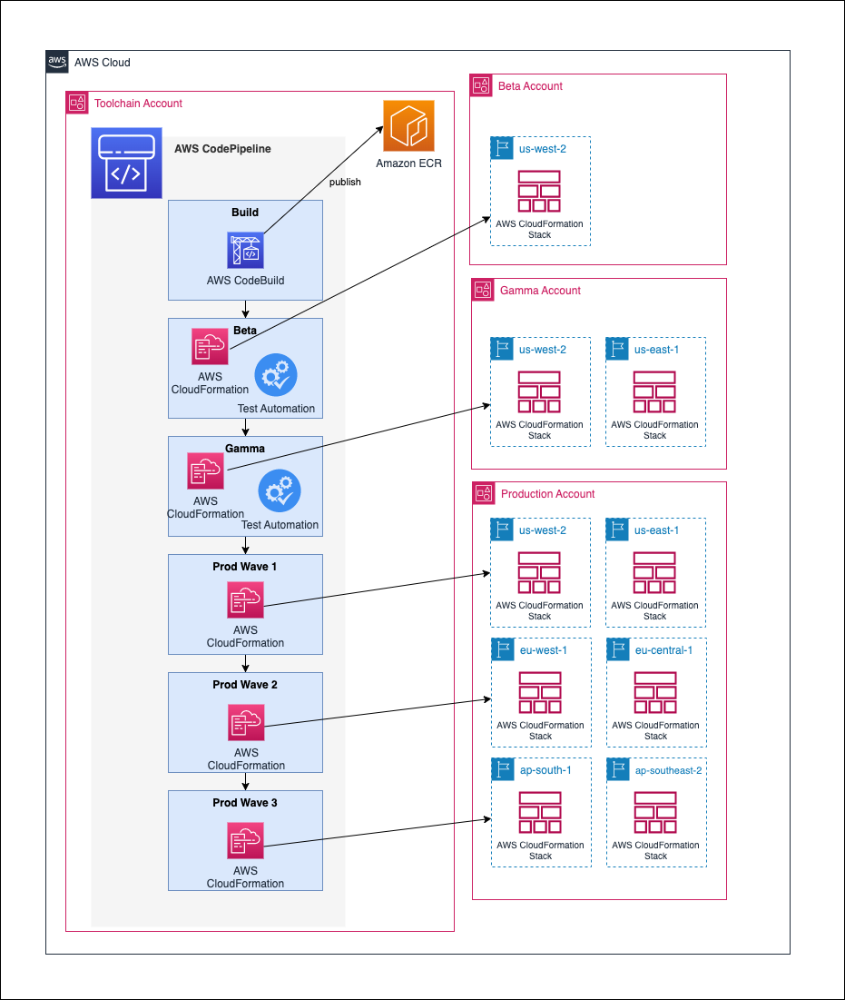

The application is a Java [Spring Boot](https://spring.io/projects/spring-boot) API that runs as an Amazon ECS Service with an Amazon Aurora database.

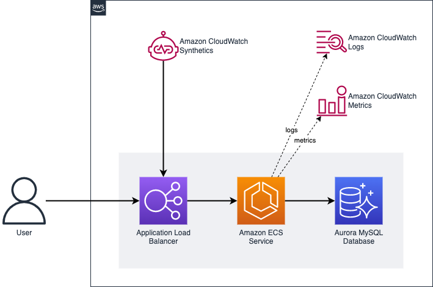

This reference implementation contains the following significant components:

* [infrastructure/](infrastructure) - [Amazon CDK](https://aws.amazon.com/cdk/) code necessary to provision the pipeline (see [pipeline.ts](infrastructure/src/pipeline.ts)) and the application (see [deployment/index.js](infrastructure/src/deployment/index.ts)). This directory also contains [tests](infrastructure/test/) for the infrastructure code, including SAST (static application security testing) with [cdk-nag](https://github.com/cdklabs/cdk-nag).
* [src/](src) - Java source code for a simple API that manages a list of fruits in a relational database. Unit tests are available for the application in [src/test/java](src/test/java).

> **Warning**
> This reference implementation has intentionally not followed the following [AWS Well-Architected](https://aws.amazon.com/architecture/well-architected/) best practices to make it accessible by a wider range of customers. Be sure to address these before using this code for any workloads in your own environment:

* [ ] **TLS on HTTP endpoint** - the listener for the sample application uses HTTP instead of HTTPS to avoid having to create new ACM certificates and Route53 hosted zones. This should be replaced in your account with an `HTTPS` listener.

## Prerequisites

Before beginning this walk through, you should have the following prerequisites:

* 4 AWS accounts (https://portal.aws.amazon.com/billing/signup) - with named profiles (https://docs.aws.amazon.com/cli/latest/userguide/cli-configure-profiles.html) as: toolchain, beta, gamma and production
* AWS Command Line Interface (AWS CLI) (https://docs.aws.amazon.com/cli/latest/userguide/getting-started-install.html) installed
* AWS CDK (https://docs.aws.amazon.com/cdk/v2/guide/getting_started.html) installed
* Node.js (https://nodejs.org/)(>= 10.13.0, except for versions 13.0.0 - 13.6.0) installed
* Apache Maven (https://maven.apache.org/install.html) installed
* JDK 18.0.2.1 (https://www.oracle.com/java/technologies/javase/jdk18-archive-downloads.html) installed
* Basic understanding of continuous integration/continuous development (CI/CD) Pipelines

## Initial setup

1. Clone the repository from GitHub (https://github.com/aws-samples/aws-deployment-pipeline-reference-architecture):

```bash
git clone https://github.com/aws-samples/aws-deployment-pipeline-reference-architecture.git
cd aws-deployment-pipeline-reference-architecture/examples/cdk-application-pipeline
```

This reference implementation contains the following significant components:

* [infrastructure/](https://github.com/aws-samples/aws-deployment-pipeline-reference-architecture/blob/main/examples/cdk-application-pipeline/infrastructure) - Amazon CDK code necessary to provision the pipeline
* [src/](https://github.com/aws-samples/aws-deployment-pipeline-reference-architecture/blob/main/examples/cdk-application-pipeline/src) - Java source code for a simple API that manages a list of fruits in a relational database

2. To build and run the unit tests for the Spring Boot Application, run the following command:

```bash
mvn package
```

3. To install dependencies run:

```bash
npm install
```

4. To bootstrap your AWS accounts for AWS CDK, run:

```bash
npx ts-node infrastructure/src/bootstrap.ts
```

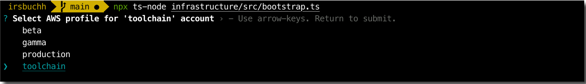

Use the keyboard up/down arrow-key to choose the AWS profile for `toolchain`, `beta`, `gamma` and `production` as prompted.

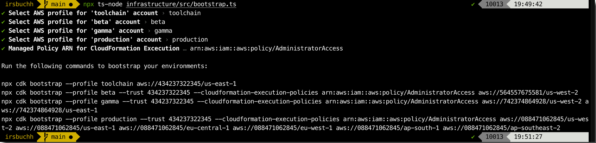

The bootstraping script shall print out 4 commands as shown above.

5. Run the following commands to bootstrap toolchain environment, account id `111111111111`:

```bash
npx cdk bootstrap --profile toolchain aws://111111111111/us-east-1
```

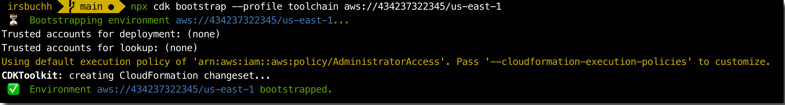

6. Run the following commands to bootstrap beta environment, account id `222222222222`:

```bash
npx cdk bootstrap --profile beta --trust 111111111111 --cloudformation-execution-policies 'arn:aws:iam::aws:policy/AdministratorAccess' aws://222222222222/us-west-2
```

7. Run the following commands to bootstrap gamma environment, account id `333333333333`:

```bash
npx cdk bootstrap --profile gamma --trust 111111111111 --cloudformation-execution-policies \
 arn:aws:iam::aws:policy/AdministratorAccess aws://333333333333/us-west-2 aws://333333333333/us-east-1
```

8. Run the following commands to bootstrap production environment, account id `444444444444`:

```bash
npx cdk bootstrap --profile production --trust 111111111111 --cloudformation-execution-policies \
 arn:aws:iam::aws:policy/AdministratorAccess aws://444444444444/us-west-2 aws://444444444444/us-east-1 aws://444444444444/eu-central-1 aws://444444444444/eu-west-1 aws://444444444444/ap-south-1 aws://444444444444/ap-southeast-2
```

To learn more about the CDK boostrapping process, see: https://docs.aws.amazon.com/cdk/v2/guide/bootstrapping.html

## Pipeline Deploy

To deploy the pipeline to the toolchain AWS account run:

```bash
npx cdk deploy --profile toolchain --all --require-approval never
```

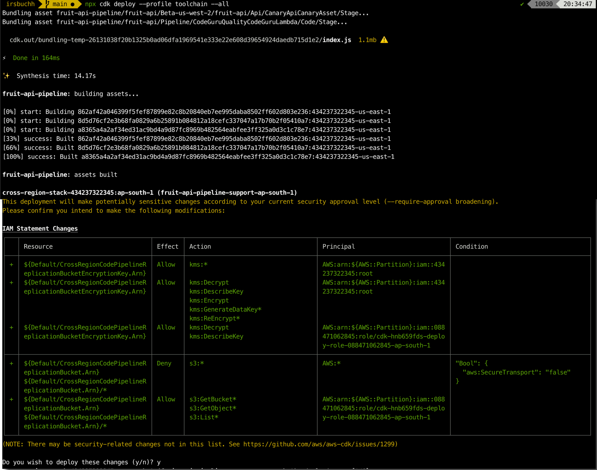

Using AWS management console, login to `toolchain` account and click [AWS CodePipeline](https://us-east-1.console.aws.amazon.com/codesuite/codepipeline/home?region=us-east-1) to check the different stages of the pipeline.

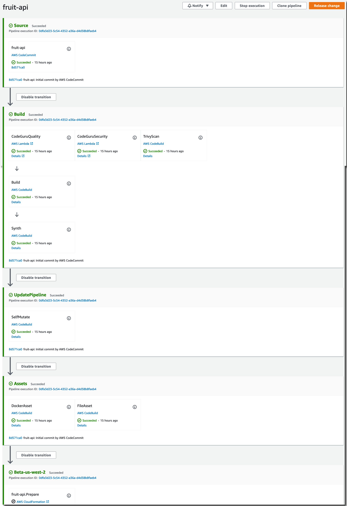

Here is the deployment to `Beta` environment.

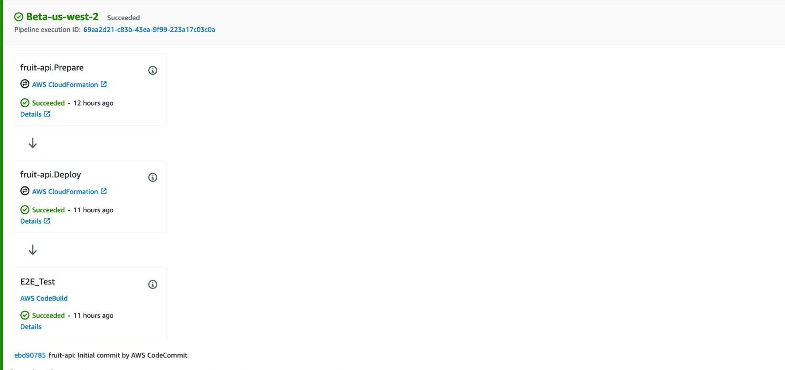

Here is the deployment to `Gamma` environment.

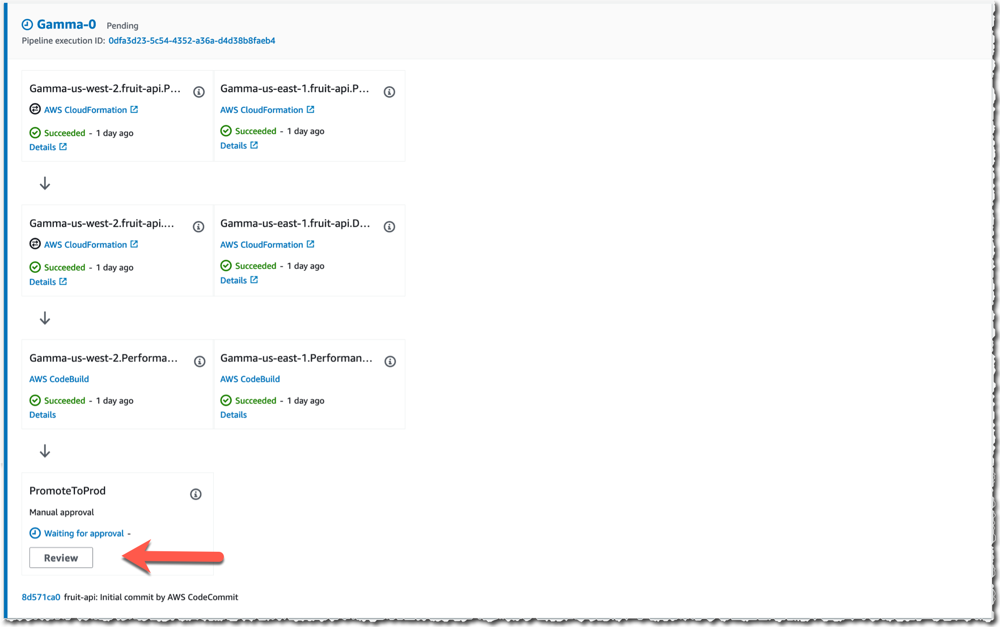

Click the Review button to manually approve the *PromoteToProd.*

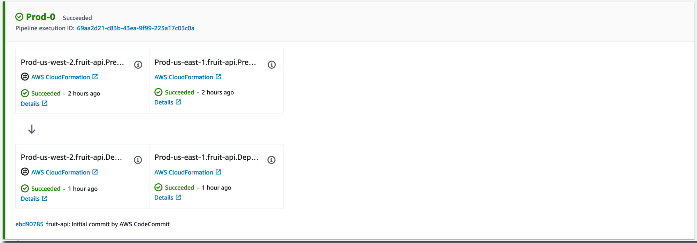

Here is the deployment to `Prod-1` environment.

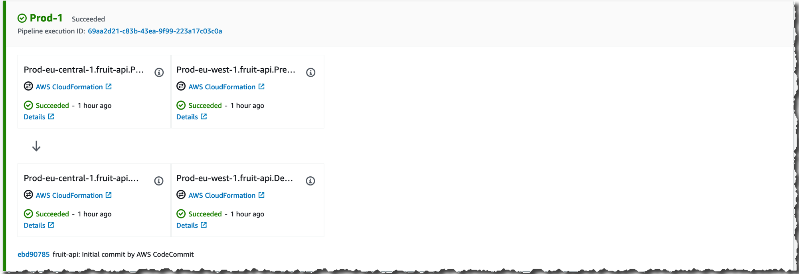

Here is the deployment to `Prod-2` environment.

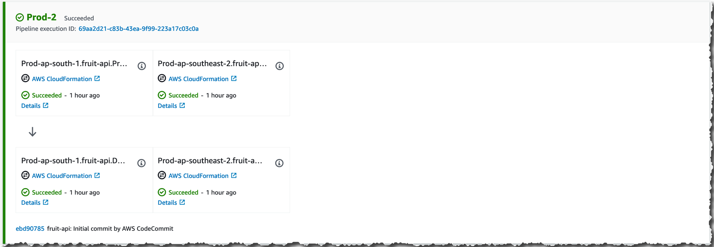

Here is the application running in production in us-east-1 region.

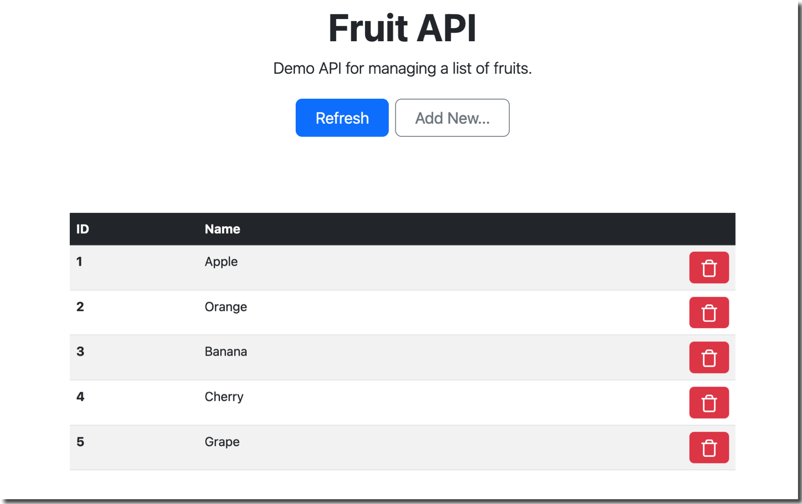

(OPTIONAL) If you'd like to make changes and deploy with the pipeline, you'll need to [setup Git for AWS CodeCommit](https://docs.aws.amazon.com/codecommit/latest/userguide/setting-up.html) and then clone the new CodeCommit repository:

```bash
git clone https://git-codecommit.us-west-2.amazonaws.com/v1/repos/fruit-api
```

To fix failed Trivy scans, see: https://www.mojohaus.org/versions/versions-maven-plugin/index.html or https://docs.npmjs.com/packages-and-modules

## Pipeline Teardown

The cleanup task will take these actions:

1. Destroy the CDK app using: `npx cdk --profile dpra-toolchain destroy --all`
2. Empty and remove the CDKToolkit S3 staging buckets in all environments
2. Empty and remove the CDKToolkit ECR repository in all environments
3. Delete the CDKToolkit stacks in all environments

```bash
./infrastructure/src/cleanup.ts
```

NOTE: account removal is left to the account owner.