# Overview

Reference implementation of application pipeline from DPRA that includes a CI/CD pipeline to build an application and deploy via AWS CloudFormation across different accounts for each environment.

This reference implementation contains the following significant components:

* [infrastructure/](infrastructure) - [Amazon CDK](https://aws.amazon.com/cdk/) code necessary to provision the pipeline (see [pipeline.ts](infrastructure/src/pipeline-stack.ts)). This directory also contains [tests](infrastructure/test/) for the infrastructure code, including SAST (static application security testing) with [cdk-nag](https://github.com/cdklabs/cdk-nag).

> **Warning**
> This reference implementation has intentionally not followed the following [AWS Well-Architected](https://aws.amazon.com/architecture/well-architected/) best practices to make it accessible by a wider range of customers. Be sure to address these before using this code for any workloads in your own environment.


## Prerequisites

Before beginning this walk through, you should have the following prerequisites:

* 5 AWS accounts (https://portal.aws.amazon.com/billing/signup) toolchain, dynamic configuration, beta, gamma and production configured through [AWS Organizations](https://aws.amazon.com/organizations/).
* AWS Command Line Interface [(AWS CLI) installed](https://docs.aws.amazon.com/cli/latest/userguide/getting-started-install.html) 
* AWS Command Line Interface [(AWS CLI) configured](https://docs.aws.amazon.com/cli/latest/userguide/getting-started-quickstart.html)
* AWS [CDK installed]((https://docs.aws.amazon.com/cdk/v2/guide/getting_started.html)).
* Node.js [(>= 10.13.0, except for versions 13.0.0 - 13.6.0) installed.](https://nodejs.org/)
* Basic understanding of continuous integration/continuous development (CI/CD) Pipelines.
* 

## Initial setup

1. [Clone the repository from GitHub: ](https://github.com/aws-samples/aws-deployment-pipeline-reference-architecture)

```bash
git clone https://github.com/aws-samples/aws-deployment-pipeline-reference-architecture.git
cd aws-deployment-pipeline-reference-architecture/examples/dynamic-configuration-cdk-codepipeline
```

This reference implementation contains the following significant component:

* [infrastructure/](https://github.com/aws-samples/aws-deployment-pipeline-reference-architecture/blob/main/examples/dynamic-configuration-cdk-codepipeline/infrastructure) - Amazon CDK code necessary to provision the pipeline.
* [bootstrap.ts/](https://github.com/aws-samples/aws-deployment-pipeline-reference-architecture/blob/main/examples/dynamic-configuration-cdk-codepipeline/scripts/bootstrap.ts) - bootstrap script to configure your development environment.

2. To install dependencies run:

```bash
npm install
```

3. To bootstrap your AWS accounts for AWS CDK, run:

```bash
npx ts-node scripts/bootstrap.ts
```
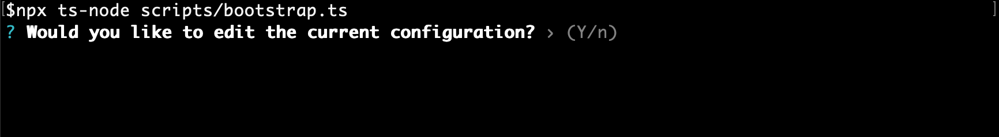</img>

Confirm that you want to edit the current cdk.json file configuration. Press `y` or `n`.
**Note:** This prompt only shows up the second time you run the bootstrap script.

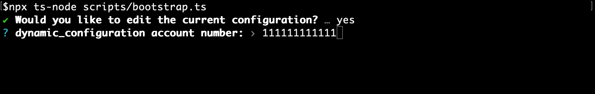</img>

Enter the account number where ([AWS AppConfig](https://docs.aws.amazon.com/appconfig/) will be used to store dynamic configurations.

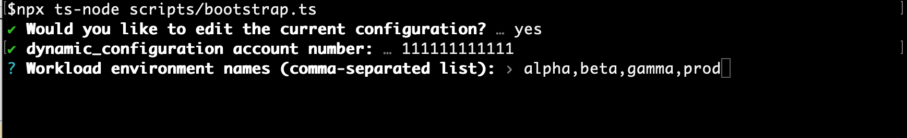</img>

Enter the names of the workload [environments](https://docs.aws.amazon.com/appconfig/latest/userguide/appconfig-creating-environment.html).

The following questions will be asked for each [environment](https://docs.aws.amazon.com/appconfig/latest/userguide/appconfig-creating-environment.html) from the previous step:

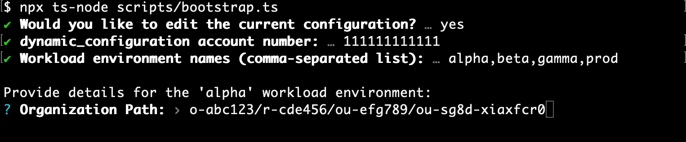</img>

Enter the [organization unit (OU) path for the selected account](https://docs.aws.amazon.com/organizations/latest/userguide/orgs_manage_ous.html)

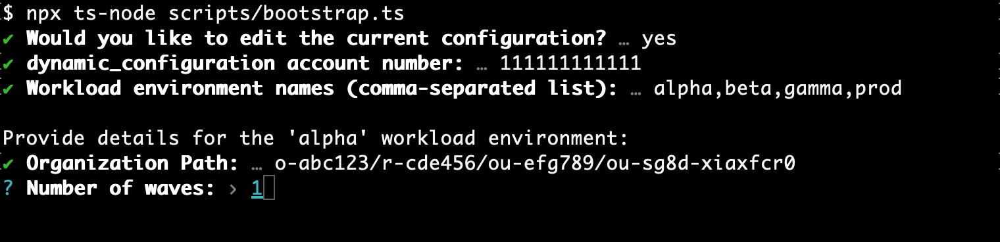</img>

Enter number of deployment waves that will be used for this environment.

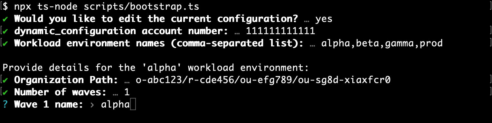</img>

Enter the name for the wave.

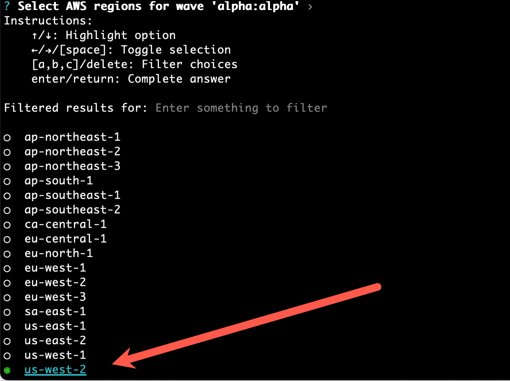</img>

Select the regions where the wave will be deployed.

</img>

Confirm if you want to view the updated subection of cdk.json pertaining to this configuration.

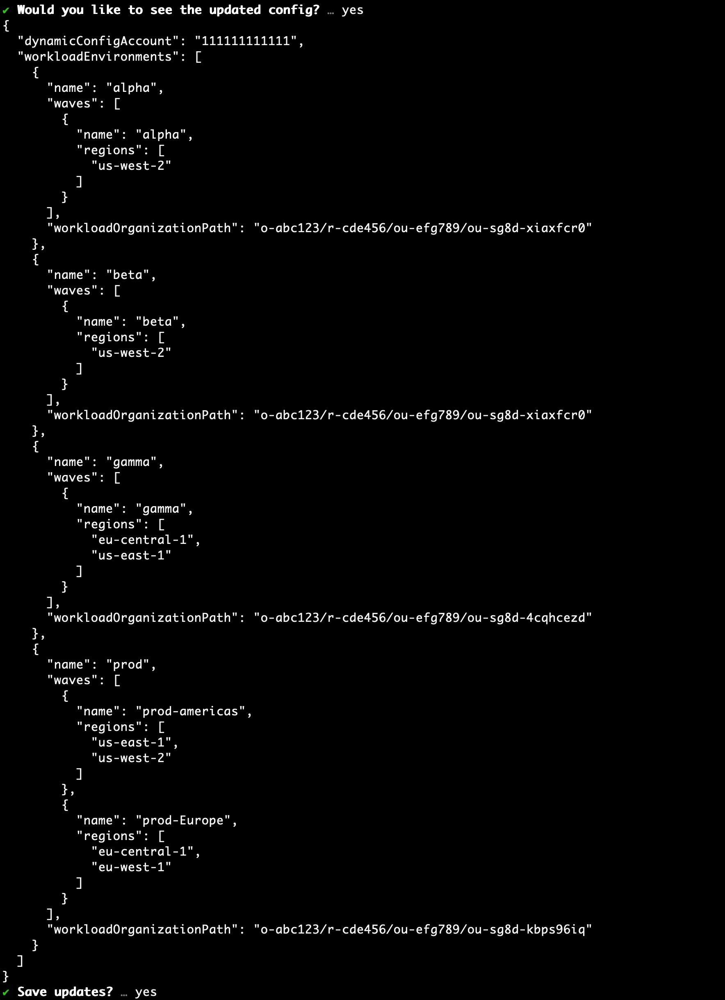</img>

Confirm you would like to save the changes made.

</img>

Select if you would like to generate the bootstrap commands.

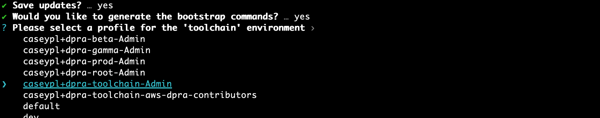</img>

Select the dynamic configuration profile to be used for the bootstrap commands.

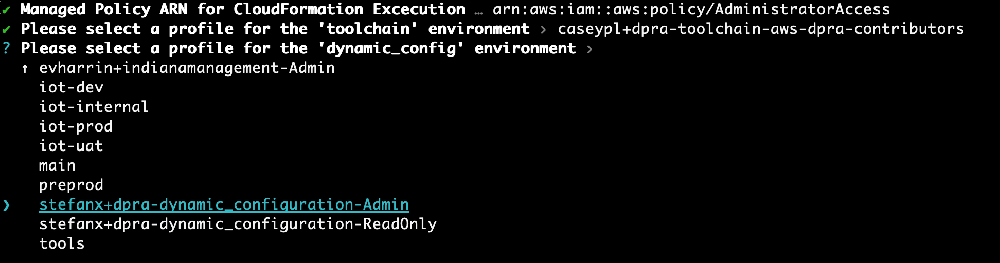</img>

At this point the cdk bootstrap commands are generated for you:

**222222222222** = account number for toolchain account

**111111111111** = account number for dynamic configuration account.

You can choose to run them manually or have the bootstrap script run them for you.
```
npx cdk bootstrap --profile toolchain aws://222222222222/us-east-1
npx cdk bootstrap --profile dynamic-config --trust 222222222222 --cloudformation-execution-policies arn:aws:iam::aws:policy/AdministratorAccess aws://111111111111/us-east-1 aws://111111111111/us-west-2 aws://111111111111/eu-central-1 aws://111111111111/eu-west-2
```

Select the toolchain profile to be used for the bootstrap commands.

4. Run the following commands to bootstrap toolchain environment, account id `222222222222`:

```bash
npx cdk bootstrap --profile toolchain aws://222222222222/us-east-1
```

5. Run the following commands to bootstrap beta environment, account id `333333333333`:

```bash
npx cdk bootstrap --profile beta --trust 222222222222 --cloudformation-execution-policies 'arn:aws:iam::aws:policy/AdministratorAccess' aws://333333333333/us-west-2
```

6. Run the following commands to bootstrap gamma environment, account id `444444444444`:

```bash
npx cdk bootstrap --profile gamma --trust 222222222222 --cloudformation-execution-policies \
 arn:aws:iam::aws:policy/AdministratorAccess aws://444444444444/us-west-2 aws://444444444444/us-east-1
```

7. Run the following commands to bootstrap production environment, account id `555555555555`:

```bash
npx cdk bootstrap --profile production --trust 222222222222 --cloudformation-execution-policies \
 arn:aws:iam::aws:policy/AdministratorAccess aws://555555555555/us-west-2 aws://555555555555/us-east-1 aws://555555555555/eu-central-1 aws://555555555555/eu-west-1 aws://555555555555/ap-south-1 aws://444444444444/ap-southeast-2
```

To learn more about the CDK boostrapping process, see: https://docs.aws.amazon.com/cdk/v2/guide/bootstrapping.html

## Pipeline Deploy

To deploy the pipeline to the toolchain AWS account run:

```bash
npx cdk deploy --profile toolchain --all --require-approval never
```

Using AWS management console, login to `toolchain` account and click [AWS CodePipeline](https://us-east-1.console.aws.amazon.com/codesuite/codepipeline/home?region=us-east-1) to check the different stages of the pipeline.

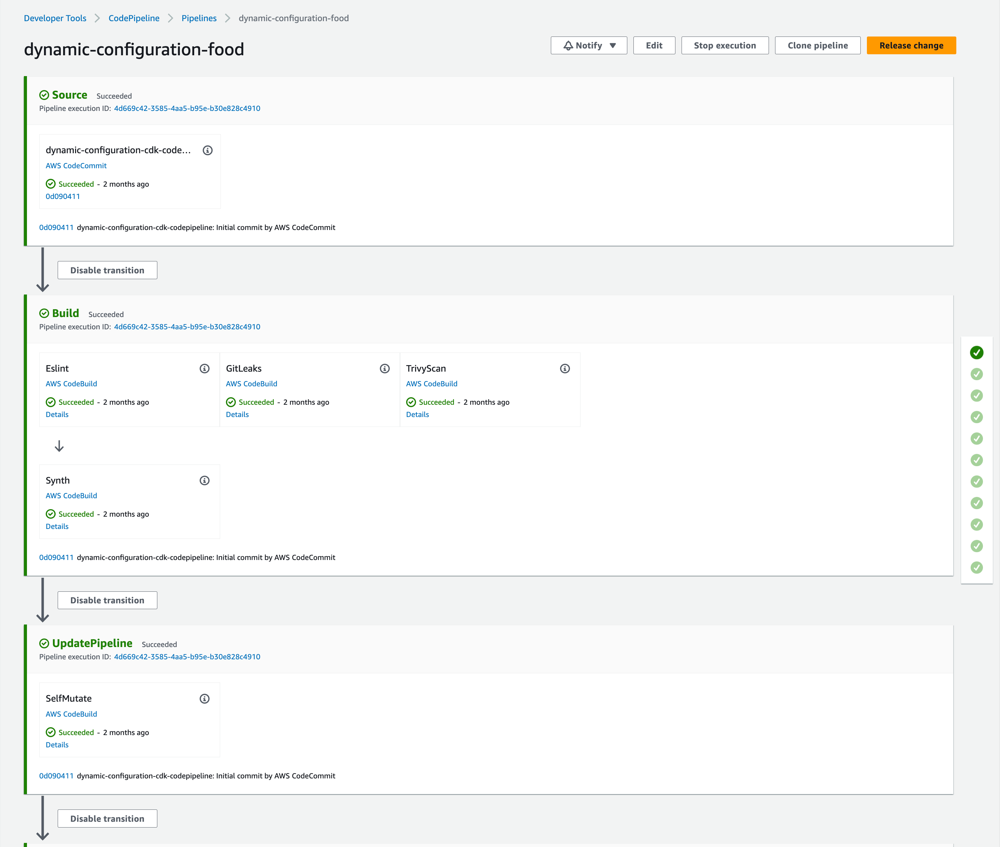

Here is the deployment to `Core` stage to all accounts and regions. It sets up the feature flags and dynamic configurations and gets the ready for deployment to all accounts.

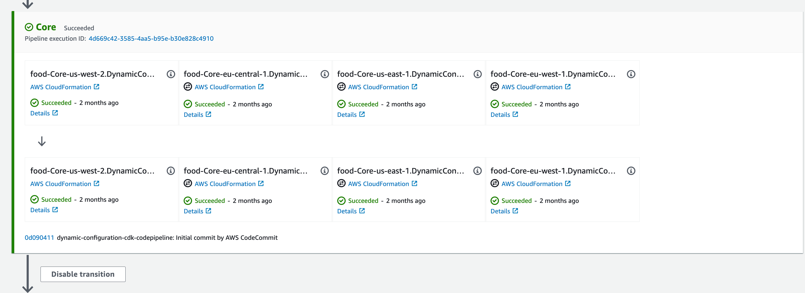

Here is the deployment to `Global` stage resources to all accounts. Generates roles and policies needed by the pipeline and resources for deployment of configurations and feature flags.

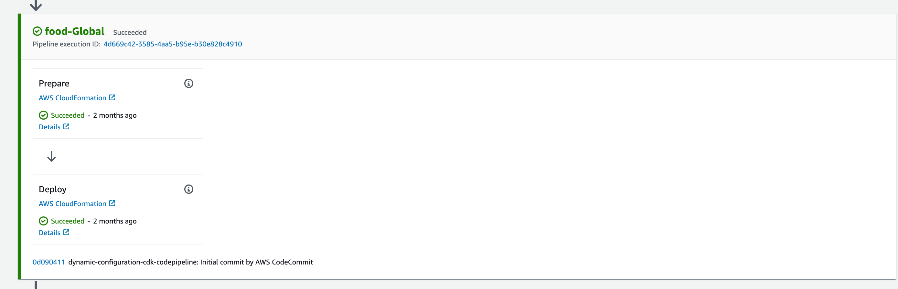

Here is the deployment to `food-serviceDiscovery` stage. It uses the parameter store to store the ARN of the roles created on the previous stage.

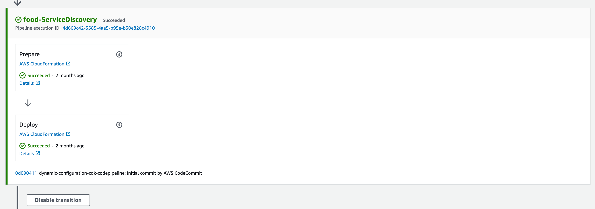

Here is the deployment to `Alpha` environment.

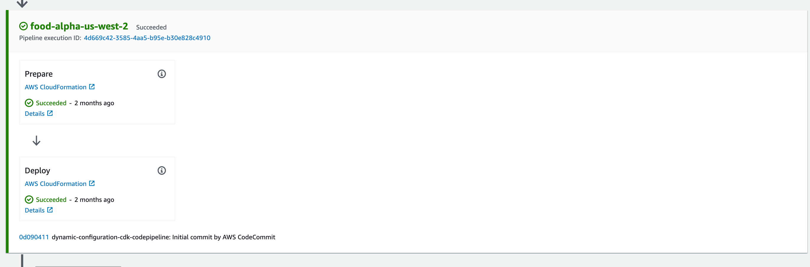

Here is the deployment to `Beta` environment.

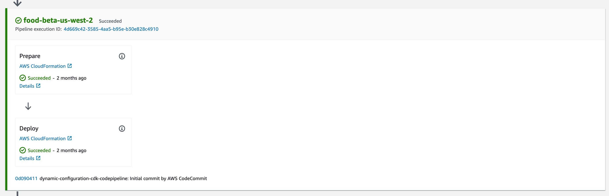

Here is the deployment to `Gamma` environment.

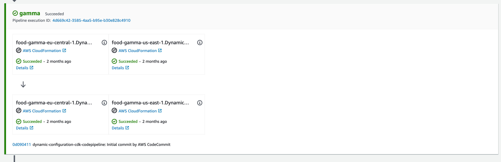

Here are the 2 waves for prod accross the selected regions

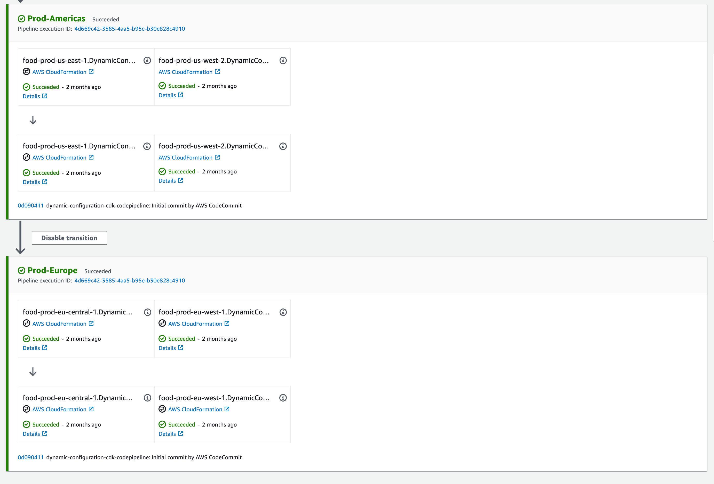

(OPTIONAL) If you'd like to make changes and deploy with the pipeline, you'll need to [setup Git for AWS CodeCommit](https://docs.aws.amazon.com/codecommit/latest/userguide/setting-up.html) and then clone the new CodeCommit repository:

```bash
git clone https://git-codecommit.us-west-2.amazonaws.com/v1/repos/dynamic-configuration-cdk-codepipeline
```

To fix failed Trivy scans, see: https://www.mojohaus.org/versions/versions-maven-plugin/index.html or https://docs.npmjs.com/packages-and-modules

## Pipeline Teardown

The cleanup task will take these actions:

1. Destroy the CDK app using: `npx cdk --profile dpra-toolchain destroy --all`
2. Empty and remove the CDKToolkit S3 staging buckets in all environments
2. Empty and remove the CDKToolkit ECR repository in all environments
3. Delete the CDKToolkit stacks in all environments

```bash
./infrastructure/src/cleanup.ts
```

NOTE: account removal is left to the account owner.

##Manually updating cdk.json
If you prefer to manually update the cdk.json file instad of using the bootstrap script displayed on [step 3 of initial setup](#initial-setup):

Find out the [organization unit (OU) path for the selected accounts](https://docs.aws.amazon.com/organizations/latest/userguide/orgs_manage_ous.html)

Within the "context" node of you [cdk.json file](cdk.json) enter:

```json
"context": {
    "workloadName": "food",
    "dynamicConfigAccount": "111111111111",
    "workloadEnvironments": [
        {
            "name": "alpha",
            "workloadOrganizationPath": "o-abc123/r-cde456/ou-efg789/ou-sg8d-xiaxfcr0",
            "waves": [
            {
                "name": "alpha",
                "regions": ["us-west-2"]
            }
            ]
        },
        {
            "name": "beta",
            "workloadOrganizationPath": "o-abc123/r-cde456/ou-efg789/ou-sg8d-xiaxfcr0",
            "waves": [
            {
                "name": "beta",
                "regions": ["us-west-2"]
            }
            ]
        },
        {
            "name": "gamma",
            "workloadOrganizationPath": "o-abc123/r-cde456/ou-efg789/ou-sg8d-4abcdef",
            "waves": [
            {
                "name": "gamma",
                "regions": ["eu-central-1", "us-east-1"]
            }
            ]
        },
        {
            "name": "prod",
            "workloadOrganizationPath": "o-abc123/r-cde456/ou-efg789/ou-sg8d-5abcdef",
            "waves": [
            {
                "name": "Prod-Americas",
                "regions": ["us-east-1", "us-west-2"]
            },
            {
                "name": "Prod-Europe",
                "regions": ["eu-central-1", "eu-west-1"]
            }
            ]
        }
    ],
    .....
}
```